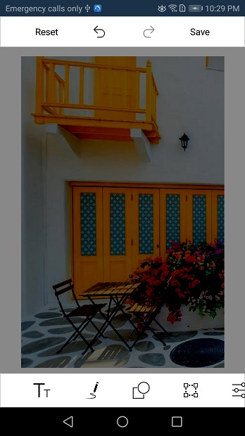
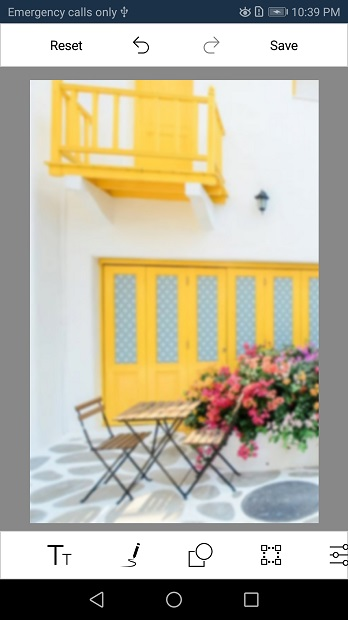
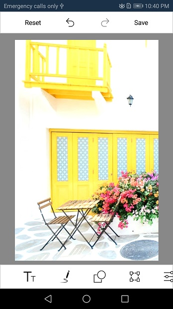

# Image Filter in SfImageEditor

Using the image editor control, you can add effects such as Hue, Saturation, Brightness, Contrast, Blur, and Sharpen to the image. These effects can be applied from toolbar or using the ApplyImageEffect method. The [`ApplyImageEffect`](https://help.syncfusion.com/cr/xamarin-android/Syncfusion.SfImageEditor.Android~Syncfusion.SfImageEditor.Android.SfImageEditor~ApplyImageEffect(ImageEffect,Single).html) method contains two arguments: [`ImageEffect`](https://help.syncfusion.com/cr/xamarin-android/Syncfusion.SfImageEditor.Android~Syncfusion.SfImageEditor.Android.SfImageEditor~ImageEffect.html) and [`EffectValue`](https://help.syncfusion.com/cr/xamarin-android/Syncfusion.SfImageEditor.Android~Syncfusion.SfImageEditor.Android.SfImageEditor~EffectValue.html). The ImageEffect is an Enum, which contains the following effects:

* Hue
* Saturation
* Brightness
* Contrast
* Blur
* Sharpen 
* None

The EffectValue are the corresponding ImageEffect values, which varies for each effect, and they are explained as follows.

## Hue

The Hue represents the dominant wavelength of the color. The value of hue effect ranges from -180 to 180.



public MainPage()
{               
    . . .
    editor.ApplyImageEffect(ImageEffect.Hue, 120);
    . . .
}



## Saturation

The Saturation represents the intensity of the color. The value of the saturation effect ranges from -100 to 100.



public MainPage()
{               
    . . .
    editor.ApplyImageEffect(ImageEffect. Saturation, -80);
    . . .
}



## Brightness

The brightness represents how bright the color is. The value of brightness effect ranges from -100 to 100.



public MainPage()
{               
    . . .
    editor.ApplyImageEffect(ImageEffect.Brightness, -60);
    . . .
}



## Contrast

The contrast represents the color contrast of an image. The value of contrast effect ranges from -100 to 100.



public MainPage()
{               
    . . .
    editor.ApplyImageEffect(ImageEffect. Contrast, -30);
    . . .
}



## Blur

The Blur represents the clearness of the image. The value of blur effect ranges from 0 to 6.



public MainPage()
{               
    . . .
    editor.ApplyImageEffect(ImageEffect.Blur, 4);
    . . .
}



## Sharpen

Sharpen is used to highlight edges and fine details in an image. The value of sharpen effect ranges from 0 to 6.



public MainPage()
{               
    . . .
    editor.ApplyImageEffect(ImageEffect.Sharpen, 2);
    . . .
}



N> The Image Effect enum also contains “None” option, which removes all the previously applied effects, which are not saved displays the original image. When applying effect through the Apply Image effect method, the effects will be saved automatically. But, if you apply effect from toolbar, each effect will be saved only when clicking the OK button, else all the applied effects will not be saved.

