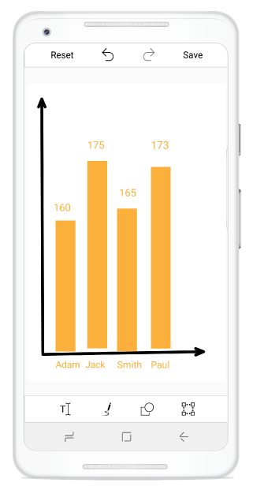

# Serialization And Deserialization
 ImageEditor provides support to serialize and deserialize the shapes(Circle, Arrow, Rectangle), free hand drawing, Text and Toolbar settings. Save the current state of the Image Editor and Load it back when its needed.

## Serialization
  SaveEdits() method used to serialize the current edits of shapes. Serialized object will be return in the form of JSON stream.




    
	 public class MainActivity : Activity
    {

        SfImageEditor editor;
        protected override void OnCreate(Bundle savedInstanceState)
        {
            base.OnCreate(savedInstanceState);
            LinearLayout layout = new LinearLayout(this);
            layout.Orientation = Android.Widget.Orientation.Vertical;
            layout.LayoutParameters = new LinearLayout.LayoutParams(LinearLayout.LayoutParams.MatchParent, LinearLayout.LayoutParams.MatchParent);
            Button saveEdits = new Button(this);
            saveEdits.Text = "Serialize";
            saveEdits.SetWidth(100);
            saveEdits.SetHeight(100);
            saveEdits.Click += SaveEdits_Click;
            editor = new SfImageEditor(this);
            layout.AddView(saveEdits);
            layout.AddView(editor);
            SetContentView(layout);
        }

        void SaveEdits_Click(object sender, EventArgs e)
        {
            Stream stream = editor.SaveEdits();
        }
    }
    
	



  
  you can save stream into .txt format file. if you saved as .txt format file in asset folder to deserialize the shapes then set as AndroidAsset in project.
  
  Please find sample text file shown below

  [Chart.txt](http://www.syncfusion.com/downloads/support/directtrac/general/txt/Chart677841499.txt)
       

## Deserialization
   LoadEdits() method used to deserialize the shapes.




        
	 SfImageEditor editor;
        protected override void OnCreate(Bundle savedInstanceState)
        {
            base.OnCreate(savedInstanceState);
            LinearLayout layout = new LinearLayout(this);
            layout.Orientation = Android.Widget.Orientation.Vertical;
            layout.LayoutParameters = new LinearLayout.LayoutParams(LinearLayout.LayoutParams.MatchParent, LinearLayout.LayoutParams.MatchParent);
            Button loadEdits = new Button(this);
            loadEdits.Text = "Deserialize";
            loadEdits.SetWidth(100);
            loadEdits.SetHeight(100);
            loadEdits.Click += LoadEdits_Click;
            editor = new SfImageEditor(this);
            layout.AddView(loadEdits);
            layout.AddView(editor);
            SetContentView(layout);
        }

        void LoadEdits_Click(object sender, EventArgs e)
        {
            using (StreamReader str = new StreamReader(Assets.Open("Chart.txt")))
            {
                string content = str.ReadToEnd();
                byte[] byteArray = Encoding.ASCII.GetBytes(content);
                MemoryStream stream = new MemoryStream(byteArray);
                if (stream != null)
                    editor.LoadEdits(stream);

            }
        }
    
		
        




