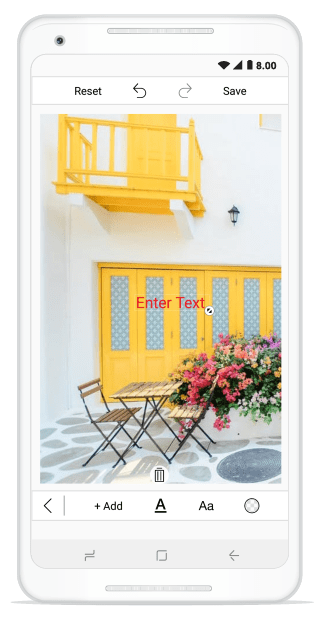

# Text

To add the desired text elements over the image, use the following two ways:

* From Toolbar
* Using Code

### From Toolbar

To add text from the toolbar, click on the Text icon in the toolbar. When the Text is tapped, a pop-up will appear. To add the text over the image, Type the desired text and click OK. To close the pop-up, click CANCEL button. By dragging, the text can be moved to the desired place.Text can be Resized with the help of handle.

#### Change Color of the selected Text

To change the color of the selected text, select the desired text and click on the color buttons available in the sub menu.

### Using Code

You can also add the desired text elements over the image from the code programmatically. The `AddText` method in the SfImageEditor control is used to add text based on the string value and `TextSettings`.

#### TextSettings

TextSettings is defined to set the values for `Color` and `FontSize`.





    editor.AddText("New Text", new TextSettings() { Color = Color.Green, FontSize = 16d});





# Custom Font Family

We can able to change the font family of selected text from default font family into custom font family.

   * From Toolbar
   * Using Code

### From Toolbar

After adding text we can able to change the font family of the selected text from toolbar, Select the desired text and click the font family buttons available in the sub menu.
   
Now the font family of the selected text has been changed.

### Using Code

Download the custom fonts file in ttf file format and add these fonts into "Assets" folder in sample project. Refer the below screen shot.

   
Right click the font file and open properties, in that Change the "Build Action" property of every font file as "AndroidAsset" and "Copy to output directory" to "Copy Always".
    

    
Finally use the below code snippet to apply custom font family for Xamarin Android.





    editor.AddText("New Xefus Text",new TextSettings() { FontFamily=Typeface.CreateFromAsset(this.Assets,"pacifico.ttf")});





