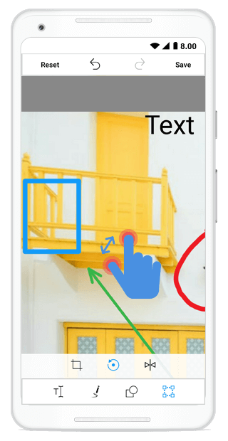

## Zooming

The image editor control provides support for zooming and panning.You can Zoom in and Zoom out image  in image editor control.

The following properties are related to the zooming feature of the image editor control:

* EnableZooming
* Maximum ZoomLevel

## EnableZooming

 You can Enable or Disable zooming by setting Enable Zooming to either true or false.





     editor.EnableZooming = true;





## Maximum ZoomLevel

You can customize maximum zoom level  by setting value to Maximum ZoomLevel property in image editor control.





     editor.EnableZooming = true;
     editor.MaximumZoomLevel = 8;





## PanningMode

Image editor control provides support for panning. Image editor allows you to pan the image with two fingers or single finger by setting the PanningMode in image editor.

The following properties are used in the panning.

* Single Finger – You can zoom or pan the image but it restrict the select or move the shapes.

* Two Finger – You can zoom or pan the image and also select or move the shapes.

By default, PanningMode value as TwoFinger.





editor.PanningMode = PanningMode.TwoFinger;





