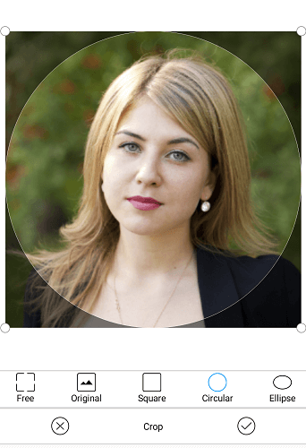
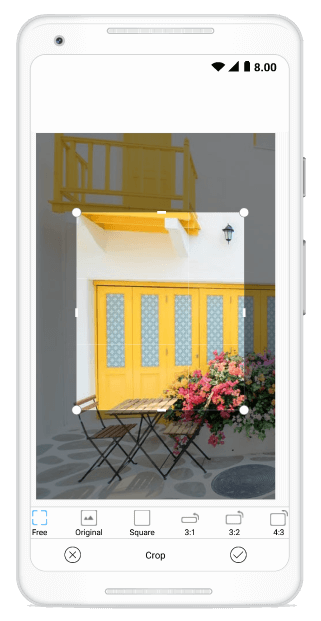

# Cropping image in various aspect ratios

You can crop the desired portion of an image using the cropping tool.

## Image cropping ratio

You can crop the image to various aspect ratios. The following cropping ratios are available in built-in toolbar: "`Free`, `Original`, `Square`, `Circular`, `Ellipse`, `3:1`, `1:3`, `3:2`, `2:3`, `4:3`, `3:4`, `5:4`, `4:5`, `16:9`, `9:16`".

Cropping operation can be done in the following two ways:

* Enabling cropping and selecting the crop region visually.
* Entering the cropping area manually.

## Handling the cropping tool

The `ToggleCropping` method in the SfImageEditor control is used to enable and disable a cropping region placed over the image to visually choose the area for cropping. 

* The following code shows cropping the image to any desired size.



// For free hand cropping.

editor.ToggleCropping();    



* The following code shows cropping an image based on its original width and height.



// For cropping a image with its original width and height.

editor.ToggleCropping(float.NaN,float.NaN);    



* The following code shows cropping an image based on specific ratio.



// For cropping the image with ratio, x value as 9, and y value as 17.

editor.ToggleCropping(9,17);    

 

* To position the cropping window with custom location, pass the desired rectangle in ToggleCropping method. Each value in the rectangle should be in offset value(0 to 100).



Rectangle rect = new Rectangle(20,20,50,50);

editor.ToggleCropping(rect);    

 

After the cropping area has been selected, the `Crop` method is called, which in turn crops the selected region and displays the cropped image on the image editor.



editor.Crop();



### Circle cropping

An image can be cropped in circle or elliptical format, which could be perfect for using it as a profile picture.

Specify the [`ToggleCropping`](https://help.syncfusion.com/cr/xamarin-android/Syncfusion.SfImageEditor.Android.SfImageEditor.html#Syncfusion_SfImageEditor_Android_SfImageEditor_ToggleCropping_System_Drawing_RectangleF_System_Boolean_) parameter as shown in the below code sample.

N> When an empty rect is specified in the parameter, a rounded rect will be formed covering the entire image and it will be either in circle or ellipse shape based on the image bounds.



// To crop an image as a circular dimension.

            var size = editor.ActualImageRenderedBounds;
            var minSize = Math.Min(size.Width, size.Height);
            var leftX = (size.Width - minSize) / 2;
            var topY = (size.Height - minSize) / 2 ;

            var x = (leftX * 100) / size.Width;
            var y = (topY * 100) / size.Height;
            var width = (minSize * 100) / size.Width;
            var height = (minSize * 100) / size.Height;

            editor.ToggleCropping(new Rectangle(x, y, width, height), true);



The following image show cases the circularly cropped image.

 The following code shows cropping an image in elliptical format.



// To crop an image as a elliptical dimension.

editor.ToggleCropping(new Rectangle(), true);



## Manually enter the cropping area

To manually enter the cropping area without enabling the cropping functionality, use the overloaded Crop(Rectangle rect) method. It can be done by defining a rectangle and passing it to the Crop(rect) method



editor.Crop(new Rectangle(100,100,150,200));



### Selecting the cropping ratio programmatically

Programmatically, you can select the desired cropping ratio from the various aspect ratios available in the built-in cropping toolbar by specifying the corresponding index of the toolbar item using the [`ToggleCropping`](https://help.syncfusion.com/cr/xamarin-android/Syncfusion.SfImageEditor.Android.SfImageEditor.html#Syncfusion_SfImageEditor_Android_SfImageEditor_ToggleCropping_System_Boolean_System_Int32_) method.

The following code sample will add the cropping preview on the image in square shape.





 editor.ToggleCropping(true, 2);





