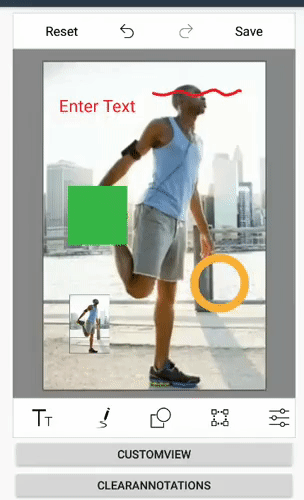

# Clear all annotations (Text, Shapes, Paths, etc) from Image Editor

By invoking the `ClearAnnotations` method of SfImageEditor, you can clear all the annotations (Text, Shapes, Path, and CustomView) added in the image editor without resetting the other edits (Rotation, Flip, Crop, Effects, etc).

The following code sample demonstrates this.



SfImageEditor imageEditor;
private LinearLayout.LayoutParams layoutParams;

protected override void OnCreate(Bundle savedInstanceState)
{
    base.OnCreate(savedInstanceState);
    Xamarin.Essentials.Platform.Init(this, savedInstanceState);

    this.layoutParams = new LinearLayout.LayoutParams(
        this.Resources.DisplayMetrics.WidthPixels - 120,
        this.Resources.DisplayMetrics.HeightPixels / 18);

    this.imageEditor = new SfImageEditor(this);
    this.imageEditor.Bitmap = BitmapFactory.DecodeResource(Resources, Resource.Drawable.EditedImage);
    this.imageEditor.LayoutParameters = new LinearLayout.LayoutParams(
        this.Resources.DisplayMetrics.WidthPixels - 120,
        1450);
    this.imageEditor.ItemSelected += this.ImageEditor_ItemSelected;

    Button btn2 = new Button(this);
    btn2.Text = "CustomView";
    btn2.Click += Btn2_Click;
    btn2.LayoutParameters = this.layoutParams;

    Button btn = new Button(this);
    btn.Text = "ClearAnnotations";
    btn.Click += Btn_Click;
    btn.LayoutParameters = this.layoutParams;

    LinearLayout linearLayout = new LinearLayout(this) { Orientation = Orientation.Vertical };
    linearLayout.SetPadding(60, 20, 0, 0);

    linearLayout.AddView(imageEditor);
    linearLayout.AddView(btn2);
    linearLayout.AddView(btn);

    SetContentView(linearLayout);
}

private void Btn2_Click(object sender, EventArgs e)
{
    ImageView customView = new ImageView(this);
    customView.LayoutParameters = new Android.Views.ViewGroup.LayoutParams(200, 200);
    customView.SetImageResource(Resource.Drawable.EditedImage);
    this.imageEditor.AddCustomView(customView, new CustomViewSettings());
}

private void Btn_Click(object sender, EventArgs e)
{
    this.imageEditor.ClearAnnotations();
}



