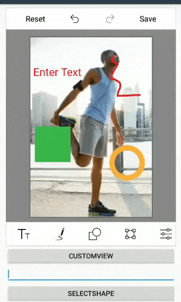

# Select annotations programmatically in Image Editor (SfImageEditor)

In ImageEditor, the Unique ID is generated for all annotations (Text, Shapes, Paths, and CustomViews) when they are added to the image editor and you can get this Unique ID from the ItemsSelected event arguments or from the serialized JSON. By passing this Unique ID to the `SelectShape` method of SfImageEditor, you can select the particular annotation programmatically.

The following code sample demonstrates this.



SfImageEditor imageEditor;
EditText et;
private LinearLayout.LayoutParams layoutParams;

protected override void OnCreate(Bundle savedInstanceState)
{
    base.OnCreate(savedInstanceState);
    Xamarin.Essentials.Platform.Init(this, savedInstanceState);

    this.layoutParams = new LinearLayout.LayoutParams(
        this.Resources.DisplayMetrics.WidthPixels - 120,
        this.Resources.DisplayMetrics.HeightPixels / 18);

    this.imageEditor = new SfImageEditor(this);
    this.imageEditor.Bitmap = BitmapFactory.DecodeResource(Resources, Resource.Drawable.EditedImage);
    this.imageEditor.LayoutParameters = new LinearLayout.LayoutParams(
        this.Resources.DisplayMetrics.WidthPixels - 120,
        1350);
    this.imageEditor.ItemSelected += this.ImageEditor_ItemSelected;

    Button btn2 = new Button(this);
    btn2.Text = "CustomView";
    btn2.Click += Btn2_Click;
    btn2.LayoutParameters = this.layoutParams;

    et = new EditText(this);
    et.InputType = Android.Text.InputTypes.ClassNumber;
    et.LayoutParameters = this.layoutParams;

    Button btn1 = new Button(this);
    btn1.Text = "SelectShape";
    btn1.Click += Btn1_Click;
    btn1.LayoutParameters = this.layoutParams;

    LinearLayout linearLayout = new LinearLayout(this) { Orientation = Orientation.Vertical };
    linearLayout.SetPadding(60, 20, 0, 0);

    linearLayout.AddView(imageEditor);
    linearLayout.AddView(btn2);
    linearLayout.AddView(et);
    linearLayout.AddView(btn1);

    SetContentView(linearLayout);
}

private void ImageEditor_ItemSelected(object sender, ItemSelectedEventArgs e)
{
    int uniqueID;
    PenSettings penSettings = e.Settings as PenSettings;
    TextSettings textSettings = e.Settings as TextSettings;
    CustomViewSettings customViewSettings = e.Settings as CustomViewSettings;
    if (penSettings != null)
    {
        uniqueID = penSettings.ShapeID;
    }
    else if (textSettings != null)
    {
        uniqueID = textSettings.ShapeID;
    }
    else
    {
        uniqueID = customViewSettings.ShapeID;
    }
}

private void Btn2_Click(object sender, EventArgs e)
{
    ImageView customView = new ImageView(this);
    customView.LayoutParameters = new Android.Views.ViewGroup.LayoutParams(200, 200);
    customView.SetImageResource(Resource.Drawable.EditedImage);
    this.imageEditor.AddCustomView(customView, new CustomViewSettings());
}

private void Btn1_Click(object sender, EventArgs e)
{
    int shapeId;
    if (int.TryParse(this.et.Text, out shapeId))
    {
        this.imageEditor.SelectShape(shapeId);
    }

    this.imageEditor.SelectShape(shapeId);
}



