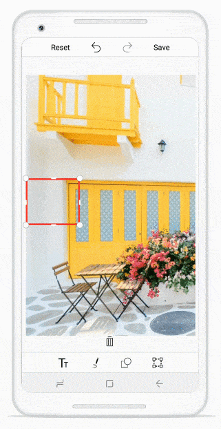
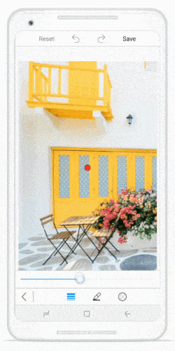

# Shapes

You can annotate any path on an image using free hand drawing and add shapes like rectangle, circle over the image. The shapes can be added in two ways:

* From Toolbar
* Using Code

## How to add a shape (Rectangle, Circle,Arrow) over an image

### From Toolbar

You can add the shapes from the toolbar by clicking on the `Shapes` icon available in the toolbar below the image. When the `Shapes` icon is touched, a sub toolbar will appear on top of that toolbar from which we can choose the shape( `Rectangle`,`Circle` and `Arrow`). Click on the desired shape and the shape will be added on the center of the image. The shape will have the handles on each edges of the shape which help in resizing it to the desired size and you can move it to the desired position by dragging the shape.

#### Change Color and Fill Options of the Shape

When the shape is clicked, the current toolbar menu with the shapes list will be hidden, and new menu with the options such as `Stroke`, `Fill`, and `Colors` will appear. 

If the selected shape is in `Stroke` mode, then the menu will appear with `StrokeThickness`, `Color` and `Opacity` options so that you can customize the selected shape appearance with these options. 

If the selected shape is in `Fill` mode, then the menu will appear with `FillColor` and `Opacity` options. So, you can customize the selected shape appearance with these options. 

I> By default, the shapes has `Red` stroke with `Transparent` fill.

### Using Code

The `AddShape` method in the SfImageEditor control is used to add shapes based on the `ShapeType` and `PenSettings`.

## ShapeType

ShapeType is an enum type with values `Rectangle`, `Circle`,`Arrow` and `Path`.

## PenSettings

PenSettings is defined to set the values for `StrokeColor`, `FillColor` and `StrokeWidth`.

N> FillColor property is applicable only if the ShapeType is `Rectangle` or `Circle` and `StrokeWidth` only used for `Path`.

   * To add a rectangle,circle or arrow over the image, you need to specify the ShapeType as well as the desired PenSettings as in the below code snippet:





      editor.AddShape(ShapeType.Circle, new PenSettings() { Color = Color.Green});





  

   * You can annotate any path on an image by using free hand drawing as shown in the below code,





      editor.AddShape(ShapeType.Path, new PenSettings() { StrokeWidth = 10 });





## Bounds

`Bounds` property allows you to set frame for the newly added shapes(rectangle and circle) and you can position the shapes wherever you want on the image. The value of the shapes frame should be in percentage(maximum - 100 & minimum - 0).



  edit.AddShape(ShapeType.Circle, new PenSettings() { Bounds = new Rectangle(20,20,35,35) });



## How to delete a shape or text from the view

You can delete a selected shape or text from the view in two ways:

* From Toolbar
* Using Code

N> You cannot delete Path.

### From Toolbar

When a shape is selected, a circular floating button with `Delete` icon will appear above the bottom toolbars. Clicking on the button will delete the selected shape from the view.

### Using Code

You can delete the selected shape programmatically using the `Delete` method as like in below code snippet:





    editor.Delete();




