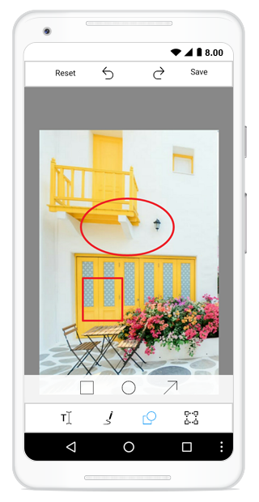

# Undo-Redo support

One of the important features of the image editor control is to perform `Undo` and `Redo` operations of adding shapes, text and drawing paths. The undo and redo operations can be done in two ways:

* From Toolbar
* Using Code

N> Undo and Redo will not be applied for cropping and transformations

## Undo

### From Toolbar

The top toolbar in the Image Editor control contains the undo and redo buttons in between the `Save` and `Reset` buttons. The Undo and Redo buttons will be disabled by default. If we add a shape or text or draw path, the undo button will be enabled. Clicking on the `Undo` button will clear the last performed operation. Undo can be performed for operations like:

* Add/Delete shapes, text
* Change Positions
* Color/Fill changes
* Path Drawings

### Using Code

Programmatically, you can make use of the `Undo` method in the SfImageEditor control to revert the changes.





editor.Undo();





## Redo

### From Toolbar

The Redo button will be disabled by default. The redo button will be enabled only when an undo operation is performed. Clicking on the `Redo` button negates the undo operations.

### Using Code

The `Redo` method is used to redo the changes reverted in the undo operation.





editor.Redo();





