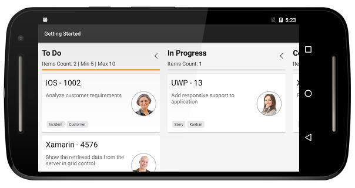

#Kanban for Xamarin.Android

This section provides a quick overview for working with Essential Kanban for Xamarin.Android. It’s an efficient way to visualize the workflow at each stage along its path to completion.

**Referencing Essential Studio Components in your Solution**

After installing Essential Studio for Xamarin, you can find all the required assemblies in the installation folders, typically:

{Syncfusion Installed location}\Essential Studio{14.2.0.26}\lib

Note: Assemblies are available in unzipped package location in Mac.

You have to add the following assembly reference to the android project

android\Syncfusion.SfKanban.Android.dll

**Create a simple SfKanban**

This section explains how to create a SfKanban and configure it. 

This is how the final output will look like on Android devices. You can download the entire source code of this demo for Xamarin.Android from [here](http://files2.syncfusion.com/Xamarin.Android/Samples/Kanban_GettingStarted.zip).

In this walk through, you will create a new application that contains the SfKanban which includes the below topics.

* Adding SfKanban in Xamarin.Android
* Create data model
* Binding data
* Defining columns
* Working with Workflows
* Work In-Progress Limit

**Adding SfKanban in Xamarin.Android**

1. Add the required assembly references to the project as discussed in the _Reference Essential Studio Components in your Solution_ section.
2. Import [`SfKanban`](http://help.syncfusion.com/cr/cref_files/xamarin-android/sfkanban/Syncfusion.SfKanban.Android~Syncfusion.SfKanban.Android.SfKanban.html) control namespace [`Syncfusion.SfKanban.Android`](https://help.syncfusion.com/cr/cref_files/xamarin-android/sfkanban/Syncfusion.SfKanban.Android.html).
3. Create an instance of [`SfKanban`](http://help.syncfusion.com/cr/cref_files/xamarin-android/sfkanban/Syncfusion.SfKanban.Android~Syncfusion.SfKanban.Android.SfKanban.html) control and set as a content view of Activity.


using System.Collections.ObjectModel;
using Syncfusion.SfKanban.Android; 

namespace Getting_Started
{
[Activity(Label = “Getting Started”, MainLauncher = true, Icon = “@drawable/icon”)]
public  class MainActivity : Activity
{
	public override void OnCreate(Bundle bundle)
	{		
		base.OnCreate(bundle);
		SfKanban kanban = new SfKanban(this);	
		SetContentView(kanban);
	}
}
}


**Create KanbanModel for the SfKanban**

Create a collection of [`KanbanModel`](http://help.syncfusion.com/cr/cref_files/xamarin-android/sfkanban/Syncfusion.SfKanban.Android~Syncfusion.SfKanban.Android.KanbanModel.html) objects for populating [`SfKanban`](http://help.syncfusion.com/cr/cref_files/xamarin-android/sfkanban/Syncfusion.SfKanban.Android~Syncfusion.SfKanban.Android.SfKanban.html).


using System.Collections.ObjectModel;
using Syncfusion.SfKanban.Android; 

namespace Getting_Started
{
[Activity(Label = “Getting Started”, MainLauncher = true, Icon = “@drawable/icon”)]
public class MainActivity : Activity
{
	ObservableCollection<KanbanModel> ItemsSourceCards()
	{
		ObservableCollection<KanbanModel> cards = new ObservableCollection<KanbanModel>();
		cards.Add(new KanbanModel() { 
			ID = 1, 
			Title = "iOS - 1002", 
			ImageURL = "Image1.png", 
			Category = "Open", 
			Description = "Analyze customer requirements", 
			ColorKey = "Red",
			Tags = new string[] { "Incident", "Customer" }
		});
		
		cards.Add(new KanbanModel() { 
			ID = 6, 
			Title = "Xamarin - 4576", 
			ImageURL = "Image2.png", 
			Category = "Open",
			Description = "Show the retrieved data from the server in grid control" 
			ColorKey = "Green", 
			Tags = new string[] { "SfDataGrid", "Customer" }
		});
		
		cards.Add(new KanbanModel() { 
			ID = 13, 
			Title = "UWP - 13", 
			ImageURL = "Image4.png", 
			Category = "In Progress", 
			Description = "Add responsive support to application", 
			ColorKey = "Brown", 
			Tags = new string[] { "Story", "Kanban" } 
		});  
		
		cards.Add(new KanbanModel() { 
			ID = 2543, 
			Title = "Xamarin_iOS - 2543", 
			Category = "Code Review", 
			ImageURL = "Image12.png", 
			Description = "Provide swimlane support kanban", 
			ColorKey = "Brown", 
			Tags = new string[] { "Feature","SfKanban" } 
		});
		  
		cards.Add(new KanbanModel() { 
			ID = 1975, 
			Title = "iOS - 1975", 
			Category = "Done", 
			ImageURL = "Image11.png", 
			Description = "Fix the issues reported by the customer", 
			ColorKey = "Purple", 
			Tags = new string[] { "Bug" } 
		});   
		
		return cards; 
	} 
}     
}

**Binding data to SfKanban**

In order to bind the data source of the [`SfKanban`](http://help.syncfusion.com/cr/cref_files/xamarin-android/sfkanban/Syncfusion.SfKanban.Android~Syncfusion.SfKanban.Android.SfKanban.html), set [`ItemsSource`](https://help.syncfusion.com/cr/cref_files/xamarin-android/sfkanban/Syncfusion.SfKanban.Android~Syncfusion.SfKanban.Android.SfKanban~ItemsSource.html) property as shown below. The following code binds the collection created in previous step to [`ItemsSource`](https://help.syncfusion.com/cr/cref_files/xamarin-android/sfkanban/Syncfusion.SfKanban.Android~Syncfusion.SfKanban.Android.SfKanban~ItemsSource.html) property.


kanban.ItemsSource = ItemsSourceCards();

**Defining Columns**

By default, we need to define the columns manually by adding the [`KanbanColumn`](https://help.syncfusion.com/cr/cref_files/xamarin-android/sfkanban/Syncfusion.SfKanban.Android~Syncfusion.SfKanban.Android.KanbanColumn.html) object to the [`Columns`](https://help.syncfusion.com/cr/cref_files/xamarin-android/sfkanban/Syncfusion.SfKanban.Android~Syncfusion.SfKanban.Android.SfKanban~Columns.html) collection property in [`SfKanban`](http://help.syncfusion.com/cr/cref_files/xamarin-android/sfkanban/Syncfusion.SfKanban.Android~Syncfusion.SfKanban.Android.SfKanban.html). 

[`ItemsSource`](https://help.syncfusion.com/cr/cref_files/xamarin-android/sfkanban/Syncfusion.SfKanban.Android~Syncfusion.SfKanban.Android.SfKanban~ItemsSource.html) which was bound to the kanban will be added to the respective columns using [`ColumnMappingPath`](https://help.syncfusion.com/cr/cref_files/xamarin-android/sfkanban/Syncfusion.SfKanban.Android~Syncfusion.SfKanban.Android.SfKanban~ColumnMappingPath.html) property in [`SfKanban`](http://help.syncfusion.com/cr/cref_files/xamarin-android/sfkanban/Syncfusion.SfKanban.Android~Syncfusion.SfKanban.Android.SfKanban.html) and [`Categories`](https://help.syncfusion.com/cr/cref_files/xamarin-android/sfkanban/Syncfusion.SfKanban.Android~Syncfusion.SfKanban.Android.KanbanColumn~Categories.html) collection property in [`KanbanColumn`](https://help.syncfusion.com/cr/cref_files/xamarin-android/sfkanban/Syncfusion.SfKanban.Android~Syncfusion.SfKanban.Android.KanbanColumn.html).

We need to set the required property name to [`ColumnMappingPath`](https://help.syncfusion.com/cr/cref_files/xamarin-android/sfkanban/Syncfusion.SfKanban.Android~Syncfusion.SfKanban.Android.SfKanban~ColumnMappingPath.html) which will be essential to add the data to the respective columns.

In this example, data whose [`Category`](http://help.syncfusion.com/cr/cref_files/xamarin-android/sfkanban/Syncfusion.SfKanban.Android~Syncfusion.SfKanban.Android.KanbanModel~Category.html) property’s value is set as `Open` will be added to the todoColumn and other data will be added to the respective columns.

The following code example illustrates how this can be done.


kanban.ColumnMappingPath = "Category"; 
 
KanbanColumn todoColumn = new KanbanColumn();
todoColumn.Title = "To Do"; 
todoColumn.Categories = new List<object>() { "Open" };
kanban.Columns.Add(todoColumn);  

KanbanColumn progressColumn = new KanbanColumn();
progressColumn.Title = "In Progress";  
progressColumn.Categories = new List<object>() { "In Progress" }; 
kanban.Columns.Add(progressColumn);  
 
KanbanColumn codeColumn = new KanbanColumn(); 
codeColumn.Title = "Code Review"; 
codeColumn.Categories = new List<object>() { "Code Review" };  
kanban.Columns.Add(codeColumn);  

KanbanColumn doneColumn = new KanbanColumn(); 
doneColumn.Title = "Done"; 
doneColumn.Categories = new List<object>() { "Done" };  
kanban.Columns.Add(doneColumn); 


You can also set [`AutoGenerateColumns`](https://help.syncfusion.com/cr/cref_files/xamarin-android/sfkanban/Syncfusion.SfKanban.Android~Syncfusion.SfKanban.Android.SfKanban~AutoGenerateColumns.html) property to true in which you don't need to define the columns as mentioned in the above example.  This will create columns depending on the [`ColumnMappingPath`](https://help.syncfusion.com/cr/cref_files/xamarin-android/sfkanban/Syncfusion.SfKanban.Android~Syncfusion.SfKanban.Android.SfKanban~ColumnMappingPath.html) property for all the distinct values in [`ItemsSource`](https://help.syncfusion.com/cr/cref_files/xamarin-android/sfkanban/Syncfusion.SfKanban.Android~Syncfusion.SfKanban.Android.SfKanban~ItemsSource.html).

When the columns are auto-generated, you can handle the [`ColumnsGenerated`](https://help.syncfusion.com/cr/cref_files/xamarin-android/sfkanban/Syncfusion.SfKanban.Android~Syncfusion.SfKanban.Android.SfKanban~ColumnsGenerated_EV.html) event to customize the columns after they are added to the [`ActualColumns`](http://help.syncfusion.com/cr/cref_files/xamarin-android/sfkanban/Syncfusion.SfKanban.Android~Syncfusion.SfKanban.Android.SfKanban~ActualColumns.html) collection in [`SfKanban`](http://help.syncfusion.com/cr/cref_files/xamarin-android/sfkanban/Syncfusion.SfKanban.Android~Syncfusion.SfKanban.Android.SfKanban.html).

**Working with workflows**

A Kanban workflow is a set of [`Category`](https://help.syncfusion.com/cr/cref_files/xamarin-android/sfkanban/Syncfusion.SfKanban.Android~Syncfusion.SfKanban.Android.KanbanWorkflow~Category.html) and  [`AllowedTransitions`](https://help.syncfusion.com/cr/cref_files/xamarin-android/sfkanban/Syncfusion.SfKanban.Android~Syncfusion.SfKanban.Android.KanbanWorkflow~AllowedTransitions.html), that an item moves through during its lifecycle and typically represents processes within your organization.

[`Category`](https://help.syncfusion.com/cr/cref_files/xamarin-android/sfkanban/Syncfusion.SfKanban.Android~Syncfusion.SfKanban.Android.KanbanWorkflow~Category.html) represents a state of an item at a particular point in a specific workflow. An item can be in only one category at a specific point of time.

[`AllowedTransitions`](https://help.syncfusion.com/cr/cref_files/xamarin-android/sfkanban/Syncfusion.SfKanban.Android~Syncfusion.SfKanban.Android.KanbanWorkflow~AllowedTransitions.html) is a list of categories to where the card can be moved from the current category. 

**Creating the workflows**

Initialize [`Workflows`](https://help.syncfusion.com/cr/cref_files/xamarin-android/sfkanban/Syncfusion.SfKanban.Android~Syncfusion.SfKanban.Android.SfKanban~Workflows.html) property with a list of [`KanbanWorkflow`](https://help.syncfusion.com/cr/cref_files/xamarin-android/sfkanban/Syncfusion.SfKanban.Android~Syncfusion.SfKanban.Android.KanbanWorkflow.html) instances. Each instance represents a workflow in Kanban. The following code example illustrates how this can be done.


var workflows = new List<KanbanWorkflow>();

var openWorkflow = new KanbanWorkflow();
openWorkflow.Category = "Open"; 
openWorkflow.AllowedTransitions = new List<object> { "In Progress" };  

var progressWorkflow = new KanbanWorkflow(); 
progressWorkflow.Category = "In Progress"; 
progressWorkflow.AllowedTransitions = new List<object> { "Open", "Code Review", "Closed-No Code Changes" };  

workflows.Add(openWorkflow); 
workflows.Add(progressWorkflow);    

kanban.Workflows = workflows;  


**Work In-Progress Limit**

In column, you can set minimum and maximum items limit by using the [`MinimumLimit`](https://help.syncfusion.com/cr/cref_files/xamarin-android/sfkanban/Syncfusion.SfKanban.Android~Syncfusion.SfKanban.Android.KanbanColumn~MinimumLimit.html) and [`MaximumLimit`](https://help.syncfusion.com/cr/cref_files/xamarin-android/sfkanban/Syncfusion.SfKanban.Android~Syncfusion.SfKanban.Android.KanbanColumn~MaximumLimit.html) properties. However, this will not restrict moving the items from one column to another column. But the violation of the limit can be indicated by changing the color of the error bar. 


todoColumn.MinimumLimit = 5; 
todoColumn.MaximumLimit = 10;   


Following properties are used to customize its appearance.

* Color – used to change the default color of the error bar
* MaxValidationColor – used to change the maximum validation color of the error bar
* MinValidationColor – used to change the minimum validation color of the error bar
* Height – used to change the height of the error bar


todoColumn.ErrorBarSettings.Color = Color.Green; 
todoColumn.ErrorBarSettings.MinValidationColor = Color.Orange; 
todoColumn.ErrorBarSettings.MaxValidationColor = Color.Red; 
todoColumn.ErrorBarSettings.Height = 4;    


