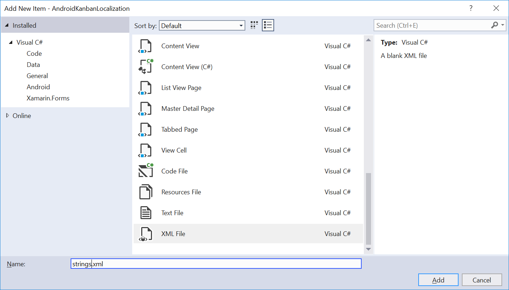
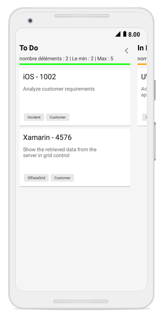

# Localization 

Localization is the process of translating the application resources into different languages for specific cultures. You can localize the SfKanban by adding a resource file. Application culture can be changed by language settings in device.

To localize the SfKanban based on language settings in device using string files, use the following steps:

1. Right-click the **Resources** folder, click **Add**, and then click **NewFolder**, name the folder as **value-[language name]**.

For example, you will have to give name as **value-fr** for French culture.

2. Right-click the **value-[language name]** folder, click **Add**, and then click **NewItem**.

3. In the Add New Item dialog, click the XML File, and name the filename as **strings.xml**.

4. Add the Name/Value pair in **strings.xml** file, and change its corresponding value to corresponding culture.

You can get the SfKanban’s key from default resource [strings.xml](http://www.syncfusion.com/downloads/support/directtrac/general/ze/Strings1939524593.zip).

You can download the sample for localizing the Kanban from [here](http://www.syncfusion.com/downloads/support/directtrac/general/ze/AndroidKanbanLocalization-2117266056.zip)