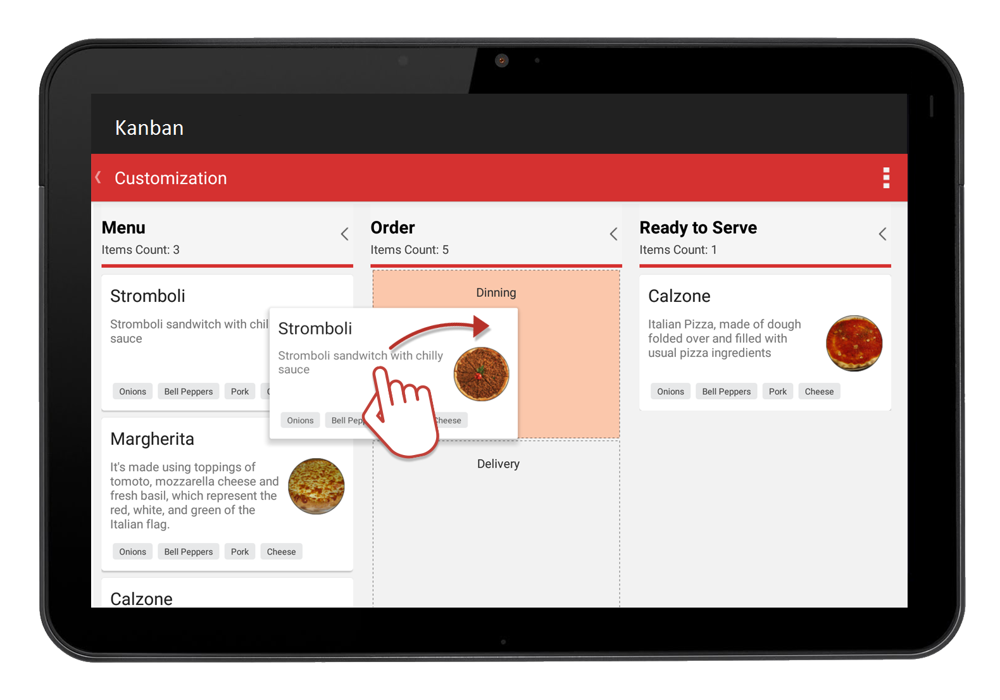

# Kanban

The Kanban control is an efficient way to visualize a workflow at each stage of completion.

## Key Features
* Visualize the workflow of any process.
* Limit a work in progress (WIP).
* Manage workflow transitions.
* Customize at a high level.
* Transition smoothly within processes.
