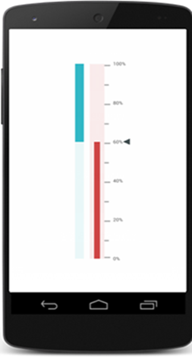

# Getting Started

This section explains how to create the LinearGauge and configure its properties.This section provides overview for working with LinearGauge for Xamarin.Android.

## Creating your First LinearGauge in Xamarin.Android

### Referencing Essential Studio Components in Your Solution

After installing Essential Studio for Xamarin, you can find all the required assemblies in the installation folders,

{Syncfusion Installed location}\Essential Studio\12.4.0.24\lib

Add the following assembly references to the Android project,

android\Syncfusion.SfLinearGauge.Andriod.dll

### Add and Configure the LinearGauge

The LinearGauge control is configured entirely in C# code.The following steps explain on how to create a LinearGauge and configure its elements,

* Add reference to LinearGauge



	using Com.Syncfusion.LinearGauge; 



* Create an instance of SfLinearGauge.



	SfLinearGauge linearGauge = new SfLinearGauge ();
	SetContentView(linearGauge);
	


* Configure the properties of LinearGauge



    linearGauge.SetOrientation (SfLinearGauge.Orientation.Vertical);



### Add Scales:

We will add one or more scale value to linear gauge. Before adding that scales we have to set 
Maximum and Minimum value to this.



	ObservableCollection<LinearScale> scales = new ObservableCollection<LinearScale> ();
	LinearScale outerScale = new LinearScale ();
	outerScale.Minimum = 0;
	outerScale.Maximum = 100;
	outerScale.ScaleBarSize = 50;
	outerScale.ScaleBarLength = 100;
	outerScale.Interval = 20;
	outerScale.ScaleBarColor = Color.ParseColor ("#FAECEC");
	outerScale.MinorTicksPerInterval = 2;
	outerScale.LabelFontSize = 17;
	outerScale.LabelColor = Color.ParseColor ("#545454");
	outerScale.LabelPostfix = "%";
			


Before adding scales to Array list, Add range value to Scale.

### Add Symbol Pointer:

We can point a value on scale in lineargauge by creating instance of SymbolPointer.



	ObservableCollection<LinearPointer> pointers = new ObservableCollection<LinearPointer> ();
	SymbolPointer outerScale_needlePointer = new SymbolPointer ();
	outerScale_needlePointer.Value = pointervalue;
	outerScale_needlePointer.StrokeWidth = 0;
	outerScale_needlePointer.Offset = 0.3f;
	outerScale_needlePointer.Color = Color.ParseColor ("#414D4F");
	pointers.Add (outerScale_needlePointer);
			


### Add a Bar Pointer:

Before adding that symbol and bar pointer into Scale’s pointer add value of that pointers.


		
	BarPointer rangePointer = new BarPointer ();
	rangePointer.Value = barvalue;
	rangePointer.Color = Color.ParseColor ("#CE4545");
	rangePointer.StrokeWidth = 20;
	pointers.Add (rangePointer);
	outerScale.Pointers = pointers;
			


### Add a Range:

We can improve the readability of data by including ranges that quickly display when values fall within specific ranges



    ObservableCollection<LinearRange> ranges = new ObservableCollection<LinearRange> ();
    LinearRange lowerRange = new LinearRange ();
	lowerRange.StartWidth = 30;
	lowerRange.EndWidth = 30;
	lowerRange.Color = Color.ParseColor ("#67d6db");
	lowerRange.StartValue = 0;
	lowerRange.EndValue = 50;
	lowerRange.Offset = -.3;
	ranges.Add (lowerRange);

	LinearRange higherRange = new LinearRange ();
	higherRange.StartWidth = 30;
	higherRange.EndWidth = 30;
	higherRange.Color = Color.ParseColor ("#32B8C6");
	higherRange.StartValue = 50;
	higherRange.EndValue = 100;
	higherRange.Offset = -.3;
	ranges.Add (higherRange);

	outerScale.Ranges = ranges;
	scales.Add (outerScale);
	linearGauge.Scales = scales;
			


