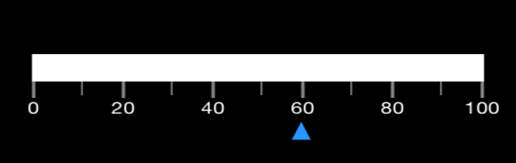

# Types of Value Indicator

This section explains about different types of Pointers available in SfLinearGauge.

## Through Bar Pointer

Barpointer is an accenting line or colored bar that is placed on the SfLinearGauge to mark the values. 





List<LinearPointer> pointers = new List<LinearPointer> ();
BarPointer rangePointer = new BarPointer ();
rangePointer.Value = 50;
rangePointer.Color = Color.FromRgb (206, 69, 69);
rangePointer.Thickness = 10;
pointers.Add (rangePointer);





## Through Symbol Pointer

In SymbolPointer, the value is pointed by a symbol on the scale. The Symbol Pointer class is derived from Pointer class. You can modify the symbol pointers size using the `StrokeWidth` property. The color of the symbol pointer is changed using the `Color` property.





List<LinearPointer> pointers = new List<LinearPointer> ();
//SymbolPointer
SymbolPointer symbolPointer = new SymbolPointer ();
symbolPointer.Value = 50;
symbolPointer.Offset = 0.0;
symbolPointer.Thickness = 3;
symbolPointer.Color = Color.FromRgb (65, 77, 79);
pointers.Add (symbolPointer);





