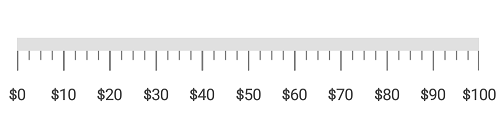

---

layout: post
title: Labels in Syncfusion LinearGauge control for Xamarin.Android
description:  Learn how to set labels in Syncfusion LinearGauge control
platform: Xamarin.Android
control: LinearGauge
documentation: ug

---

# Labels 

[`LinearScale`](https://help.syncfusion.com/cr/cref_files/xamarin-android/Syncfusion.SfGauge.Android~Com.Syncfusion.Gauges.SfLinearGauge.LinearScale.html) labels associate a numeric value with major scale tick marks.

## Label color customization

The label color can be changed using the [`LabelColor`](https://help.syncfusion.com/cr/cref_files/xamarin-android/Syncfusion.SfGauge.Android~Com.Syncfusion.Gauges.SfLinearGauge.LinearScale~LabelColor.html) property.



             SfLinearGauge linearGauge = new SfLinearGauge(this);
            linearGauge.SetBackgroundColor(Color.White);
            linearGauge.SetOrientation(SfLinearGauge.Orientation.Horizontal);
            LinearScale linearScale = new LinearScale();
            linearScale.ScaleBarColor = Color.ParseColor("#e0e0e0");
            linearScale.MajorTickSettings.StrokeWidth = 1;
            linearScale.MinorTickSettings.StrokeWidth = 1;
            linearScale.MajorTickSettings.Length = 20;
            linearScale.MajorTickSettings.Color = Color.Gray;
            linearScale.MinorTickSettings.Color = Color.Gray;
            linearScale.MinorTickSettings.Length = 10;
            linearScale.LabelColor = Color.Purple;
            linearGauge.Scales.Add(linearScale);
    


## Label font customization

The label font can be customized by using the [`LabelFontSize`](https://help.syncfusion.com/cr/cref_files/xamarin-android/Syncfusion.SfGauge.Android~Com.Syncfusion.Gauges.SfLinearGauge.LinearScale~LabelFontSize.html) and [`LabelFontStyle`](https://help.syncfusion.com/cr/cref_files/xamarin-android/Syncfusion.SfGauge.Android~Com.Syncfusion.Gauges.SfLinearGauge.LinearScale~LabelFontStyle.html) properties.



           SfLinearGauge linearGauge = new SfLinearGauge(this);
            linearGauge.SetBackgroundColor(Color.White);
            linearGauge.SetOrientation(SfLinearGauge.Orientation.Horizontal);
            LinearScale linearScale = new LinearScale();
            linearScale.LabelFontSize = 15;
            linearScale.ScaleBarColor = Color.ParseColor("#e0e0e0");
            linearScale.LabelFontStyle = Typeface.Create("Chiller", TypefaceStyle.Italic);
            linearScale.MajorTickSettings.StrokeWidth = 1;
            linearScale.MinorTickSettings.StrokeWidth = 1;
            linearScale.MajorTickSettings.Length = 20;
            linearScale.MajorTickSettings.Color = Color.Gray;
            linearScale.MinorTickSettings.Color = Color.Gray;
            linearScale.MinorTickSettings.Length = 10;
            linearScale.LabelColor = Color.ParseColor("#424242");
            linearGauge.Scales.Add(linearScale);
    


## Setting position for labels

The labels can be positioned far away from the ticks by using the [`LabelOffset`](https://help.syncfusion.com/cr/cref_files/xamarin-android/Syncfusion.SfGauge.Android~Com.Syncfusion.Gauges.SfLinearGauge.LinearScale~LabelOffset.html) property in pixel.



            SfLinearGauge linearGauge = new SfLinearGauge(this);
            linearGauge.SetBackgroundColor(Color.White);
            linearGauge.SetOrientation(SfLinearGauge.Orientation.Horizontal);
            LinearScale linearScale = new LinearScale();
            linearScale.ScaleBarColor = Color.ParseColor("#e0e0e0");
            linearScale.MajorTickSettings.StrokeWidth = 1;
            linearScale.MinorTickSettings.StrokeWidth = 1;
            linearScale.MajorTickSettings.Length = 20;
            linearScale.MajorTickSettings.Color = Color.Gray;
            linearScale.MinorTickSettings.Color = Color.Gray;
            linearScale.MinorTickSettings.Length = 10;
            linearScale.LabelColor = Color.ParseColor("#424242");
            linearScale.LabelOffset = 5;
            linearGauge.Scales.Add(linearScale);
   


### Setting postfix and prefix for labels

You can  postfix/prefix values to the scale labels using the [`LabelPostfix`](https://help.syncfusion.com/cr/cref_files/xamarin-android/Syncfusion.SfGauge.Android~Com.Syncfusion.Gauges.SfLinearGauge.LinearScale~LabelPostfix.html) and [`LabelPrefix`](https://help.syncfusion.com/cr/cref_files/xamarin-android/Syncfusion.SfGauge.Android~Com.Syncfusion.Gauges.SfLinearGauge.LinearScale~LabelPrefix.html) properties, respectively.

### Setting label postfix

The [`LabelPostfix`](https://help.syncfusion.com/cr/cref_files/xamarin-android/Syncfusion.SfGauge.Android~Com.Syncfusion.Gauges.SfLinearGauge.LinearScale~LabelPostfix.html) property allows you to postfix the values to scale labels.



             SfLinearGauge linearGauge = new SfLinearGauge(this);
            linearGauge.SetBackgroundColor(Color.White);
            linearGauge.SetOrientation(SfLinearGauge.Orientation.Horizontal);
            LinearScale linearScale = new LinearScale();
            linearScale.Minimum = 0;
            linearScale.Maximum = 1000;
            linearScale.Interval = 200;
            linearScale.ScaleBarColor = Color.ParseColor("#e0e0e0");
            linearScale.MajorTickSettings.StrokeWidth = 1;
            linearScale.MinorTickSettings.StrokeWidth = 1;
            linearScale.MajorTickSettings.Length = 20;
            linearScale.MajorTickSettings.Color = Color.Gray;
            linearScale.MinorTickSettings.Color = Color.Gray;
            linearScale.MinorTickSettings.Length = 10;
            linearScale.LabelColor = Color.ParseColor("#424242");
            linearScale.LabelPostfix = "K";
            linearGauge.Scales.Add(linearScale);
    


### Setting label prefix

The [`LabelPrefix`](https://help.syncfusion.com/cr/cref_files/xamarin-android/Syncfusion.SfGauge.Android~Com.Syncfusion.Gauges.SfLinearGauge.LinearScale~LabelPrefix.html) property allows you to prefix the values to scale labels.



            SfLinearGauge linearGauge = new SfLinearGauge(this);
            linearGauge.SetBackgroundColor(Color.White);
            linearGauge.SetOrientation(SfLinearGauge.Orientation.Horizontal);
            LinearScale linearScale = new LinearScale();
            linearScale.ScaleBarColor = Color.ParseColor("#e0e0e0");
            linearScale.LabelColor = Color.ParseColor("#424242");
            linearScale.LabelPrefix = "$";
            linearScale.MajorTickSettings.StrokeWidth = 1;
            linearScale.MinorTickSettings.StrokeWidth = 1;
            linearScale.MajorTickSettings.Length = 20;
            linearScale.MajorTickSettings.Color = Color.Gray;
            linearScale.MinorTickSettings.Color = Color.Gray;
            linearScale.MinorTickSettings.Length = 10;
            linearGauge.Scales.Add(linearScale);
    


## Labels visibility

Labels visibility can be customized using the [`ShowLabels`](https://help.syncfusion.com/cr/cref_files/xamarin-android/Syncfusion.SfGauge.Android~Com.Syncfusion.Gauges.SfLinearGauge.LinearScale~ShowLabels.html) property of linear scale.



           SfLinearGauge linearGauge = new SfLinearGauge(this);
            linearGauge.SetBackgroundColor(Color.White);
            linearGauge.SetOrientation(SfLinearGauge.Orientation.Horizontal);
            LinearScale linearScale = new LinearScale();
            linearScale.ScaleBarSize = 40;
            linearScale.ScaleBarColor = Color.ParseColor("#e0e0e0");
            linearScale.MajorTickSettings.Color = Color.Black;
            linearScale.MinorTickSettings.Color = Color.Black;
            linearScale.MajorTickSettings.Length = 40;
            linearScale.MinorTickSettings.Offset = -20;
            linearScale.MajorTickSettings.Offset = -40;
            linearScale.MajorTickSettings.StrokeWidth = 1;
            linearScale.MinorTickSettings.StrokeWidth = 1;
            linearScale.MinorTickSettings.Length = 20;
            linearScale.MinorTicksPerInterval = 4;
            linearScale.ShowLabels = false;
            linearGauge.Scales.Add(linearScale);
   


