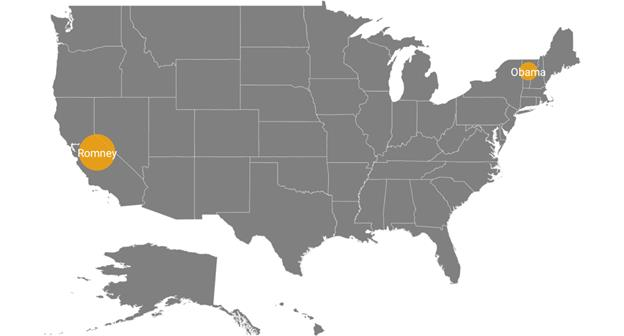
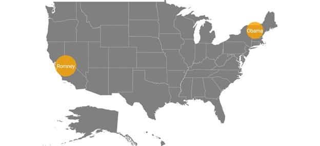

# Bubble marker

Bubbles in the maps control represents the underlying data values of the map. Bubbles are scattered throughout the map shapes that contain bound values.

## Bubble Data

Bubbles are included when the data binding and [`BubbleMarkerSetting`](https://help.syncfusion.com/cr/cref_files/xamarin-android/Syncfusion.SfMaps.Android~Com.Syncfusion.Maps.ShapeFileLayer~BubbleMarkerSetting.html) are set to the shape layers.

Below code snippet explains the data binding that is provided for bubble.





  ShapeFileLayer layer = new ShapeFileLayer();
  layer.Uri = "usa_state.shp";         
  layer.DataSource = viewModel.Data;
  layer.ShapeIdTableField = "STATE_NAME";
  layer.ShapeIdPath = "State";
  maps.Layers.Add(layer);

  public class ViewModel
  {
    public ObservableCollection<ElectionData> Data { get; set; }
    public ViewModel()
    {
       Data = new ObservableCollection<ElectionData>();
       Data.Add(new ElectionData("California", "Romney", 55));            
       Data.Add(new ElectionData("Vermont", "Obama", 3));
    }
  }





## Adding bubbles

To add bubbles to a map, the bubble marker setting should be added to the shape file layer.[`ShowBubbles`](https://help.syncfusion.com/cr/cref_files/xamarin-android/Syncfusion.SfMaps.Android~Com.Syncfusion.Maps.BubbleMarkerSetting~ShowBubbles.html) property should be enabled for the bubble to be visible.

[`ValuePath`](https://help.syncfusion.com/cr/cref_files/xamarin-android/Syncfusion.SfMaps.Android~Com.Syncfusion.Maps.BubbleMarkerSetting~ValuePath.html) represents the field value that is to be fetched from the data for each bubble.





  BubbleMarkerSetting bubbleSetting = new BubbleMarkerSetting();
  bubbleSetting.ShowBubbles = true;
  bubbleSetting.ValuePath = "Electors";
  layer.BubbleMarkerSetting = bubbleSetting;





## Bubble marker customization

### Color Customization

The fill color and opacity of the bubbles can be customized using the [`FillColor`](https://help.syncfusion.com/cr/cref_files/xamarin-android/Syncfusion.SfMaps.Android~Com.Syncfusion.Maps.BubbleMarkerSetting~FillColor.html) and [`Alpha`](https://help.syncfusion.com/cr/cref_files/xamarin-android/Syncfusion.SfMaps.Android~Com.Syncfusion.Maps.BubbleMarkerSetting~Alpha.html)  properties.





  BubbleMarkerSetting bubbleSetting = new BubbleMarkerSetting();
  bubbleSetting.ShowBubbles = true;
  bubbleSetting.ValuePath = "Electors";
  bubbleSetting.FillColor = Color.Orange;
  bubbleSetting.Alpha = 0.8f;
  layer.BubbleMarkerSetting = bubbleSetting;





### Size customization

Size of the bubbles depends on the data that is bound to the [`ValuePath`](https://help.syncfusion.com/cr/cref_files/xamarin-android/Syncfusion.SfMaps.Android~Com.Syncfusion.Maps.BubbleMarkerSetting~ValuePath.html) but the maximum and minimum size of the bubble can be customized using [`MaxSize`](https://help.syncfusion.com/cr/cref_files/xamarin-android/Syncfusion.SfMaps.Android~Com.Syncfusion.Maps.BubbleMarkerSetting~MaxSize.html) and [`MinSize`](https://help.syncfusion.com/cr/cref_files/xamarin-android/Syncfusion.SfMaps.Android~Com.Syncfusion.Maps.BubbleMarkerSetting~MinSize.html) properties.

I> [`ShowItems`](https://help.syncfusion.com/cr/cref_files/xamarin-android/Syncfusion.SfMaps.Android~Com.Syncfusion.Maps.ShapeFileLayer~ShowItems.html) should be enabled to display label on bubble marker.





  BubbleMarkerSetting bubbleSetting = new BubbleMarkerSetting();
  bubbleSetting.ShowBubbles = true;
  bubbleSetting.ValuePath = "Electors";
  bubbleSetting.FillColor = Color.Orange;
  bubbleSetting.Alpha = 0.8f;
  bubbleSetting.MinSize = 20;
  bubbleSetting.MaxSize = 25;
  layer.BubbleMarkerSetting = bubbleSetting;





Following snippet explains the complete code for adding bubbles along with its customization.





  SfMaps maps = new SfMaps(this);
  maps.SetBackgroundColor(Color.White);
  ShapeFileLayer layer = new ShapeFileLayer();
  layer.Uri = "usa_state.shp";
  layer.DataSource = viewModel.Data;
  layer.ShapeIdTableField = "STATE_NAME";
  layer.ShapeIdPath = "State";
  layer.ShowItems = true;
  maps.Layers.Add(layer);
            
  BubbleMarkerSetting bubbleSetting = new BubbleMarkerSetting();
  bubbleSetting.ShowBubbles = true;
  bubbleSetting.MinSize = 20;
  bubbleSetting.MaxSize = 25;
  bubbleSetting.FillColor = Color.Orange;
  bubbleSetting.Alpha = 0.8f;
  bubbleSetting.ValuePath = "Electors";
  layer.BubbleMarkerSetting = bubbleSetting;

  ShapeSetting shapeSetting = new ShapeSetting();
  shapeSetting.ShapeValuePath = "Candidate";
  layer.ShapeSettings = shapeSetting;

  SetContentView(maps);

  public class ViewModel
  {
     public ObservableCollection<ElectionData> Data { get; set; }
     public ViewModel()
     {
         Data = new ObservableCollection<ElectionData>();
         Data.Add(new ElectionData("California", "Romney", 55));            
         Data.Add(new ElectionData("Vermont", "Obama", 3));
     }
  }





