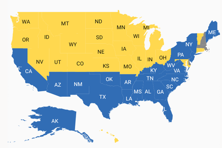
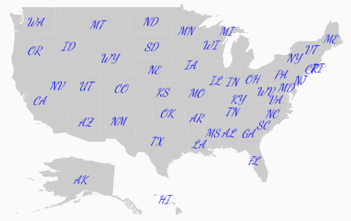

# Data Labels

Data labels are used to display the values of shapes.

## Adding data labels

 The [`ShowItems`](https://help.syncfusion.com/cr/cref_files/xamarin-android/Syncfusion.SfMaps.Android~Com.Syncfusion.Maps.ShapeFileLayer~ShowItems.html) property, which is a boolean property, displays or hides the data labels in shapes. Set the [`ShapeValuePath`](https://help.syncfusion.com/cr/cref_files/xamarin-android/Syncfusion.SfMaps.Android~Com.Syncfusion.Maps.ShapeSetting~ShapeValuePath.html) property to get the data labels bound to each shape.





             SfMaps maps = new SfMaps(this);
         
            ShapeFileLayer layer = new ShapeFileLayer();

            layer.Uri = "usa_state.shp";

            layer.ShowItems = true;

            layer.ShapeSettings.ShapeFill = Color.LightGray;

            layer.DataSource = GetDataSource();

            layer.ShapeIdPath = "Name";

            layer.ShapeIdTableField = "STATE_NAME";

            layer.ShapeSettings.ShapeValuePath = "Type";

            maps.Layers.Add(layer);

            SetContentView(maps);





## Setting contrast color

Based on the background color of the shapes, contrast color will be applied to data labels.





             SfMaps maps = new SfMaps(this);
         
            ShapeFileLayer layer = new ShapeFileLayer();

            layer.Uri = "usa_state.shp";

            layer.ShowItems = true;

            layer.DataSource = GetDataSource();

            layer.ShapeIdPath = "Name";

            layer.ShapeIdTableField = "STATE_NAME";

            layer.ShapeSettings.ShapeValuePath = "Type";

            layer.ShapeSettings.ShapeColorValuePath = "Count";

            RangeColorMapping rangeColorMapping = new RangeColorMapping();

            rangeColorMapping.From = 0;

            rangeColorMapping.To = 25;

            rangeColorMapping.Color = Color.ParseColor("#FFD84F");

            RangeColorMapping rangeColorMapping1 = new RangeColorMapping();

            rangeColorMapping1.From = 25;

            rangeColorMapping1.To = 50;

            rangeColorMapping1.Color = Color.ParseColor("#316DB5");

            layer.ShapeSettings.ColorMapping.Add(rangeColorMapping);

            layer.ShapeSettings.ColorMapping.Add(rangeColorMapping1);

            DataLabelSetting dataLabelSetting = new DataLabelSetting();

            dataLabelSetting.SmartLabelMode = IntersectAction.Trim;

            layer.DataLabelSettings = dataLabelSetting;

            maps.Layers.Add(layer);

            SetContentView(maps);





## Customizing data labels

Data labels can be customized using the [`DataLabelSetting`](https://help.syncfusion.com/cr/cref_files/xamarin-android/Syncfusion.SfMaps.Android~Com.Syncfusion.Maps.ShapeFileLayer~DataLabelSettings.html) property in shape file layer. The typeface, color, and text size can be customized using the [`Typeface`](https://help.syncfusion.com/cr/cref_files/xamarin-android/Syncfusion.SfMaps.Android~Com.Syncfusion.Maps.DataLabelSetting~Typeface.html), [`TextColor`](https://help.syncfusion.com/cr/cref_files/xamarin-android/Syncfusion.SfMaps.Android~Com.Syncfusion.Maps.DataLabelSetting~TextColor.html), and [`TextSize`](https://help.syncfusion.com/cr/cref_files/xamarin-android/Syncfusion.SfMaps.Android~Com.Syncfusion.Maps.DataLabelSetting~TextSize.html) properties.





             SfMaps maps = new SfMaps(this);
         
            ShapeFileLayer layer = new ShapeFileLayer();

            layer.Uri = "usa_state.shp";

            layer.ShowItems = true;

            layer.ShapeSettings.ShapeFill = Color.LightGray;

            layer.DataSource = GetDataSource();

            layer.ShapeIdPath = "Name";

            layer.ShapeIdTableField = "STATE_NAME";

            layer.ShapeSettings.ShapeValuePath = "Type";

            DataLabelSetting dataLabelSetting = new DataLabelSetting();

            dataLabelSetting.TextColor = Color.Blue;

            dataLabelSetting.Typeface = Typeface.Create("cursive", TypefaceStyle.Italic);

            dataLabelSetting.TextSize = 12;

            layer.DataLabelSettings = dataLabelSetting;

            maps.Layers.Add(layer);

            SetContentView(maps);





## To smartly align data labels

The [`SmartLabelMode`](https://help.syncfusion.com/cr/cref_files/xamarin-android/Syncfusion.SfMaps.Android~Com.Syncfusion.Maps.DataLabelSetting~SmartLabelMode.html) property aligns the labels smartly within shape boundaries and avoids labels overlapping. Labels can be customized using the `Hide`, `Trim`, and `None` options.





            SfMaps maps = new SfMaps(this);
         
            ShapeFileLayer layer = new ShapeFileLayer();

            layer.Uri = "usa_state.shp";

            layer.ShowItems = true;

            layer.DataSource = GetDataSource();

            layer.ShapeIdPath = "Name";

            layer.ShapeIdTableField = "STATE_NAME";

            layer.ShapeSettings.ShapeValuePath = "Name";

            layer.ShapeSettings.ShapeColorValuePath = "Count";

            layer.ShapeSettings.ShapeFill = Color.LightGray;

            DataLabelSetting dataLabelSetting = new DataLabelSetting();

            dataLabelSetting.SmartLabelMode = IntersectAction.Trim;

            layer.DataLabelSettings = dataLabelSetting;

            maps.Layers.Add(layer);

            SetContentView(maps);





## To avoid overlap in data labels

The [`IntersectionAction`](https://help.syncfusion.com/cr/cref_files/xamarin-android/Syncfusion.SfMaps.Android~Com.Syncfusion.Maps.DataLabelSetting~IntersectionAction.html) property aligns labels that overlap. Labels can be customized using the `Hide`, `Trim`, and `None` options. First, set the [`SmartLabelMode`](https://help.syncfusion.com/cr/cref_files/xamarin-android/Syncfusion.SfMaps.Android~Com.Syncfusion.Maps.DataLabelSetting~SmartLabelMode.html) property to `None`.





            SfMaps maps = new SfMaps(this);
         
            ShapeFileLayer layer = new ShapeFileLayer();

            layer.Uri = "usa_state.shp";

            layer.ShowItems = true;

            layer.DataSource = GetDataSource();

            layer.ShapeIdPath = "Name";

            layer.ShapeIdTableField = "STATE_NAME";

            layer.ShapeSettings.ShapeValuePath = "Name";

            layer.ShapeSettings.ShapeColorValuePath = "Count";

            layer.ShapeSettings.ShapeFill = Color.LightGray;

            DataLabelSetting dataLabelSetting = new DataLabelSetting();

            dataLabelSetting.IntersectionAction = IntersectAction.Hide;

            dataLabelSetting.SmartLabelMode = IntersectAction.None;

            layer.DataLabelSettings = dataLabelSetting;

            maps.Layers.Add(layer);

            SetContentView(maps);





   