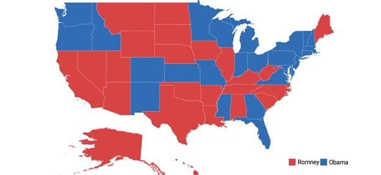

# Legend

A legend is a key used on a map that contains swatches of symbols with descriptions. A legend interprets what the map displays; it can be represented in various colors, shapes, or other identifiers based on the data. It gives a breakdown of what each symbol represents throughout the map.
Legends can be added with the help of [`LegendSetting`](https://help.syncfusion.com/cr/cref_files/xamarin-android/Syncfusion.SfMaps.Android~Com.Syncfusion.Maps.ShapeFileLayer~LegendSetting.html) in the shape file layer.

## Visibility

The legends can be made visible by setting the [`ShowLegend`](https://help.syncfusion.com/cr/cref_files/xamarin-android/Syncfusion.SfMaps.Android~Com.Syncfusion.Maps.LegendSetting~ShowLegend.html) property in [`LegendSetting`](https://help.syncfusion.com/cr/cref_files/xamarin-android/Syncfusion.SfMaps.Android~Com.Syncfusion.Maps.LegendSetting.html) class to true.





  LegendSetting legendSetting = new LegendSetting();
  legendSetting.ShowLegend = true;
  layer.LegendSetting = legendSetting;





## Legend position

Based on the margin values of x and y-axes, the legends can be positioned using the [`LegendPosition`](https://help.syncfusion.com/cr/cref_files/xamarin-android/Syncfusion.SfMaps.Android~Com.Syncfusion.Maps.LegendSetting~LegendPosition.html) property of [`LegendSetting`](https://help.syncfusion.com/cr/cref_files/xamarin-android/Syncfusion.SfMaps.Android~Com.Syncfusion.Maps.LegendSetting.html) class.





  LegendSetting legendSetting = new LegendSetting();
  legendSetting.ShowLegend = true;
  legendSetting.LegendPosition = new Point(75, 90);
  layer.LegendSetting = legendSetting;





## Icon customization

The icon size of a legend can be customized using the [`IconHeight`](https://help.syncfusion.com/cr/cref_files/xamarin/sfmaps/Syncfusion.SfMaps.XForms~Syncfusion.SfMaps.XForms.MapLegendSetting~IconSize.html#) and [`IconWidth`](https://help.syncfusion.com/cr/cref_files/xamarin-android/Syncfusion.SfMaps.Android~Com.Syncfusion.Maps.LegendSetting~IconWidth.html) properties.





  LegendSetting legendSetting = new LegendSetting();
  legendSetting.ShowLegend = true;
  legendSetting.LegendPosition = new Point(75, 90);
  legendSetting.IconHeight = 20;
  legendSetting.IconWidth = 20;
  layer.LegendSetting = legendSetting;





## Legend label

[`LegendLabel`](https://help.syncfusion.com/cr/cref_files/xamarin-android/Syncfusion.SfMaps.Android~Com.Syncfusion.Maps.ColorMapping~LegendLabel.html) provides an information about the map content. It is specified under color mapping.





  EqualColorMapping colorMapping = new EqualColorMapping();
  colorMapping.Color = Color.ParseColor("#D84444");
  colorMapping.LegendLabel = "Romney";
  colorMapping.Value = "Romney";

  EqualColorMapping colorMapping1 = new EqualColorMapping();
  colorMapping1.Color = Color.ParseColor("#316DB5");
  colorMapping1.LegendLabel = "Obama";
  colorMapping1.Value = "Obama";





The following code snippet explains the complete code for adding legend along with its customization.





  SfMaps maps = new SfMaps(this);
  maps.SetBackgroundColor(Color.White);

  ShapeFileLayer layer = new ShapeFileLayer();
  layer.Uri = "usa_state.shp";
  layer.DataSource = viewModel.Data;
  layer.ShapeIdTableField = "STATE_NAME";
  layer.ShapeIdPath = "State";
  maps.Layers.Add(layer);

  LegendSetting legendSetting = new LegendSetting();
  legendSetting.ShowLegend = true;
  legendSetting.LegendPosition = new Point(75, 90);
  legendSetting.IconHeight = 20;
  legendSetting.IconWidth = 20;
  layer.LegendSetting = legendSetting;

  EqualColorMapping colorMapping = new EqualColorMapping();
  colorMapping.Color = Color.ParseColor("#D84444");
  colorMapping.LegendLabel = "Romney";
  colorMapping.Value = "Romney";

  EqualColorMapping colorMapping1 = new EqualColorMapping();
  colorMapping1.Color = Color.ParseColor("#316DB5");
  colorMapping1.LegendLabel = "Obama";
  colorMapping1.Value = "Obama";

  ShapeSetting shapeSetting = new ShapeSetting();
  shapeSetting.ShapeValuePath = "Candidate";
  shapeSetting.ShapeColorValuePath = "Candidate";
  shapeSetting.ColorMapping.Add(colorMapping);
  shapeSetting.ColorMapping.Add(colorMapping1);

  layer.ShapeSettings = shapeSetting;           
  SetContentView(maps);





