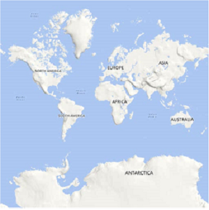
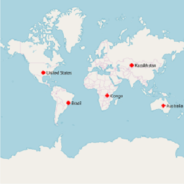

# Map Providers

The maps control supports map providers such as OpenStreetMap and Bing Maps that can be added to an imagery layer in maps.

## OpenStreetMap

The OpenStreetMap (OSM) is a world map; it was built by a community of mappers. It is free to use under an open license. This allows you view geographical data in a collaborative way from anywhere on the earth. The OSM provides small tile images based on your requests and combines them into a single image to display the map area in the maps control. 

### Adding OSM in maps

The maps control uses `imagery layer` to display the tile images from the OSM service. To use `OSM`, add an imagery layer in maps’ layers collection.





        SfMaps maps = new SfMaps(this);
        ImageryLayer layer = new ImageryLayer();
        maps.Layers.Add(layer);





N> Both the [`ShapeFileLayer`](https://help.syncfusion.com/cr/cref_files/xamarin-android/Syncfusion.SfMaps.Android~Com.Syncfusion.Maps.ShapeFileLayer.html) and `ImageryLayer` have been derived commonly from MapsLayer.

## Bing Maps

The Bing Maps is a world map owned by Microsoft. As OSM, Bing Maps also provides map tile images based on your requests and combines them into a single image to display the map area. To use `Bing maps`, set the `LayerType` property of ImageryLayer to “Bing”. Then, set the Bing Maps key, which is obtained from [Bing Maps Key](https://www.microsoft.com/en-us/maps/create-a-bing-maps-key).





        SfMaps maps = new SfMaps(this);
        ImageryLayer layer = new ImageryLayer();
        layer.LayerType = LayerType.Bing;
        layer.BingMapKey = "Your bing map key";
        maps.Layers.Add(layer);





N> The `LayerType` property of `ImageryLayer` provides support to `OSM` and `Bing Maps`. The default value of the `LayerType` property is OSM.

## BingMapStyle

The ImageryLayer provides support to the following types of Bing Maps:

* `Road`
* `Aerial`
* `AerialWithLabels`

The desired style for the Bing Maps can be set using the `BingMapStyle` property of ImageryLayer. The default value of `BingMapStyle` is "Road".

### Road

The Road view displays the default map view of roads, buildings, and geography. The default value of the `BingMapStyle` property of imagery layer is "Road".

### Aerial

The Aerial view displays the satellite images to highlight the roads and major landmarks for easy identification. The aerial view can be applied to maps by setting the `BingMapStyle` to "Aerial".





    SfMaps maps = new SfMaps(this);
    ImageryLayer layer = new ImageryLayer();
    layer.LayerType = LayerType.Bing;
    layer.BingMapStyle = BingMapStyle.Aerial;
    layer.BingMapKey = "Your bing map key ";
    maps.Layers.Add(layer);





## AerialWithLabel

The AerialWithLabel view displays the Aerial map with labels for continent, country, ocean, etc. This view can be applied to maps by setting the `BingMapStyle` to "AerialWithLabel".





    SfMaps maps = new SfMaps(this);
    ImageryLayer layer = new ImageryLayer();
    layer.LayerType = LayerType.Bing;
    layer.BingMapStyle = BingMapStyle.AerialWithLabels;
    layer.BingMapKey = "Your bing map key ";
    maps.Layers.Add(layer);





## Zooming and panning

The maps control provides interactive zooming and panning supports to OSM and Bing Maps.

Zooming helps you get a closer look of an area on maps for in-depth analysis. Panning helps you move a map around to focus the targeted area. You can perform zooming and panning with the pinching gesture in a map area.

## ResetOnDoubleTap

The ImageryLayer provides support to reset the maps to the default view when you double tap the imagery layer by setting the `ResetOnDoubleTap` property to true. The default value of this property is true. This behavior can be restricted by setting the `ResetOnDoubleTap` property to false.





        SfMaps maps = new SfMaps(this);
        ImageryLayer layer = new ImageryLayer();
        layer.ResetOnDoubleTap = true;
        maps.Layers.Add(layer);





## GeoCoordinates

The `GeoCoordinates` property allows you view the desired area at the center on loading. By default, the `GeoCoordinates` value is (0,0). So, the latitude value "0" and longitude value "0" are shown at the center.





        SfMaps maps = new SfMaps(this);
        maps.ZoomLevel = 2;
        ImageryLayer layer = new ImageryLayer();
        layer.GeoCoordinates = new PointF(69.07f, -37.08f);
        maps.Layers.Add(layer);









        SfMaps maps = new SfMaps(this);
        maps.ZoomLevel = 2;
        ImageryLayer layer = new ImageryLayer();
        layer.GeoCoordinates = new PointF(0,0);
        maps.Layers.Add(layer);





## Markers

As [`ShapeFileLayer`](https://help.syncfusion.com/cr/cref_files/xamarin-android/Syncfusion.SfMaps.Android~Com.Syncfusion.Maps.ShapeFileLayer.html), markers also can be added to imagery layer. Markers can be customized using the `MarkerSettings` property in imagery layer.
The detailed explanation of marker and its customization have been provided in Markers section.





            SfMaps maps = new SfMaps(this);          
            ImageryLayer layer = new ImageryLayer();        
            layer.MarkerSetting = new MarkerSetting();
            layer.MarkerSetting.MarkerIconColor = Color.Red;
            layer.MarkerSetting.MarkerIcon = MarkerIcon.Diamond;
            layer.MarkerSetting.IconSize = 13;
            MapMarker marker1 = new MapMarker();
            marker1.Label = "United States";
            marker1.Latitude = 40;
            marker1.Longitude = -101;
            layer.Markers.Add(marker1);
            MapMarker marker2 = new MapMarker();
            marker2.Label = "Brazil";
            marker2.Latitude = -15.7833;
            marker2.Longitude = -52;
            layer.Markers.Add(marker2);
            MapMarker marker3 = new MapMarker();
            marker3.Label = "Congo";
            marker3.Latitude = -1.6;
            marker3.Longitude = 24.4;
            layer.Markers.Add(marker3);
            MapMarker marker4 = new MapMarker();
            marker4.Label = "Kazakhstan";
            marker4.Latitude = 49.9;
            marker4.Longitude = 72.23;
            layer.Markers.Add(marker4);
            MapMarker marker5 = new MapMarker();
            marker5.Label = "Australia";
            marker5.Latitude = -20.54;
            marker5.Longitude = 134.10;
            layer.Markers.Add(marker5);
            maps.Layers.Add(layer);

            SetContentView(maps);





## Cache tiles in application memory

The [`CanCacheTiles`](https://help.syncfusion.com/cr/cref_files/xamarin-android/Syncfusion.SfMaps.Android~Com.Syncfusion.Maps.ImageryLayer~CanCacheTiles.html) property used to decide whether the tiles should be cached or not.





       ImageryLayer imageryLayer = new ImageryLayer();

       imageryLayer.CanCacheTiles = true;





## Delete the tiles from cache

The [`DeleteTilesFromCache`](https://help.syncfusion.com/cr/cref_files/xamarin-android/Syncfusion.SfMaps.Android~Com.Syncfusion.Maps.ImageryLayer~DeleteTilesFromCache.html) method used to delete the cache stored in the applications.





       SfMaps maps = new SfMaps(this);          
       ImageryLayer imageryLayer = new ImageryLayer();
       imageryLayer.DeleteTilesFromCache();





## Events

[`ZoomLevelChanging`](https://help.syncfusion.com/cr/cref_files/xamarin-android/Syncfusion.SfMaps.Android~Com.Syncfusion.Maps.ImageryLayer~ZoomLevelChanging_EV.html) event triggers when zoom level changed. Following arguments can be get from the ZoomLevelChanging event .

* [`Cancel`](https://help.syncfusion.com/cr/cref_files/xamarin-android/Syncfusion.SfMaps.Android~Com.Syncfusion.Maps.ZoomLevelChangingEventArgs~Cancel.html) - Used to cancel the zooming.

* [`PreviousLevel`](https://help.syncfusion.com/cr/cref_files/xamarin-android/Syncfusion.SfMaps.Android~Com.Syncfusion.Maps.ZoomLevelChangingEventArgs~PreviousLevel.html) - Returns the previous level after the zooming.

* [`CurrentLevel`](https://help.syncfusion.com/cr/cref_files/xamarin-android/Syncfusion.SfMaps.Android~Com.Syncfusion.Maps.ZoomLevelChangingEventArgs~CurrentLevel.html) - Returns the current level to be zoomed.





        SfMaps maps = new SfMaps(this);          
        ImageryLayer imageryLayer = new ImageryLayer();
        imageryLayer.ZoomLevelChanging += ImageryLayer_ZoomLevelChanging;
		maps.Layers.Add(imageryLayer);
        SetContentView(maps);
		
        private void ImageryLayer_ZoomLevelChanging(object sender, ZoomLevelChangingEventArgs e)
        {
            if (e.PreviousLevel == 10) // Returns the previous zoom level
            {
                e.Cancel = true; // Cancels the zooming event
                var CurrentLevel = e.CurrentLevel; // Returns the current zoomed level
            }
        }





