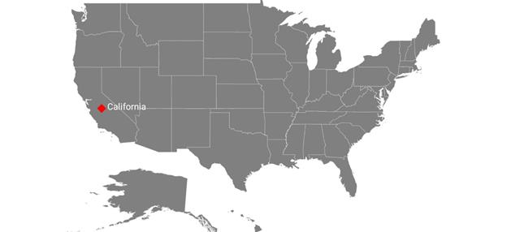
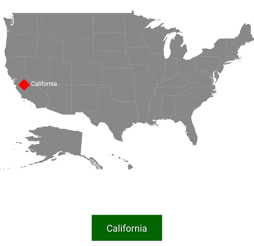

# Markers

Markers provide some messages on the map.

Markers are set to map by using the following two ways:

1. Adding marker objects to map.
2. Defining custom marker.

## Adding marker

Any number of markers can be added to the shape file layers using the [`Markers`](https://help.syncfusion.com/cr/cref_files/xamarin-android/Syncfusion.SfMaps.Android~Com.Syncfusion.Maps.MapLayer~Markers.html) property. Each marker object contains the following list of properties:

[`Label`](https://help.syncfusion.com/cr/cref_files/xamarin-android/Syncfusion.SfMaps.Android~Com.Syncfusion.Maps.MapMarker~Label.html): Text that is used to display information.

[`Latitude`](https://help.syncfusion.com/cr/cref_files/xamarin-android/Syncfusion.SfMaps.Android~Com.Syncfusion.Maps.MapMarker~Latitude.html): Latitude point that specifies the y-axis position of the marker.

[`Longitude`](https://help.syncfusion.com/cr/cref_files/xamarin-android/Syncfusion.SfMaps.Android~Com.Syncfusion.Maps.MapMarker~Longitude.html): Longitude point that specifies the x-axis position of the marker.





  SfMaps maps = new SfMaps(this);
  maps.SetBackgroundColor(Color.White);

  ShapeFileLayer layer = new ShapeFileLayer();
  layer.Uri = "usa_state.shp";

  maps.Layers.Add(layer);

  MapMarker marker = new MapMarker();
  marker.Label = "California";
  marker.Latitude = 37;
  marker.Longitude = -120;
  layer.Markers.Add(marker);
  SetContentView(maps);





## Marker customization

A map marker can be customized using the [`MarkerSetting`](https://help.syncfusion.com/cr/cref_files/xamarin-android/Syncfusion.SfMaps.Android~Com.Syncfusion.Maps.MapLayer~MarkerSetting.html) property in shape file layer.

### Icon customization

Shape, size, and color of a marker icon can be customized using the [`MarkerIcon`](https://help.syncfusion.com/cr/cref_files/xamarin-android/Syncfusion.SfMaps.Android~Com.Syncfusion.Maps.MarkerSetting~MarkerIcon.html) , [`IconSize`](https://help.syncfusion.com/cr/cref_files/xamarin-android/Syncfusion.SfMaps.Android~Com.Syncfusion.Maps.MarkerSetting~IconSize.html), and [`MarkerIconColor`](https://help.syncfusion.com/cr/cref_files/xamarin-android/Syncfusion.SfMaps.Android~Com.Syncfusion.Maps.MarkerSetting~MarkerIconColor.html) properties. 

### Label customization

A marker label’s color and font style can be customized using the [`LabelColor`](https://help.syncfusion.com/cr/cref_files/xamarin-android/Syncfusion.SfMaps.Android~Com.Syncfusion.Maps.MarkerSetting~LabelColor.html)  and [`LabelFontStyle`](https://help.syncfusion.com/cr/cref_files/xamarin-android/Syncfusion.SfMaps.Android~Com.Syncfusion.Maps.MarkerSetting~LabelFontStyle.html) properties.

The following code explains the marker customization.





  SfMaps maps = new SfMaps(this);

  maps.SetBackgroundColor(Color.White);

  ShapeFileLayer layer = new ShapeFileLayer();

  layer.Uri = "usa_state.shp";

  maps.Layers.Add(layer);

  MapMarker marker = new MapMarker();

  marker.Label = "California";

  marker.Latitude = 37;

  marker.Longitude = -120;

  layer.Markers.Add(marker);

  MarkerSetting markerSetting = new MarkerSetting();

  markerSetting.MarkerIconColor = Color.Red;

  markerSetting.IconSize = 25;

  markerSetting.MarkerIcon = MarkerIcon.Diamond;

  markerSetting.LabelColor = Color.White;

  markerSetting.LabelFontStyle = Typeface.Default;

  layer.MarkerSetting = markerSetting;

  SetContentView(maps);





## Custom marker

Maps provide support for defining the custom marker by inheriting the MapMarker class.





  SfMaps maps = new SfMaps(this);
  maps.SetBackgroundColor(Color.White); 

  ShapeFileLayer layer = new ShapeFileLayer();   
  layer.Uri = "usa_state.shp";

  CustomMarker marker = new CustomMarker(this);
  marker.Label = "California";
  marker.Latitude = 37;
  marker.Longitude = -120;    
  layer.Markers.Add(marker); 

  maps.Layers.Add(layer);
  SetContentView(maps);





Below snippet explains on how to define custom marker with image support. 





 public class CustomMarker : MapMarker
 {
    Android.Content.Context context;
    public CustomMarker(Android.Content.Context con)
    {
       context = con;
    }

    public override void DrawMarker(PointF p0, Canvas p1)
    {
        float density = context.Resources.DisplayMetrics.Density / 1.5f;
        Bitmap bitmap = BitmapFactory.DecodeResource(context.Resources, Resource.Drawable.pin);
        p1.DrawBitmap(bitmap, (float)p0.X - (12 * density), (float)p0.Y - (35 * density), new Paint());
    }
 }





## Events

[`MarkerSelected`](https://help.syncfusion.com/cr/cref_files/xamarin-android/Syncfusion.SfMaps.Android~Com.Syncfusion.Maps.MapLayer~MarkerSelected_EV.html) event is triggered when the marker is selected.
Argument contains the [`MapMarker`](https://help.syncfusion.com/cr/cref_files/xamarin-android/Syncfusion.SfMaps.Android~Com.Syncfusion.Maps.MapMarker.html) which gives the information about the marker.





 layer.MarkerSelected += Layer_MarkerSelected;

 private void Layer_MarkerSelected(object sender, ShapeFileLayer.MarkerSelectedEventArgs e)
 {
     MapMarker marker = (MapMarker)e.P0;
     if (marker != null)
     {
         if (toast != null)
         {
             toast.Cancel();
         }
         toast = Toast.MakeText(this, marker.Label, ToastLength.Short);
         toast.View.SetBackgroundColor(Color.DarkGreen);
         toast.Show();
    }
 }





