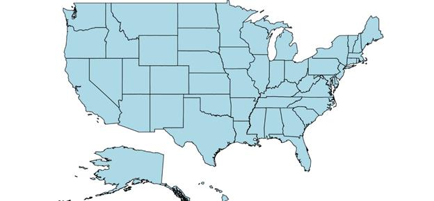
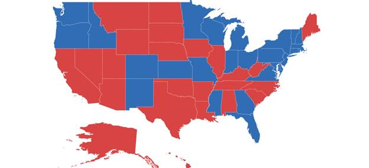

# Shape customization

## Shape settings

The shape settings define the basic customization options for shapes in the map.

A shape’s fill, stroke, and stroke thickness can be customized using the following properties:

[`ShapeFill`](https://help.syncfusion.com/cr/cref_files/xamarin-android/Syncfusion.SfMaps.Android~Com.Syncfusion.Maps.ShapeSetting~ShapeFill.html): Sets the fill color for the shapes in a map. 

[`ShapeStroke`](https://help.syncfusion.com/cr/cref_files/xamarin-android/Syncfusion.SfMaps.Android~Com.Syncfusion.Maps.ShapeSetting~ShapeStroke.html): Sets the border color for the shape in a map.

[`ShapeStrokeThickess`](https://help.syncfusion.com/cr/cref_files/xamarin-android/Syncfusion.SfMaps.Android~Com.Syncfusion.Maps.ShapeSetting~ShapeStrokeThickess.html): Sets the border thickness for the shape in a map. 

Refer to the following code snippet.





  ShapeSetting shapeSetting = new ShapeSetting();
  shapeSetting.ShapeFill = Color.LightBlue;
  shapeSetting.ShapeStroke = Color.Black;
  shapeSetting.ShapeStrokeThickess = 2;
  layer.ShapeSettings = shapeSetting;





To customize the shapes based on the bound values, use the following properties:

[`ShapeValuePath`](https://help.syncfusion.com/cr/cref_files/xamarin-android/Syncfusion.SfMaps.Android~Com.Syncfusion.Maps.ShapeSetting~ShapeValuePath.html): Field value that has to be bound for each shape.

[`ShapeColorValuePath`](https://help.syncfusion.com/cr/cref_files/xamarin-android/Syncfusion.SfMaps.Android~Com.Syncfusion.Maps.ShapeSetting~ShapeColorValuePath.html): Field value that has to be bound to determine the color.





  SfMaps maps = new SfMaps(this);
  maps.SetBackgroundColor(Color.White);

  ShapeFileLayer layer = new ShapeFileLayer();
  layer.Uri = "usa_state.shp";
  layer.DataSource = viewModel.Data;
  layer.ShapeIdTableField = "STATE_NAME";
  layer.ShapeIdPath = "State";
  maps.Layers.Add(layer);

  EqualColorMapping colorMapping = new EqualColorMapping();
  colorMapping.Color = Color.ParseColor("#D84444");
  colorMapping.LegendLabel = "Romney";
  colorMapping.Value = "Romney";

  EqualColorMapping colorMapping1 = new EqualColorMapping();
  colorMapping1.Color = Color.ParseColor("#316DB5");
  colorMapping1.LegendLabel = "Obama";
  colorMapping1.Value = "Obama";

  ShapeSetting shapeSetting = new ShapeSetting();
  shapeSetting.ShapeValuePath = "Candidate";
  shapeSetting.ShapeColorValuePath = "Candidate";
  shapeSetting.ColorMapping.Add(colorMapping);
  shapeSetting.ColorMapping.Add(colorMapping1);
  layer.ShapeSettings = shapeSetting;

  SetContentView(maps);





## Selected shapes settings

Selection can be enabled with the help of [`EnableSelection`](https://help.syncfusion.com/cr/cref_files/xamarin-android/Syncfusion.SfMaps.Android~Com.Syncfusion.Maps.ShapeFileLayer~EnableSelection.html) property in shape file layer. Selected shape can be customized using the [`SelectedShapeColor`](https://help.syncfusion.com/cr/cref_files/xamarin-android/Syncfusion.SfMaps.Android~Com.Syncfusion.Maps.ShapeSetting~SelectedShapeColor.html) property.





  ShapeFileLayer layer = new ShapeFileLayer();
  layer.Uri = "usa_state.shp";
  layer.DataSource = viewModel.Data;
  layer.ShapeIdTableField = "STATE_NAME";
  layer.ShapeIdPath = "State";
  layer.EnableSelection = true;
  maps.Layers.Add(layer);                     

  ShapeSetting shapeSetting = new ShapeSetting();
  shapeSetting.SelectedShapeColor = Color.DarkGreen;  
  layer.ShapeSettings = shapeSetting;    





## Events

[`ShapeSelected`](https://help.syncfusion.com/cr/cref_files/xamarin-android/Syncfusion.SfMaps.Android~Com.Syncfusion.Maps.ShapeFileLayer~ShapeSelected_EV.html) event gets triggered when the map shapes are selected.
Corresponding model data is passed as an argument.





  layer.EnableSelection = true;
  layer.ShapeSelected += Layer_ShapeSelected;

  private void Layer_ShapeSelected(object sender, ShapeFileLayer.ShapeSelectedEventArgs e)
  {
      if (toast != null)
         toast.Cancel();

      var layer = sender as ShapeFileLayer;
      int index = (int) layer.SelectedItems[0];
      var dataSource = layer.DataSource as ObservableCollection<ElectionData>;
      var data = dataSource[index] as ElectionData;
      toast = Toast.MakeText(this, data.State + "\n" + data.Candidate, ToastLength.Short);
      toast.View.SetBackgroundColor(Color.DarkGreen);            
      toast.Show();  
  }
 




