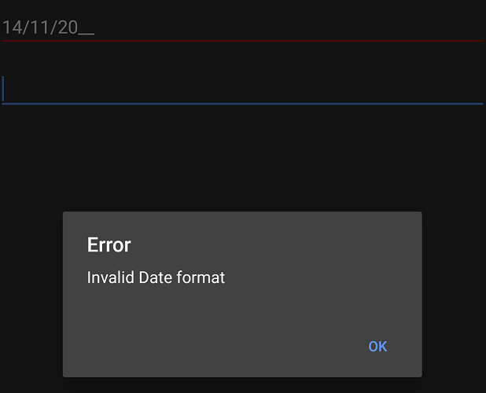
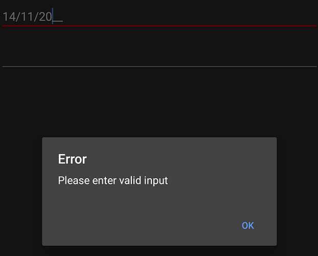

# Events

The `SfMaskedEdit` control exposes the following events:

* `ValueChanged`: Occurs when the value of the `Value` property changes.
* `MaskInputRejected`: Occurs when a character is rejected by the input mask.

## ValueChanged Event

The `ValueChanged` event occurs when the value of the `Value` property changes, either by entering a valid input character or by setting the value programmatically through C# code. The event arguments are of type `ValueChangedEventArgs` and expose the following property:

* `Value`: A read-only property that contains the updated value of the `Value` property of `SfMaskedEdit`.

> **Note:** Valid input characters are updated to the `Value` property based on the `ValidationMode` property setting.
> Refer to this [link](Validation#validation-mode) to learn more about the `ValidationMode` property of the `SfMaskedEdit` control.



AlertDialog.Builder valueDialog;

valueDialog = new AlertDialog.Builder(this);
SfMaskedEdit maskedEdit = new SfMaskedEdit(this);
maskedEdit.MaskType = MaskType.Text;
maskedEdit.Mask = "00/00/0000";
maskedEdit.Watermark = "dd/MM/YYYY";
maskedEdit.ValidationMode = InputValidationMode.LostFocus;
maskedEdit.ValueChanged += MaskedEdit_OnValueChanged;

private void MaskedEdit_OnValueChanged(object sender, ValueChangedEventArgs e)
{
    string date= e.Value.ToString();
    
    if (!string.IsNullOrEmpty(date))
    {
        try
        {
            DateTime datetime = DateTime.ParseExact(date,CultureInfo.CurrentCulture.DateTimeFormat.ShortDatePattern, CultureInfo.InvariantCulture);
        }
        catch (Exception exception)
        {
           valueDialog.SetMessage("Invalid Date format");
           valueDialog.SetTitle("Error");
           valueDialog.SetPositiveButton("OK", (object sender1, DialogClickEventArgs e1) =>{});
           valueDialog.Create().Show();
           valueDialog.SetCancelable(true);        
       }
    }
}



## MaskInputRejected Event

The `MaskInputRejected` event occurs when an input or assigned character does not match the corresponding format element of the input mask. The event arguments are of type `MaskInputRejectedEventArgs` and expose the following properties:

* `Position`: The position in the mask corresponding to the invalid input character.
* `RejectionHint`: An enumerated value that describes why the input character was rejected.

The `MaskInputRejected` event is raised in the following situations:

* An input character does not match the corresponding format element (for example, entering an alphabetic character when a digit is required). This is the most common reason for this event.
* When attempting to input extraneous characters beyond the end of the mask.
* A paste operation inserts a character that does not match its associated format element.



AlertDialog.Builder maskDialog;

maskDialog = new AlertDialog.Builder(this); 
SfMaskedEdit maskedEdit = new SfMaskedEdit(this);
maskedEdit.MaskType = MaskType.Text;
maskedEdit.Mask = "00/00/0000";
maskedEdit.Watermark = "dd/MM/YYYY";
maskedEdit.ValidationMode = InputValidationMode.LostFocus;
maskedEdit.MaskInputRejected += MaskedEdit_OnMaskInputRejected;

private void MaskedEdit_OnMaskInputRejected(object sender, MaskInputRejectedEventArgs e)
{
    if(e.RejectionHint!= MaskedTextResultHint.UnavailableEditPosition)
    {
     maskDialog.SetMessage("Please enter valid input");
     maskDialog.SetTitle("Error");
     maskDialog.SetPositiveButton("OK", (object sender1, DialogClickEventArgs e1) => {});
     maskDialog.Create().Show();
     maskDialog.SetCancelable(true);
    }
}




You can download the complete events sample from this [link](http://files2.syncfusion.com/Xamarin.Android/Samples/MaskedEdit_Events.zip).
