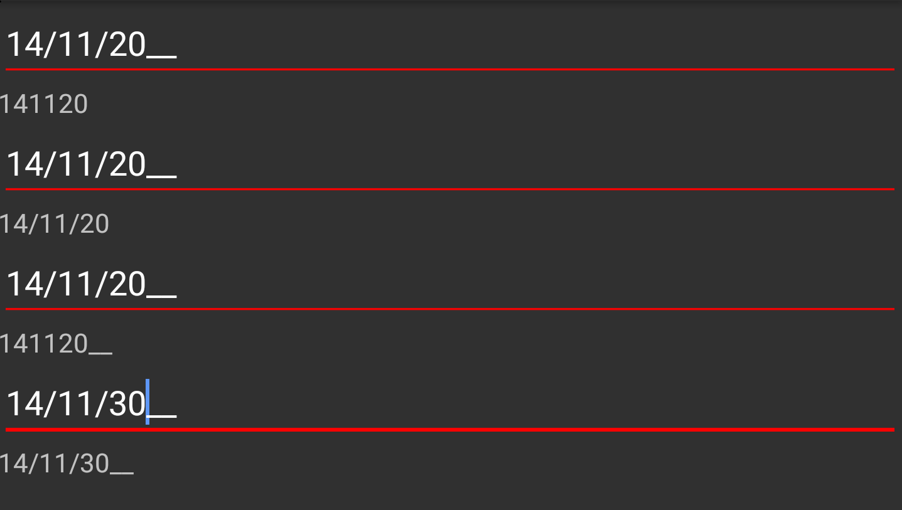

# Formatting Value

The `SfMaskedEdit` control allows you to format the characters in the `Value` property in mask scenarios (when the `Mask` property is set). By default, the `Value` property holds your input characters, prompt characters, and the literals defined in the mask. You can modify this behavior and control whether the `Value` property holds characters with or without prompt characters and literals by setting the `ValueMaskFormat` property of the control.

The `Value` in the `SfMaskedEdit` control can be formatted using any of the following `MaskFormat` enumeration values:
* `ExcludePromptAndLiterals`
* `IncludePrompt`
* `IncludeLiterals`
* `IncludePromptAndLiterals`

## ExcludePromptAndLiterals

The `Value` contains only the typed characters. Prompt characters and literals are excluded.

## IncludePrompt

The `Value` contains the typed characters and prompt characters. Literals are excluded.

## IncludeLiterals

The `Value` contains the typed characters and literals. Prompt characters are excluded.

## IncludePromptAndLiterals

The `Value` contains typed characters, prompt characters, and literals.



TextView label1;
TextView label2;
TextView label3;
TextView label4;
SfMaskedEdit maskedEdit1;
SfMaskedEdit maskedEdit2;
SfMaskedEdit maskedEdit3;
SfMaskedEdit maskedEdit4;

maskedEdit1 = new SfMaskedEdit(this);
maskedEdit1.MaskType = MaskType.Text;
maskedEdit1.Mask = "00/00/0000";
maskedEdit1.ValueMaskFormat = MaskFormat.ExcludePromptAndLiterals;
maskedEdit1.ValueChanged += MaskedEdit1_ValueChanged;
label1 = new TextView(this);
linearLayout.AddView(label1);
linearLayout.AddView(maskedEdit1);

maskedEdit2 = new SfMaskedEdit(this);
maskedEdit2.MaskType = MaskType.Text;
maskedEdit2.Mask = "00/00/0000";
maskedEdit2.ValueMaskFormat = MaskFormat.IncludeLiterals;
maskedEdit2.ValueChanged += MaskedEdit2_ValueChanged;
label2 = new TextView(this);
linearLayout.AddView(label2);
linearLayout.AddView(maskedEdit2);

maskedEdit3 = new SfMaskedEdit(this);
maskedEdit3.MaskType = MaskType.Text;
maskedEdit3.Mask = "00/00/0000";
maskedEdit3.ValueMaskFormat = MaskFormat.IncludePrompt;
maskedEdit3.ValueChanged += MaskedEdit3_ValueChanged;
label3 = new TextView(this);
linearLayout.AddView(label3);
linearLayout.AddView(maskedEdit3);

maskedEdit4 = new SfMaskedEdit(this);
maskedEdit4.MaskType = MaskType.Text;
maskedEdit4.Mask = "00/00/0000";
maskedEdit4.ValueMaskFormat = MaskFormat.IncludePromptAndLiterals;
maskedEdit4.ValueChanged += MaskedEdit4_ValueChanged;
label4 = new TextView(this);
linearLayout.AddView(maskedEdit4);
linearLayout.AddView(label4); 

private void MaskedEdit1_ValueChanged(object sender, Syncfusion.XForms.MaskedEdit.ValueChangedEventArgs e)
{
    label1.Text = e.Value as string;
}

private void MaskedEdit2_ValueChanged(object sender, Syncfusion.XForms.MaskedEdit.ValueChangedEventArgs e)
{
    label2.Text = e.Value as string;
}

private void MaskedEdit3_ValueChanged(object sender, Syncfusion.XForms.MaskedEdit.ValueChangedEventArgs e)
{
    label3.Text = e.Value as string;
}

private void MaskedEdit4_ValueChanged(object sender, Syncfusion.XForms.MaskedEdit.ValueChangedEventArgs e)
{
    label4.Text = e.Value as string;
}



Refer to this [link](Events#valuechanged-event) to learn more about the `ValueChanged` event of the `SfMaskedEdit` control.

You can download the complete value formatting sample from this [link](http://files2.syncfusion.com/Xamarin.Android/Samples/MaskedEdit_FormattingValue.zip).
