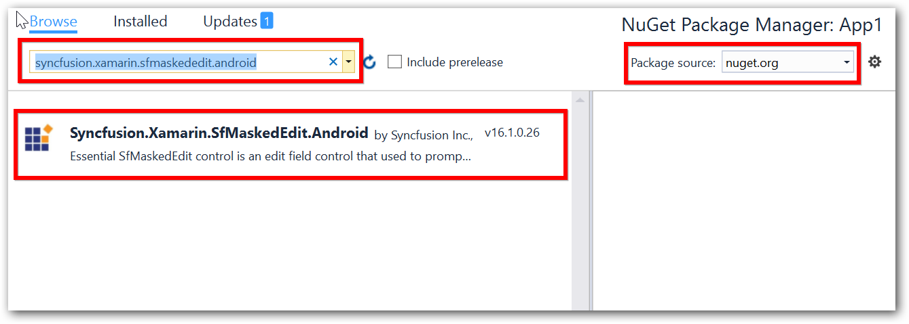

# Getting Started
This section explains the steps required to configure an `SfMaskedEdit` control in a real-time scenario and provides a walk-through of some customization features available in the `SfMaskedEdit` control.

## Reference Essential Studio® Components in Your Solution

Syncfusion® Xamarin components are available in [nuget.org](https://www.nuget.org/). To add the sfmaskededit to your project, open the NuGet package manager in Visual Studio, search for "[syncfusion.xamarin.sfmaskededit.android](https://www.nuget.org/packages/Syncfusion.Xamarin.SfMaskedEdit.Android)", and then install it.

## Create a Simple SfMaskedEdit

The `SfMaskedEdit` control is configured entirely in C# code. The following steps explain how to create an `SfMaskedEdit` control and configure its elements:

### Add Namespace for Referenced Assemblies



using Syncfusion.Android.MaskedEdit;


  
N> Starting with v16.2.0.x, if you reference Syncfusion® assemblies from the trial setup or from the NuGet feed, you also have to include a license key in your projects. Please refer to this [link](https://help.syncfusion.com/common/essential-studio/licensing/license-key) to learn about registering the Syncfusion® license key in your Xamarin application to use our components.
 
### Create a Sample with Simple SfMaskedEdit



using Android.App;
using Android.Widget;
using Android.OS;
using Syncfusion.Android.MaskedEdit;

namespace MaskEdit
{
    [Activity(Label = "MaskEdit", MainLauncher = true, Icon = "@mipmap/icon")]
    public class MainActivity : Activity
    {
        int count = 1;

        protected override void OnCreate(Bundle savedInstanceState)
        {
            base.OnCreate(savedInstanceState);

            // Set our view from the "main" layout resource
            SetContentView(Resource.Layout.Main);
            LinearLayout linearLayout = FindViewById<LinearLayout>(Resource.Id.layout);
            SfMaskedEdit maskedEdit = new SfMaskedEdit(this);
            linearLayout.AddView(maskedEdit);
        }
    }
}



## Masking the Input

To mask the input, set the `Mask` property as follows:



SfMaskedEdit maskedEdit = new SfMaskedEdit(this);
maskedEdit.Mask = "00/00/0000";



This mask expression allows only numeric inputs in the places of `0`.

Refer to this [link](MaskType) to learn more about the mask characters and mask types available in the `SfMaskedEdit` control.

Run the project and check if you get the following output to make sure that you have configured your project properly to add the `SfMaskedEdit` control.

You can find the complete getting started sample from this [link](http://files2.syncfusion.com/Xamarin.Android/Samples/MaskedEdit_GettingStarted.zip).
