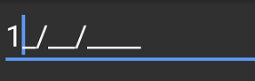

# Getting Started
This section explains you the steps required to configure a SfMaskedEdit control in a real-time scenario and provides a walk-through on some of the customization features available in `SfMaskedEdit` control.

##  Reference Essential Studio components in your solution

After installing Essential Studio for Xamarin, you can find all the required assemblies in the installation folders,

**{Syncfusion Installed location}\Essential Studio{version number}\lib**

Example: C:\Program Files (x86)\Syncfusion\Essential Studio\16.1.0.24\Xamarin\lib

Add the following assembly references to the Android project,
***android\ Syncfusion.SfMaskedEdit.Android.dll***

## Create a Simple SfMaskedEdit

The SfMaskedEdit control is configured entirely in C# code. The following steps explain how to create a SfMaskedEdit and configure its elements:

### Add namespace for referred assemblies



using Syncfusion.Android.MaskedEdit;


  
 
### Create a sample with simple SfMaskedEdit



using Android.App;
using Android.Widget;
using Android.OS;
using Syncfusion.Android.MaskedEdit;

namespace MaskEdit
{
    [Activity(Label = "MaskEdit", MainLauncher = true, Icon = "@mipmap/icon")]
    public class MainActivity : Activity
    {
        int count = 1;

        protected override void OnCreate(Bundle savedInstanceState)
        {
            base.OnCreate(savedInstanceState);

            // Set our view from the "main" layout resource
            SetContentView(Resource.Layout.Main);
            LinearLayout linearLayout = FindViewById<LinearLayout>(Resource.Id.layout);
            SfMaskedEdit maskedEdit = new SfMaskedEdit(this);
            linearLayout.AddView(maskedEdit);
        }
    }
}



## Masking the input

To mask the input, set the Mask properties as follows:



SfMaskedEdit maskedEdit = new SfMaskedEdit(this);
maskedEdit.Mask = "00/00/0000";



This mask expression allows only numeric inputs in the places of 0.

Refer to this [link](MaskType) to know more about the Mask characters and Mask Types available in SfMaskedEdit control.

Run the project and check if you get the following output to make sure that you have configured your project properly to add `SfMaskedEdit`.

You can find the complete getting started sample from this [link](http://www.syncfusion.com/downloads/support/directtrac/general/ze/GettingStarted-1902914709.zip).
