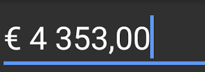

# Localization

Special symbols such as currency symbol, date separator, and decimal separator can be localized to any specific culture using the `Culture` property.

<table>
<tr>
<td>
{{'**Characters**'| markdownify }}
</td>
<td>
{{'**Description**'| markdownify }}
</td>
</tr>
<tr>
<td>
.
</td>
<td>
Decimal separator determined by current culture.
</td>
</tr>
<tr>
<td>
,
</td>
<td>
Group separator determined by current culture.
</td>
</tr>
<tr>
<td>
/
</td>
<td>
Date separator determined by current culture.
</td>
</tr>
<tr>
<td>
:
</td>
<td>
Time separator determined by current culture.
</td>
</tr>
<tr>
<td>
$
</td>
<td>
Currency symbol determined by current culture.
</td>
</tr>
</table>



SfMaskedEdit maskedEdit = new SfMaskedEdit(this);
maskedEdit.Mask = "$ 0,000.00";
maskedEdit.Culture = new CultureInfo("fr-FR");



Now the '$' will be localized to '€';'.' will be localized to ',' and ',' will be localized to ' '(single white space).

You can find the complete localization sample from this [link](http://files2.syncfusion.com/Xamarin.Android/Samples/MaskedEdit_Localization.zip).
