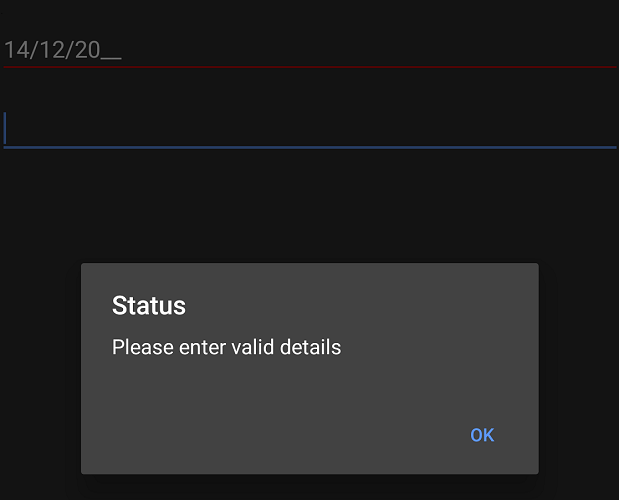

# Validation in Xamarin.Android SfMaskedEdit

The `SfMaskedEdit` control provides input validation capabilities to ensure data integrity and user input compliance with the specified mask pattern.

## Validation Mode

Input validation occurs based on the value of the `ValidationMode` property. This property accepts the following enumeration values:

* `KeyPress` - Validation is triggered on each key press
* `LostFocus` - Validation is triggered when the control loses focus
The default value for the validation mode is `LostFocus`.

The default value for validation mode is `LostFocus`.



SfMaskedEdit maskedEdit = new SfMaskedEdit(this);
maskedEdit.MaskType = MaskType.Text;
maskedEdit.Mask = "00/00/0000";
maskedEdit.ValidationMode = InputValidationMode.KeyPress;



When the `ValidationMode` is set to `LostFocus`, validation takes place when the control loses its focus. When set to `KeyPress`, validation is triggered for each key press event.

## HasError Property

This read only property is used to check whether the validation succeeds or not. It returns true once validation succeeds or else returns false. The following code example shows the usage of `HasError` property.



AlertDialog.Builder dialog;

dialog= new AlertDialog.Builder(this);
SfMaskedEdit maskedEdit = new SfMaskedEdit(this);
maskedEdit.MaskType = MaskType.Text;
maskedEdit.Mask = "00/00/0000";
maskedEdit.ValidationMode = InputValidationMode.LostFocus;
maskedEdit.ValueChanged += MaskedEdit_ValueChanged;

private void MaskedEdit_ValueChanged(object sender, ValueChangedEventArgs e)
{
    SfMaskedEdit maskedEdit = sender as SfMaskedEdit;
    if(maskedEdit.HasError)
    {
        dialog.SetMessage("Please enter valid details");             
        dialog.SetTitle("Status");
        dialog.SetPositiveButton("OK", (object sender1, DialogClickEventArgs e1)=>{});
        dialog.Create().Show();
        dialog.SetCancelable(true);   
    }
}



Refer to this [link](Events#valuechanged-event) to learn more about the `ValueChanged` event of the `SfMaskedEdit` control.

You can download the complete validation sample from this [link](http://files2.syncfusion.com/Xamarin.Android/Samples/MaskedEdit_Validation.zip).
