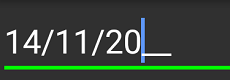
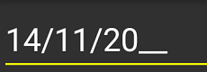
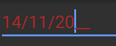

# Visual Customization:

The appearance of SfMaskedEdit can be customized using the following properties:

## Border Color

Sets the custom border color to SfMaskedEdit.



SfMaskedEdit maskedEdit = new SfMaskedEdit(this);
maskedEdit.MaskType = MaskType.Text;
maskedEdit.Mask = "00/00/0000";
maskedEdit.BorderColor = Color.Green;



## ErrorBorder Color

Sets the custom error border color to SfMaskedEdit. Error border color indicates the color to be used when the validation fails for your input with respect to the mask used. 

> Validation triggers based on `ValidationMode` property.

Refer this [link](Validation#validation-mode) to know more about the `ValidationMode` property of SfMaskedEdit control.



SfMaskedEdit maskedEdit = new SfMaskedEdit(this);
maskedEdit.MaskType = MaskType.Text;
maskedEdit.Mask = "00/00/0000";
maskedEdit.ErrorBorderColor = Color.Yellow;



 
## Setting Appearance of Text

You can customize the display text appearance of SfMaskedEdit control using the following properties:

* `SetTextColor`: Changes the color of the text.
* `TextAlignment`: Changes the horizontal alignment of the text.
* `Typeface`: Changes the font family of the text and sets font attributes(bold/italic/none) of the text.
* `TextSize`: Sets font size of the text.



SfMaskedEdit maskedEdit = new SfMaskedEdit(this);
maskedEdit.MaskType = MaskType.Text;
maskedEdit.Mask = "00/00/0000";
maskedEdit.SetTextColor(Color.Brown);
maskedEdit.TextAlignment = TextAlignment.Center;
maskedEdit.Typeface = Typeface.Create("Arial", TypefaceStyle.Bold);
maskedEdit.TextSize = 20;



This demo can be downloaded from this [link](http://www.syncfusion.com/downloads/support/directtrac/general/ze/VisualCustomize30014455.zip).
