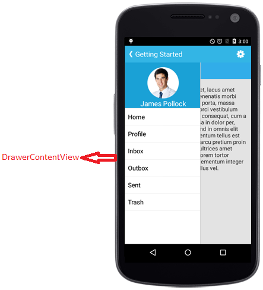

# Sliding Panel Contents
	
The sliding panel contents are divided into three parts and they are as follows
	
* [Drawer Content](#drawer-main-content)
* [Header Content](#drawer-header-content) 
* [Footer Content](#drawer-footer-content)
		
The header and footer contents are optional and Drawer content is the mandatory one which is due to the maximum space allocated for Drawer content view.
		
## Drawer Main Content

The sliding main content of the SfNavigationDrawer which is a part of DrawerPanel can be set using `DrawerContentView` property with desired views.





	List<String> list = new List<String>();
	list.Add("Home");
	list.Add("Profile");
	list.Add("Inbox");
	list.Add("Outbox");
	list.Add("Sent Items");
	list.Add("Trash");
	ArrayAdapter<String> arrayAdapter =new ArrayAdapter<String>(this, Android.Resource.Layout.SimpleListItem1,list);
	listView.Adapter=arrayAdapter;
	listView.SetBackgroundColor(Color.White);
	listView.LayoutParameters = new ViewGroup.LayoutParams(ViewGroup.LayoutParams.MatchParent,ViewGroup.LayoutParams.MatchParent);
	contentLayout.AddView(listView);
	contentLayout.Orientation=Orientation.Vertical;
	FrameLayout frame = new FrameLayout (this);
	frame.LayoutParameters = new ViewGroup.LayoutParams (ViewGroup.LayoutParams.MatchParent, ViewGroup.LayoutParams.MatchParent);
	frame.SetBackgroundColor (Color.White);
	frame.AddView (contentLayout);
	//Add Drawer content view to Navigation
	navigationDrawer.DrawerContentView=frame;	





## Drawer Header Content

Gets or sets the header of the DrawerView panel in the SfNavigationDrawer control using `DrawerHeaderView` property.





ImageView userImg= new ImageView(this);
userImg.SetImageResource(R.drawable.user);
userImg.SetBackgroundColor(Color.parseColor("#1aa1d6"));
TextView userName= new TextView(this);
userName.Text="James Pollock";
userName.SetGravity(Gravity.CENTER);
userName.TextSize=20;
userName.SetBackgroundColor(Color.TRANSPARENT);
userName.TextColor=Color.WHITE;
LinearLayout headerLayout = new LinearLayout(this);
headerLayout.Orientation=LinearLayout.VERTICAL;
headerLayout.SetBackgroundColor(Color.parseColor("#1aa1d6"));
headerLayout.SetGravity(Gravity.CENTER);
headerLayout.SetPadding(0, 20, 0, 0);
headerLayout.addView(userImg);
headerLayout.AddView(userName);
navigationDrawer.DrawerHeaderView=headerLayout;
 




## Drawer Footer Content

Gets or sets the footer for the DrawerView panel in the SfNavigationDrawer control using `DrawerFooterView` property.





TextView userName= new TextView(this);
userName.Text="James Pollock";
userName.SetGravity(Gravity.CENTER);
userName.TextSize=20;
userName.SetBackgroundColor(Color._TRANSPARENT_); text.setTextColor(Color._WHITE_);
LinearLayout footerLayout = new LinearLayout(this); 
footerLayout.Orientation=LinearLayout.VERTICAL; 
footerLayout.SetBackgroundColor(Color._parseColor_("#1aa1d6")); 
footerLayout.SetGravity(Gravity._Top_);
footerLayout.SetPadding(0, 20, 0, 0);
footerLayout.AddView(userName);
navigationDrawer.DrawerFooterView=footerLayout;





## Drawer Size

Gets or sets the height and width of the DrawerView panel in the SfNavigationDrawer control using `DrawerHeight` and `DrawerWidth` properties.





navigationDrawer.setDrawerHeight(300);
navigationDrawer.DrawerWidth=300;



