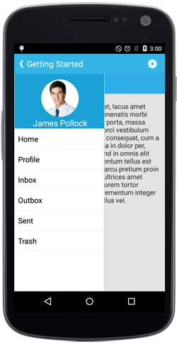

# Overview

The SfNavigationDrawer is a sliding panel menu that comes out from the edge of the window and allows to have the contents in a hidden panel. It can be shown by swiping from any of the four screen edges or by demand.

## Key Features

* `Position` - Specifies various sliding positions of the drawer content in SfNavigationDrawer. 

* `Transition` - Specifies the transition type of the SfNavigationDrawer.

