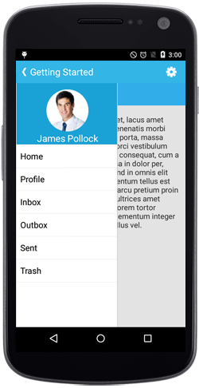
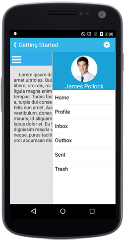
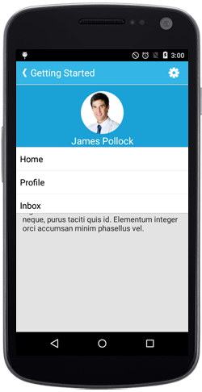

# Configuring Drawer Position

The `Position` property determines from which edge of the screen the drawer panel will slide. This property provides flexibility in designing your navigation interface to match your application's layout and user experience requirements. The `Position` property supports four distinct options:
* Left

* Right

* Top

* Bottom

N> The default option is Left.

## Left

Sets the SfNavigationDrawer sliding position to the left.





	Position sliderposition = Position.Left;	
	navigationDrawer.Position=sliderposition;





## Right

Sets the SfNavigationDrawer sliding position to the right.





	Position sliderposition = Position.Right;	
	navigationDrawer.Position=sliderposition;





	
## Top

Sets the SfNavigationDrawer sliding position to the top.





	Position sliderposition = Position.Top;	
   	navigationDrawer.Position=sliderposition;





## Bottom

Sets the SfNavigationDrawer sliding position to the bottom.



	Position sliderposition = Position.Bottom;	
	navigationDrawer.Position=sliderposition;



