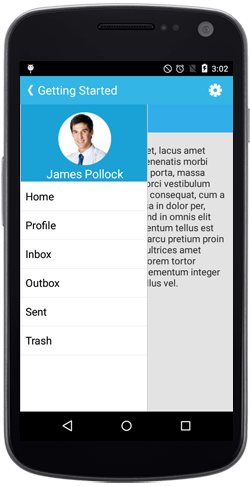
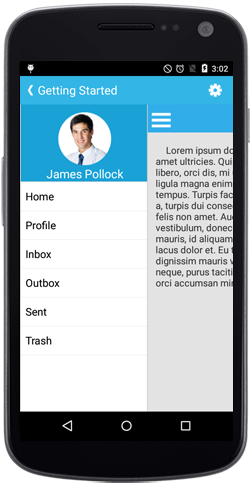

# Drawer Opening Animation

The `Transition` property controls the animation behavior when the drawer opens and closes, providing different visual effects that can enhance your application's user experience. The property offers three distinct animation types, each creating a unique interaction pattern:
* SlideOnTop
* Push
* Reveal

N> The default transition is SlideOnTop.

## SlideOnTop

Slides the DrawerContent on top of the main content.

 

	 Transition sliderTransition = Transition.SlideOnTop;
	 navigationDrawer.Transition = sliderTransition;



## Push

This transition slides the Drawer and main content simultaneously.

 

	 Transition sliderTransition = Transition.Push;
	 navigationDrawer.Transition = sliderTransition;



## Reveal

This transition keeps the Drawer content in fixed position and the main content will be slide to reveal the drawer content.

 

	Transition sliderTransition = Transition.Reveal;
	navigationDrawer.Transition = sliderTransition;



