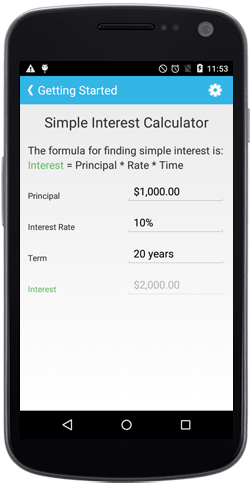

# Getting Started

This section explains you the steps to configure a SfNumericTextBox control in a real-time scenario and also provides a walk-through on some of the customization features available in SfNumericTextBox control.

 

## Creating your first SfNumericTextBox in Xamarin.Android

### Reference Essential Studio components in your solution

After installing Essential Studio for Xamarin, you can find all the required assemblies in the installation folders,

{Syncfusion Installed location}\Essential Studio\12.4.0.24\lib

N> Assemblies are available in unzipped package location in Mac.

Add the following assembly references to the Android project,

android\Syncfusion.SfNumericTextBox.Andriod.dll

### Add and configure the SfNumericTextBox

* Adding reference to NumericTextBox.



	using Com.Syncfusion.NumericTextBox; 



* Create an instance of SfNumericTextBox.



	SfNumericTextBox numericTextBox=new SfNumericTextBox(this);
	SetContentView(numericTextBox);



### Setting Value

The SfNumericTextBox control display value can be set using `Value` property.



	numericTextBox.Value = 123.45;



### Enable Parsing Mode

The value of the SfNumericTextBox can be parsed based on the `ParsingMode` property. 

N> The `ParsingMode` is of type Parsers containing enum values of Double and Decimal.



	numericTextBox.ParsingMode=Parsers.Decimal;
	


### Add Format String

The `FormatString` property determines the format specifier by which the display text has to be formatted. 

It has three types,

* c - Display the value with currency notation.
* n – Display the value in number format.
* p – Display the value in Percentage.

N> The control displays the formatted text on lost focus. Default Value of `FormatString` is "n".



	numericTextBox.FormatString = "c";



