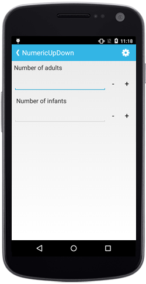

# Assign Nullable Value

The `SfNumericUpDown` control supports nullable values, allowing you to set null values in the `Value` property by setting the `AllowNull` property to `true`.
N> By default, the `AllowNull` property value is `false`.

N> By default, the property value is false.





	numericupdown.AllowNull=true;





## Set Hint Text

The `Watermark` property can be used to provide a hint that helps users get started with their input. The watermark text is visible when the value is empty or null.





	numericupdown.Watermark = "Numeric Text";
	




