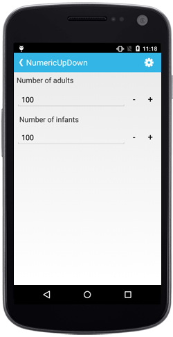
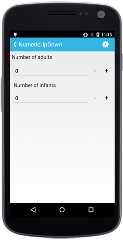

# Auto Reverse

The Auto Reverse feature allows the `SfNumericUpDown` control to automatically cycle between minimum and maximum values. When incrementing, the control will start from the minimum value once it reaches the maximum value, and vice versa when decrementing.
N> By default, the `AutoReverse` property value is `false`.

N> By default the property value is false.





numericupdown.AutoReverse = true;





## Continuous Spinning Between Ranges

You can restrict the values between a specific range by setting the `Maximum` and `Minimum` property values. When auto reverse is enabled, the control will continuously cycle within this defined range.
N> By default, the `Minimum` property value is `0` and the `Maximum` property value is `100`.

N> By default the minimum property value is 0 and maximum property value is 100.





sfNumericUpDown.Minimum = 10;
sfNumericUpDown.Maximum = 50





## Set Increment Step

The frequency at which values are incremented or decremented can be configured using the `StepValue` property. This determines how much the value changes with each increment or decrement operation.
N> By default, the `StepValue` property value is `1`.

N> By default the property value is 1.





	sfNumericUpDown.StepValue = 6;




