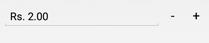
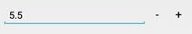
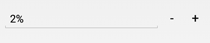

# Number Formatting in NumericUpDown (SfNumericUpDown)

The values of the `SfNumericUpDown` control can be configured to display different formats such as currency format, percent format, and custom number formats to meet various application requirements.

## Format String

The `FormatString` property determines the format specifier by which the display text is formatted. This property allows you to control how numeric values are presented to users.

N> The control displays the formatted text when it loses focus. The default value of `FormatString` is "n".

### Display Currency Notation

Use `c` to display the value with currency notation based on the current culture settings.

	

	
	numeric.FormatString="c";
	 



	
### Display Number Notation

Use `n` to display the value in standard number format with appropriate decimal and group separators.

	

	
	numeric.FormatString="n";
	 




### Display Percentage Notation	

Use `p` to display the value as a percentage (the value is multiplied by 100 and the % symbol is appended).

	


	numeric.FormatString="p";
	 



	
### Custom Format Strings
You can also provide custom symbols or values as strings in the `FormatString` property, which will be appended to the value in the `SfNumericUpDown`.

## Parser Input Value

The value of the SfNumericUpDown can be parsed based on the `ParsingMode` property. 

N> The `ParsingMode` is of type Parsers containing enum values of Double and Decimal. The default Value for `ParsingMode` is Double.





numeric.ParserMode=ParserMode.Decimal;
	  




## Compute to Percentage

The `PercentDisplayMode` property can be used to display numeric data in Percent mode. 

N> The control displays the percent value on lost focus. 

It provides the following options

* `Value`: Displays the value with percentage symbol.







	numeric.PercentDisplayMode=PercentDisplayMode.Value;







{{ codesnippet1 | UnOrderList_Indent_Level_1 }} 

* `Compute`: Displays the computed value with percentage symbol.







	numeric.PercentDisplayMode=PercentDisplayMode.Compute;







{{ codesnippet2 | UnOrderList_Indent_Level_1 }} 

