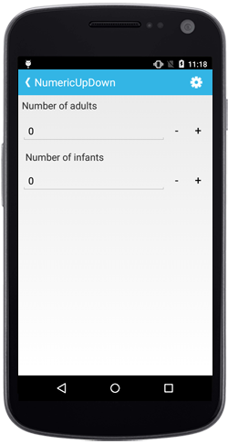

# Overview of NumericUpDown control for Xamarin.Android

The Essential Xamarin.Android NumericUpDown control provides up and down repeat buttons to increase and decrease values. The control respects UI culture and can be configured to display different formats like currency, scientific, etc.

## Key Features

* `FormatString` - Input string can be formatted by using the format strings.

* `Culture` - Number format can be localized to any specific culture.

* `AllowNull` - Allows the user to set null value.

* `ParserMode` - Value gets parsed based on parser mode.

