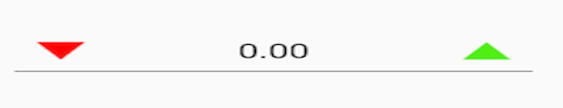

# Spin Button Customization

The `SfNumericUpDown` control provides extensive customization options for spin buttons, including position alignment and visual appearance. You can customize both the placement and the visual representation of the increment and decrement buttons to match your application's design requirements.

## Spin Button Alignment
The spin button position in the `SfNumericUpDown` control can be changed relative to the text box using the `SpinButtonAlignment` property. This property offers three built-in alignment modes:

* `Right` - Buttons aligned to the right side
* `Left` - Buttons aligned to the left side
* `Both` - Buttons aligned to both sides

N> By default, the `SpinButtonAlignment` property value is `Right`.

### Right Alignment

Spin buttons will be aligned to the right side of the control, providing a traditional numeric input appearance.




numeric.SpinButtonAlignment = SpinButtonAlignment.Right;





### Left Alignment

Spin buttons will be aligned to the left side of the control, useful for right-to-left layouts or specific design requirements.




numeric.SpinButtonAlignment = SpinButtonAlignment.Left;





### Both Sides Alignment

Spin buttons will be aligned to both sides of the control, with increment on one side and decrement on the other.




numeric.SpinButtonAlignment = SpinButtonAlignment.Both;





## UpDownButtonSettings Customization

The `SfNumericUpDown` control allows you to customize the appearance of increment and decrement buttons using the `UpDownButtonSettings` class. You can customize buttons using three different approaches:

1. **Custom View** - Use any Android view as a button
2. **Image** - Use image resources for button appearance
3. **Font Icon** - Use font icons for scalable button graphics

N> **Resource Requirements:**
> * For images: Add image files to `Resources/drawable/` folder
> * For font icons: Add TTF font files to `Assets/` folder

### Custom View Customization

You can use any Android view as a custom button, providing complete control over button appearance and behavior.




			LinearLayout MainLayout = new LinearLayout(this);
            MainLayout.Orientation = Orientation.Vertical;

            SfNumericUpDown numeric;

            numeric = new SfNumericUpDown(this);
            LinearLayout UpButton_View = new LinearLayout(this);
            LinearLayout DownButton_View = new LinearLayout(this);

            ImageView UpImage = new ImageView(this);
            ImageView DownImage = new ImageView(this);

            UpImage.SetImageResource(Resource.Drawable.UpButton);
            DownImage.SetImageResource(Resource.Drawable.DownButton);

            UpButton_View.AddView(UpImage);
            DownButton_View.AddView(DownImage);

            UpDownButtonSettings UpButton = new UpDownButtonSettings();
            UpButton.ButtonView = UpButton_View;

            UpDownButtonSettings DownButton = new UpDownButtonSettings();
            DownButton.ButtonView = DownButton_View;
            UpButton.ButtonHeight = 50;
            DownButton.ButtonHeight = 50;

            UpButton.ButtonWidth = 50;
            DownButton.ButtonWidth = 50;

            UpButton_View.SetBackgroundColor(Color.Green);
            DownButton_View.SetBackgroundColor(Color.Violet);

            numeric.DecrementButtonSettings = DownButton;
            numeric.IncrementButtonSettings = UpButton;

            MainLayout.AddView(numeric);

            SetContentView(MainLayout);





### Image-Based Customization

Use image resources to create visually appealing buttons with custom graphics.




			LinearLayout MainLayout = new LinearLayout(this);
            MainLayout.Orientation = Orientation.Vertical;

            SfNumericUpDown numeric;

            numeric = new SfNumericUpDown(this);

            UpDownButtonSettings UpButton = new UpDownButtonSettings();
           
            UpDownButtonSettings DownButton = new UpDownButtonSettings();

            UpButton.ButtonHeight = 50;
            DownButton.ButtonHeight = 50;

            UpButton.ButtonWidth = 50;
            DownButton.ButtonWidth = 50;

            UpButton.ButtonImage = "UpButton";
            DownButton.ButtonImage = "DownButton";

            numeric.DecrementButtonSettings = DownButton;
            numeric.IncrementButtonSettings = UpButton;

            MainLayout.AddView(numeric);

            SetContentView(MainLayout);





### Font Icon Customization

Use font icons for scalable, customizable button graphics that maintain quality at any size.




			LinearLayout MainLayout = new LinearLayout(this);
            MainLayout.Orientation = Orientation.Vertical;

            SfNumericUpDown numeric;

            numeric = new SfNumericUpDown(this);

            UpDownButtonSettings UpButton = new UpDownButtonSettings();
           
            UpDownButtonSettings DownButton = new UpDownButtonSettings();

            UpButton.ButtonHeight = 50;
            DownButton.ButtonHeight = 50;

            UpButton.ButtonWidth = 50;
            DownButton.ButtonWidth = 50;

            var typeface = Typeface.CreateFromAsset(this.Assets, "Segoe MDL2 Assets.ttf");
            UpButton.ButtonFontFamily = typeface;

            DownButton.ButtonFontFamily = typeface;

            UpButton.ButtonFontIcon="\xE74A";
            DownButton.ButtonFontIcon="\xE74B";

            numeric.DecrementButtonSettings = DownButton;
            numeric.IncrementButtonSettings = UpButton;

            MainLayout.AddView(numeric);

            SetContentView(MainLayout);





