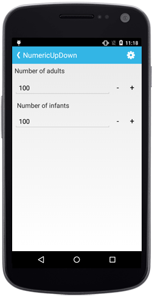

# Getting Started

This section provides overview for working with Essential NumericUpDown for Xamarin.Android. You can walk through the entire process of creating a SfNumericUpDown.

## Referencing Essential Studio Components in Your Solution	

After installing Essential Studio for Xamarin, you can find all the required assemblies in the installation folders,

{Syncfusion Installed location}\Essential Studio\12.4.0.24\lib

Add the following assembly references to the Android project,

android\Syncfusion.SfNumericUpDown.Android.dll

## Add SfNumericUpDown

The SfNumericUpDown control configured entirely in C# code or by using XAML markup. The following steps explain on how to create a SfNumericUpDown and configure its elements,

* Adding reference to NumericUpDown.





using Com.Syncfusion.NumericUpDown;





* Create an instance of SfNumericUpDown.





SfNumericUpDown numericupdown = new SfNumericUpDown(this);
SetContentView(numericupdown);





## Set Value

The SfNumericUpDown control display value can be set using `Value` property. 





numericupdown.Value= 5;





## Enable Parsing Mode

The value of the SfNumericUpDown can be parsed based on the `ParsingMode` property. 

N> The `ParsingMode` is of type Parsers containing enum values of Double and Decimal.





	numericupdown.ParsingMode=Parsers.Decimal;
	




## Add Format String

The `FormatString` property determines the format specifier by which the display text has to be formatted. 

It has three types,

* c - Display the value with currency notation.
* n – Display the value in number format.
* p – Display the value in Percentage.

N> The control displays the formatted text on lost focus. Default Value of `FormatString` is "n".





numericupdown.FormatString= “c”;





