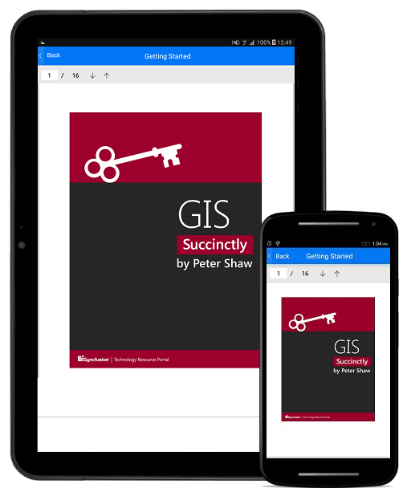

# PDF Viewer

PDF Viewer for Xamarin.Android allows the user to view PDF documents within your Xamarin.Android application. 

**Key features:**

The following list shows the key features available in PDF Viewer control.

* View PDF documents
* Search a text in PDF document
* Select text and copy it to clipboard
* Scroll, pan, zoom in and out
* Page navigation

N>**•	PDF Viewer for Xamarin.Android will be supported from Android 5.0 (API Level 21) onwards.

N>**PDF Viewer for Xamarin.Forms.iOS will be supported from iOS version 9.0 onwards.