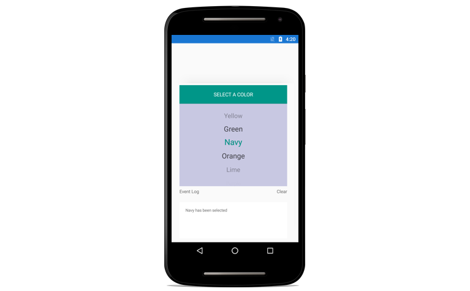

---

layout: post
title: Getting Started with Syncfusion Picker control for Xamarin.Android
description: A quick tour to initial users on Syncfusion Picker control for Xamarin.Android platform.
platform: Xamarin
control: Picker
documentation: ug

---

# Getting Started

This topic describes about the assembly that is required in your Android application, when you use SfPicker. After installing Essential Studio for Xamarin, you can find all the required assemblies in the following installation folders,

{Syncfusion Essential Studio Installed location}\Essential Studio{Release Version}\lib

Add the following assembly references to the Android project,

Android\Syncfusion.SfPicker.Android.dll

## Create your first Picker in Xamarin.Android

1) Create new Android application in Xamarin Studio.

2) Now, create a simple data source as shown in the following code example. You can set the data source of the Picker by using the sfPicker.ItemsSource property as follows.





[Activity(Label = "PickerAndroidDemoSample", MainLauncher = true, Icon = "@mipmap/icon")]
public class MainActivity : Activity
{
protected override void OnCreate(Bundle savedInstanceState)
{
base.OnCreate(savedInstanceState);

SfPicker sfpicker = new SfPicker(con);
sfpicker.ShowHeader = true;
sfpicker.ItemsSource = GetSource();
sfpicker.PickerMode = PickerMode.Default;
sfpicker.ShowColumnHeader = false;
sfpicker.UnSelectedItemTextColor = Color.Black;
sfpicker.SelectedIndex = 6;
sfpicker.ShowFooter = false;
sfpicker.HeaderText = "PICK A COLOR";
sfpicker.BorderColor = Color.Red;
sfpicker.ColumnHeaderText = "COLOR";
float height = this.Resources.DisplayMetrics.HeightPixels; ;
sfpicker.LayoutParameters = new ViewGroup.LayoutParams(Android.Views.ViewGroup.LayoutParams.MatchParent, (int)(height * 0.60));

SetContentView(sfpicker);
}
List<String> GetSource()
{
List<String> source = new List<string>();
source.Add("Yellow");
source.Add("Green");
source.Add("Orange");
source.Add("Lime");
source.Add("LightBlue");
source.Add("Pink");
source.Add("Aqua");
source.Add("SkyBlue");
source.Add("Red");
return source;
}
}





3)You can also set the Header and Footer of Picker by enabling ShowHeader and ShowFooter property.The following code illustrates this.





SfPicker sfpicker = new SfPicker(this);
sfpicker.ItemsSource = GetSource();
sfpicker.ShowHeader = true;
sfpicker.ShowColumnHeader = true;
sfpicker.UnSelectedItemTextColor = Color.Black;
sfpicker.SelectedIndex = 6;
sfpicker.ShowFooter = true;
sfpicker.HeaderText = "PICK A COLOR";
sfpicker.ColumnHeaderText = "COLOR";





