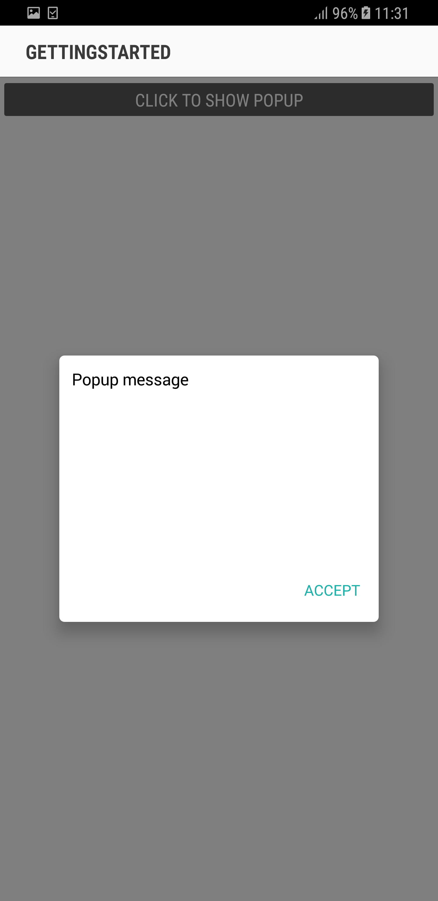
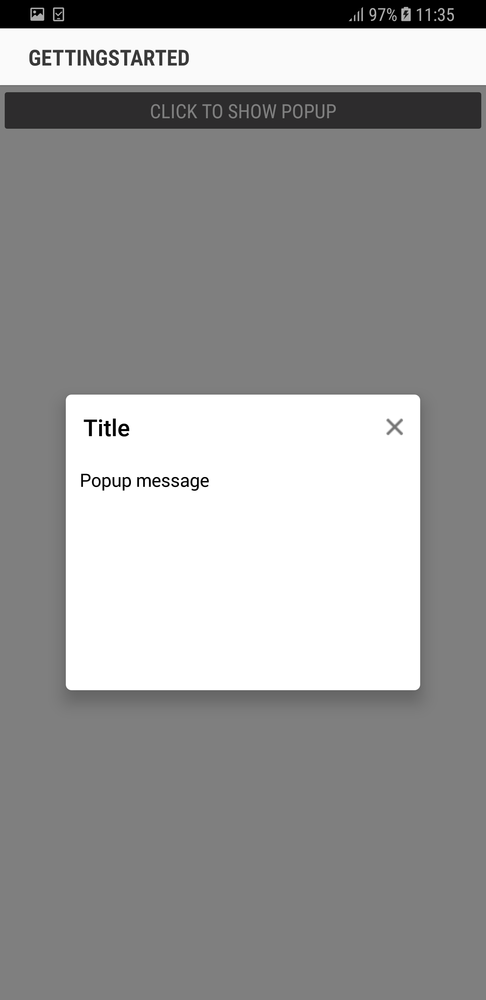
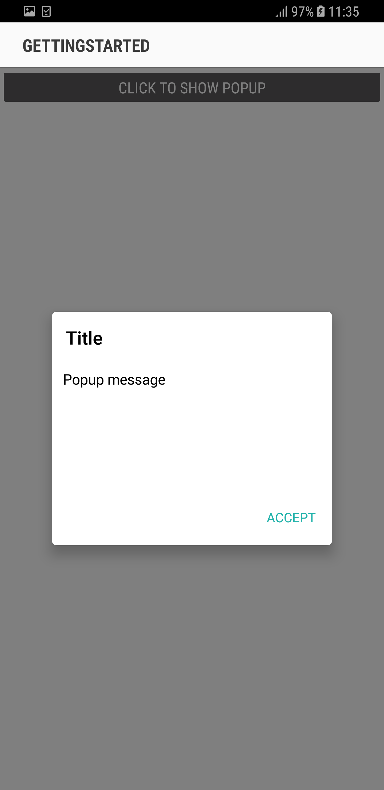

---
layout: post
title: How to | SfPopupLayout |Xamarin.Android | Syncfusion
description: How to topics in SfPopupLayout
platform: Xamarin.Android
control: SfPopupLayout
documentation: ug
--- 

# How to 

## Hide the header in the SfPopupLayout 

The SfPopupLayout allows hiding the header by using the [SfPopupLayout.PopupView.ShowHeader](https://help.syncfusion.com/cr/cref_files/xamarin-android/sfpopuplayout/Syncfusion.SfPopupLayout.Android~Syncfusion.Android.PopupLayout.PopupView~ShowHeader.html) property. The default value of this property is `true`.

To hide the header in the SfPopupLayout, follow the code example.



//MainActivity.cs

protected override void OnCreate(Bundle bundle)
{
	....
    popupLayout.PopupView.ShowHeader = false;
    SetContentView(popupLayout);
    ....
}



Executing the above codes renders the following output in Android device respectively.

## Hide the footer in the SfPopupLayout 

The SfPopupLayout allows hiding the footer by using the [SfPopupLayout.PopupView.ShowFooter](https://help.syncfusion.com/cr/cref_files/xamarin-android/sfpopuplayout/Syncfusion.SfPopupLayout.Android~Syncfusion.Android.PopupLayout.PopupView~ShowFooter.html) property. The default value of this property is `true`.

To hide the footer in the SfPopupLayout, follow the code example.



//MainActivity.cs

protected override void OnCreate(Bundle bundle)
{
	....
    popupLayout.PopupView.ShowFooter = false;
    SetContentView(popupLayout);
    ....
}



Executing the above codes renders the following output in Android device respectively.

## Hide the Close button in the SfPopupLayout 

The SfPopupLayout allows hiding the Close button by using the [SfPopupLayout.PopupView.ShowCloseButton](https://help.syncfusion.com/cr/cref_files/xamarin-android/sfpopuplayout/Syncfusion.SfPopupLayout.Android~Syncfusion.Android.PopupLayout.PopupView~ShowCloseButton.html) property. The default value of this property is `true`.

To hide the Close button in the SfPopupLayout, follow the code example.



//MainActivity.cs

protected override void OnCreate(Bundle bundle)
{
	....
    popupLayout.PopupView.ShowCloseButton = false;
    SetContentView(popupLayout);
    ....
}



Executing the above codes renders the following output in Android device respectively.

## Loading SfPopupLayout in GridTappedEvent of SfDataGrid

SfPopupLayout allows you to open it in the GridTapped event of SfDataGrid.

Refer the below code example to show the popup in Grid tapped event.


using Syncfusion.Android.PopupLayout;
using Syncfusion.SfDataGrid;

namespace GettingStarted
{
    public class MainActivity : Activity 
    {
       SfPopupLayout popupLayout;
       SfDataGrid dataGrid;
       ViewModel viewModel;

        protected override void OnCreate (Bundle bundle) 
        {
            base.OnCreate (bundle); 
            
            dataGrid = new SfDataGrid(this);
            viewModel = new ViewModel();
            dataGrid.ItemsSource = viewModel.OrdersInfo;
            dataGrid.GridTapped += DataGrid_GridTapped;

            popupLayout = new SfPopupLayout(this);
            popupLayout.Content = dataGrid;
            SetContentView(popupLayout);
        } 

        private void DataGrid_GridTapped(object sender, GridTappedEventArgs e)
        {
            popupLayout.Show();
        }
    } 
}



## Loading SfPopupLayout in ItemTapped event of ListView

SfPopupLayout allows you to open it in the ItemTapped event of ListView.

Refer the below code example to show the popup in ItemTapped event.


//MainActivity.cs

public class MainActivity : Activity
{
    ListView listView;
    SfPopupLayout popupLayout;
    ContatsViewModel viewModel;
    float density;
    protected override void OnCreate(Bundle savedInstanceState)
    {
        base.OnCreate(savedInstanceState);
        density = this.Resources.DisplayMetrics.Density;
        viewModel = new ContatsViewModel();
        popupLayout = new SfPopupLayout(this);
       
        listView = new ListView(this);
        listView.SetPadding((int)(16 * density), (int)(10 * density), (int)(16 * density), 0);
        listView.DividerHeight = 16;
        listView.SetBackgroundColor(Color.ParseColor("#F4F4F4"));
        listView.ItemClick += ListView_ItemClick;
        listView.Adapter = new CustomPopupAdapter(viewModel, this, popupLayout);
        popupLayout.Content = listView;
        SetContentView(popupLayout);
    }
    private void ListView_ItemClick(object sender, AdapterView.ItemClickEventArgs e)
    {
        popupLayout.PopupView.WidthRequest = 220;
        popupLayout.PopupView.HeightRequest = 150;
        popupLayout.PopupView.PopupStyle.BorderColor = Color.White;
        popupLayout.PopupView.PopupStyle.BorderThickness = 5;
        popupLayout.PopupView.ShowFooter = false;
        popupLayout.PopupView.PopupStyle.CornerRadius = 5;
        popupLayout.Show();
    }
    
}




// CustomPopupAdapter.cs

public class CustomPopupAdapter : BaseAdapter
{
    ContatsViewModel viewModel;
    SfPopupLayout popupLayout;
    Context context;
    public CustomPopupAdapter(ContatsViewModel viewmodel, Context contxt, SfPopupLayout popup) : base()
    {
        this.viewModel = viewmodel;
        this.context = contxt;
        this.popupLayout = popup;
    }
    public override int Count
    {
        get
        {
            return viewModel.ContactsList.Count;
        }
    }
    public override Java.Lang.Object GetItem(int position)
    {
        return position;
    }
    public override long GetItemId(int position)
    {
        return position;
    }
    public override View GetView(int position, View convertView, ViewGroup parent)
    {
        if (convertView != null)
            return convertView;
        else
        {
            var view = new CustomView(this.context);
            view.SetValue(viewModel.ContactsList[position]);
            if (position == 2)
            {
                popupLayout.PopupView.ContentView = GetCustomPopupView(this.context);
            }
            return view;
        }
    }
    private View GetCustomPopupView(Context context)
    {
        TextView messageView = new TextView(context);
        messageView.Text = "Listview items are tapped";
        messageView.SetBackgroundColor(Color.White);
        messageView.SetTextColor(Color.Black);
        messageView.TextSize = 16;
        messageView.SetPadding(20, 10, 10, 10);
        return messageView;
    }
}




// CustomView.cs

public class CustomView : GridLayout
{
    ImageView ContactImage;
    ImageView PhoneImage;
    TextView ContactName;
    TextView ContactNumber;
    GridLayout DetailsLayout;
    internal static TextView currentLabel;
    public CustomView(Context context) : base(context)
    {
        this.SetPadding(25, 25, 25, 25);
        this.SetBackgroundColor(Color.ParseColor("#FFFFFF"));
        this.ColumnCount = 3;
        this.RowCount = 1;
        ContactImage = new ImageView(context);
        ContactImage.SetPadding(0, 10, 0, 10);
        PhoneImage = new ImageView(context);
        PhoneImage.SetPadding(0, (int)(15 * Resources.DisplayMetrics.Density), 0, (int)(15 * Resources.DisplayMetrics.Density));
        ContactName = new TextView(context);
        ContactName.Gravity = GravityFlags.Start;
        ContactName.Alpha = 221;
        ContactName.SetTextColor(Color.Black);
        ContactName.TextSize = 20;
        ContactNumber = new TextView(context);
        ContactNumber.Gravity = GravityFlags.Start;
        ContactNumber.Alpha = 137;
        ContactNumber.TextSize = 16;
        ContactNumber.SetTextColor(Color.Gray);
        DetailsLayout = new GridLayout(context);
        DetailsLayout.RowCount = 4;
        DetailsLayout.ColumnCount = 1;
        DetailsLayout.AddView(ContactName);
        DetailsLayout.AddView(ContactNumber);
        DetailsLayout.SetPadding((int)(20 * this.Resources.DisplayMetrics.Density), (int)(5 * this.Resources.DisplayMetrics.Density), 0, 0);
        this.AddView(ContactImage, (int)(50 * this.Resources.DisplayMetrics.Density), (int)(50 * this.Resources.DisplayMetrics.Density));
        this.AddView(DetailsLayout, Resources.DisplayMetrics.WidthPixels - (int)(120 * Resources.DisplayMetrics.Density) - 70, ViewGroup.LayoutParams.MatchParent);
        this.AddView(PhoneImage, (int)(50 * this.Resources.DisplayMetrics.Density), (int)(50 * this.Resources.DisplayMetrics.Density));
    }
    internal void SetValue(object obj)
    {
        List<int> list = new List<int>();
        Random r = new Random();
        list.Add(Resource.Drawable.PopupImage1);
        list.Add(Resource.Drawable.PopupImage2);
        list.Add(Resource.Drawable.PopupImage3);
        list.Add(Resource.Drawable.PopupImage4);
        list.Add(Resource.Drawable.PopupImage5);
        list.Add(Resource.Drawable.PopupImage6);
        list.Add(Resource.Drawable.PopupImage7);
        list.Add(Resource.Drawable.PopupImage8);
        list.Add(Resource.Drawable.PopupImage9);
        list.Add(Resource.Drawable.PopupImage10);
        var contacts = obj as Contacts;
        ContactName.Text = contacts.ContactName;
        currentLabel = ContactName;
        ContactNumber.Text = contacts.ContactNumber.ToString();
        ContactImage.SetImageResource(list[r.Next(10)]);
        PhoneImage.SetImageResource(Resource.Drawable.Popup_CallerImage);
        PhoneImage.Alpha = 0.54f;
    }
}




//Contacts.cs

public class Contacts
{
    private string contactName;
    private string contactNumber;
    private Color color;    public Contacts(string name, string number)
    {
        contactName = name;
        contactNumber = number;
    }
    public string ContactName
    {
        get { return contactName; }
        set { contactName = value; }
    }    public string ContactNumber
    {
        get { return contactNumber; }
        set { contactNumber = value; }
    }    public Color ContactColor
    {
        get { return color; }
        set
        {
            color = value;
        }
    }
}




// ContactsLists.cs

public class ContactsLists : ObservableCollection<Contacts>
{
    public ContactsLists()
    {
        Random r = new Random();
        foreach (var cusName in CustomerNames)
        {
            var contact = new Contacts(cusName, r.Next(720, 799).ToString() + " - " + r.Next(3010, 3999).ToString());
            contact.ContactColor = Color.Rgb(r.Next(40, 255), r.Next(40, 255), r.Next(40, 255));
            this.Add(contact);
        }
    }
    string[] CustomerNames = new string[] {
        "Kyle",
        "Gina",
        "Irene",
        "Katie",
        "Michael",
        "Oscar",
        "Ralph",
        "Torrey",
        "William",
        "Bill",
        "Daniel",
        "Frank",
        "Brenda",
    };
}




// ContatsViewModel.cs

public class ContatsViewModel
{
    public ContatsViewModel()
    {
        ContactsList = new ContactsLists();
    }
 
    private ContactsLists contactsList;
    public ContactsLists ContactsList
    {
        get { return this.contactsList; }
        set { this.contactsList = value; }
    }
  
    public event PropertyChangedEventHandler PropertyChanged;
    public void OnPropertyChanged(string propertyName)
    {
        PropertyChangedEventHandler handler = PropertyChanged;
        if (handler != null)
        {
            var e = new PropertyChangedEventArgs(propertyName);
            handler(this, e);
        }
    }
}


## Loading ListView as a contentview of SfPopupLayout

SfPopupLayout allows you to load ListView as a content view.

Refer the below code example to load ListView in SfPopupLayout.



// MainActivity.cs

public class MainActivity : Activity
{
    ListView listView;
    SfPopupLayout popupLayout;
    ContatsViewModel viewModel;
    Button showPopupButton;
    LinearLayout mainLayout;
    float density;
    protected override void OnCreate(Bundle savedInstanceState)
    {
        base.OnCreate(savedInstanceState);
        density = this.Resources.DisplayMetrics.Density;
        viewModel = new ContatsViewModel();
        popupLayout = new SfPopupLayout(this);
        mainLayout = new LinearLayout(this);
        mainLayout.Orientation = Orientation.Vertical;
        mainLayout.SetBackgroundColor(Color.White);
        showPopupButton = new Button(this);
        showPopupButton.Click += ShowPopupButton_Click;
        showPopupButton.SetTextColor(Color.White);
        showPopupButton.Text = "CLICK TO SHOW POPUP";
        showPopupButton.Gravity = GravityFlags.Center;
        showPopupButton.SetBackgroundColor(Color.Gray);
        mainLayout.AddView(showPopupButton, ViewGroup.LayoutParams.MatchParent, ViewGroup.LayoutParams.WrapContent);
        listView = new ListView(this);
        listView.SetPadding((int)(10 * density), (int)(10 * density), (int)(10 * density), 0);
        listView.DividerHeight = 16;
        listView.SetBackgroundColor(Color.ParseColor("#F4F4F4"));
        listView.Adapter = new CustomPopupAdapter(viewModel, this, popupLayout);
        popupLayout.Content = mainLayout;
        SetContentView(popupLayout);
    }
    private void ShowPopupButton_Click(object sender, EventArgs e)
    {
        popupLayout.PopupView.PopupStyle.BorderColor = Color.White;
        popupLayout.PopupView.PopupStyle.BorderThickness = 5;
        popupLayout.PopupView.ShowFooter = false;
        popupLayout.PopupView.PopupStyle.CornerRadius = 5;
        popupLayout.PopupView.ContentView = listView;
        popupLayout.PopupView.HeaderTitle = "ListView";
        popupLayout.Show();
    }
    
}




// CustomPopupAdapter.cs

public class CustomPopupAdapter : BaseAdapter
{
    ContatsViewModel viewModel;
    SfPopupLayout popupLayout;
    Context context;
    public CustomPopupAdapter(ContatsViewModel viewmodel, Context contxt, SfPopupLayout popup) : base()
    {
        this.viewModel = viewmodel;
        this.context = contxt;
        this.popupLayout = popup;
    }
    public override int Count
    {
        get
        {
            return viewModel.ContactsList.Count;
        }
    }
    public override Java.Lang.Object GetItem(int position)
    {
        return position;
    }
    public override long GetItemId(int position)
    {
        return position;
    }
    public override View GetView(int position, View convertView, ViewGroup parent)
    {
        if (convertView != null)
            return convertView;
        else
        {
            var view = new CustomView(this.context);
            view.SetValue(viewModel.ContactsList[position]);
            return view;
        }
    }
}
