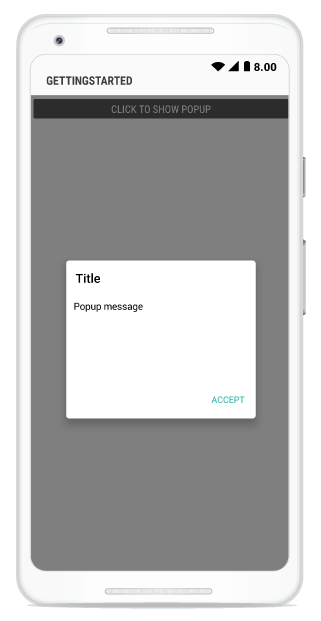

---
layout: post
title: How to | SfPopupLayout |Xamarin.Android | Syncfusion
description: How to topics in SfPopupLayout
platform: Xamarin.Android
control: SfPopupLayout
documentation: ug
--- 

# How to 

## Hide the header in the SfPopupLayout 

The SfPopupLayout allows hiding the header by using the [SfPopupLayout.PopupView.ShowHeader](https://help.syncfusion.com/cr/cref_files/xamarin-android/sfpopuplayout/Syncfusion.SfPopupLayout.Android~Syncfusion.Android.PopupLayout.PopupView~ShowHeader.html) property. The default value of this property is `true`.

To hide the header in the SfPopupLayout, follow the code example.



//MainActivity.cs

protected override void OnCreate(Bundle bundle)
{
	....
    popupLayout.PopupView.ShowHeader = false;
    SetContentView(popupLayout);
    ....
}



Executing the above codes renders the following output in Android device respectively.

## Hide the footer in the SfPopupLayout 

The SfPopupLayout allows hiding the footer by using the [SfPopupLayout.PopupView.ShowFooter](https://help.syncfusion.com/cr/cref_files/xamarin-android/sfpopuplayout/Syncfusion.SfPopupLayout.Android~Syncfusion.Android.PopupLayout.PopupView~ShowFooter.html) property. The default value of this property is `true`.

To hide the footer in the SfPopupLayout, follow the code example.



//MainActivity.cs

protected override void OnCreate(Bundle bundle)
{
	....
    popupLayout.PopupView.ShowFooter = false;
    SetContentView(popupLayout);
    ....
}



Executing the above codes renders the following output in Android device respectively.

## Hide the Close button in the SfPopupLayout 

The SfPopupLayout allows hiding the Close button by using the [SfPopupLayout.PopupView.ShowCloseButton](https://help.syncfusion.com/cr/cref_files/xamarin-android/sfpopuplayout/Syncfusion.SfPopupLayout.Android~Syncfusion.Android.PopupLayout.PopupView~ShowCloseButton.html) property. The default value of this property is `true`.

To hide the Close button in the SfPopupLayout, follow the code example.



//MainActivity.cs

protected override void OnCreate(Bundle bundle)
{
	....
    popupLayout.PopupView.ShowCloseButton = false;
    SetContentView(popupLayout);
    ....
}



Executing the above codes renders the following output in Android device respectively.

## Loading SfPopupLayout in GridTappedEvent of SfDataGrid

SfPopupLayout allows you to open it in the GridTapped event of SfDataGrid.

Refer the below code example to show the popup in Grid tapped event.


using Syncfusion.Android.PopupLayout;
using Syncfusion.SfDataGrid;

namespace GettingStarted
{
    public class MainActivity : Activity 
    {
       SfPopupLayout popupLayout;
       SfDataGrid dataGrid;
       ViewModel viewModel;

        protected override void OnCreate (Bundle bundle) 
        {
            base.OnCreate (bundle); 
            
            dataGrid = new SfDataGrid(this);
            viewModel = new ViewModel();
            dataGrid.ItemsSource = viewModel.OrdersInfo;
            dataGrid.GridTapped += DataGrid_GridTapped;

            popupLayout = new SfPopupLayout(this);
            popupLayout.Content = dataGrid;
            SetContentView(popupLayout);
        } 

        private void DataGrid_GridTapped(object sender, GridTappedEventArgs e)
        {
            popupLayout.Show();
        }
    } 
}


