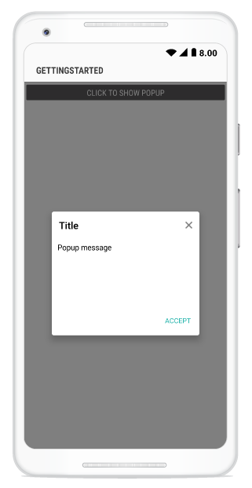
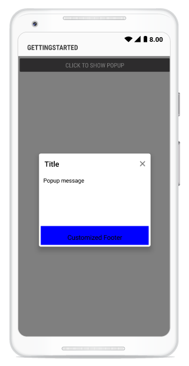
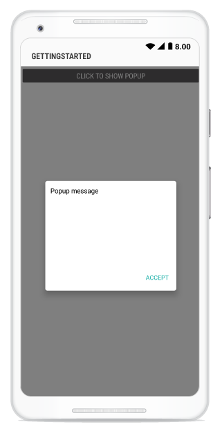
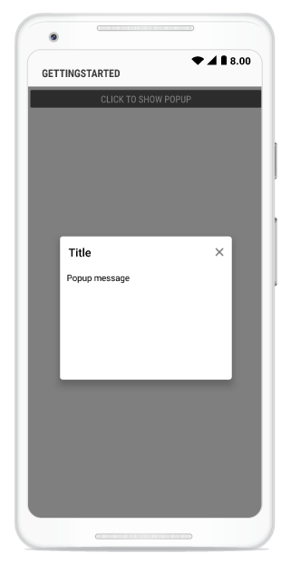
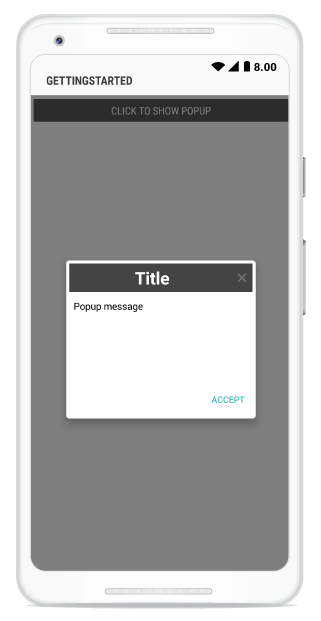

---
layout: post
title: Popup Layouts | SfPopupLayout |Xamarin.Android | Syncfusion
description: Layouts in SfPopupLayout
platform: Xamarin.Android
control: SfPopupLayout
documentation: ug
--- 

# Layout Customizations

SfPopupLayout supports two types of [SfPopupLayout.PopupView.AppearanceMode](https://help.syncfusion.com/cr/cref_files/xamarin-android/sfpopuplayout/Syncfusion.SfPopupLayout.Android~Syncfusion.Android.PopupLayout.AppearanceMode.html). By default, "AppearanceMode.OneButton" is set. You can change the appearance of the SfPopupLayout by using `SfPopupLayout.PopupView.AppearanceMode` property.
Two different appearance mode in SfPopupLayout as listed below.

<table>
<tr>
<th> Modes </th>
<th> Description </th>
</tr>
<tr>
<td> {{'[OneButton](https://help.syncfusion.com/cr/cref_files/xamarin-android/sfpopuplayout/Syncfusion.SfPopupLayout.Android~Syncfusion.Android.PopupLayout.AppearanceMode.html)'| markdownify }} </td>
<td> Shows SfPopupLayout with OneButton in the FooterView. This is the default value.</td>
</tr>
<tr>
<td> {{'[TwoButton](https://help.syncfusion.com/cr/cref_files/xamarin-android/sfpopuplayout/Syncfusion.SfPopupLayout.Android~Syncfusion.Android.PopupLayout.AppearanceMode.html)'| markdownify }} </td>
<td> Shows SfPopupLayout with TwoButtons in the FooterView.</td>
</tr>
</table>

## Popup with one button in the footer

In the below code example we have set `SfPopupLayout.PopupView.AppearanceMode` property as “OneButton” which displays only AcceptButton in the FooterView.

### Type A:



using Syncfusion.Android.PopupLayout;

namespace GettingStarted
{
    public class MainActivity : Activity 
    {
       SfPopupLayout popupLayout;
       Button showPopupButton;
       LinearLayout layout;

        protected override void OnCreate (Bundle bundle) 
        {
            base.OnCreate (bundle); 
            layout = new LinearLayout(this);
            layout.Orientation = Orientation.Vertical;
            layout.SetBackgroundColor(Color.White);

            showPopupButton = new Button(this);
            showPopupButton.Click += ShowPopupButton_Click;
            showPopupButton.SetTextColor(Color.White);
            showPopupButton.Text = "Click to show Popup";

            layout.AddView(showPopupButton, ViewGroup.LayoutParams.MatchParent, ViewGroup.LayoutParams.WrapContent);

            // Setting the AppearanceMode as OneButton
            popupLayout.PopupView.AppearanceMode = AppearanceMode.OneButton;
            popupLayout = new SfPopupLayout(this);
            popupLayout.Content = layout;

            SetContentView(popupLayout);
        } 

        private void ShowPopupButton_Click(object sender, System.EventArgs e)
        {
            popupLayout.Show();
        }
    }
} 



If we run the above sample with `AppearanceMode` as `OneButton`, the output will look like on Android device as shown below.

## Popup with two buttons in the footer

In the below code example we have set `SfPopupLayout.PopupView.AppearanceMode` property as `TwoButton` which displays both DeclineButton and AcceptButton in the FooterView.

### Type A:



using Syncfusion.Android.PopupLayout;

namespace GettingStarted
{
    public class MainActivity : Activity 
    {
       SfPopupLayout popupLayout;
       Button showPopupButton;
       LinearLayout layout;

        protected override void OnCreate (Bundle bundle) 
        {
            base.OnCreate (bundle); 
            layout = new LinearLayout(this);
            layout.Orientation = Orientation.Vertical;
            layout.SetBackgroundColor(Color.White);

            showPopupButton = new Button(this);
            showPopupButton.Click += ShowPopupButton_Click;
            showPopupButton.SetTextColor(Color.White);
            showPopupButton.Text = "Click to show Popup";

            layout.AddView(showPopupButton, ViewGroup.LayoutParams.MatchParent, ViewGroup.LayoutParams.WrapContent);

            // Setting the AppearanceMode as TwoButton
            popupLayout.PopupView.AppearanceMode = AppearanceMode.TwoButton;
            popupLayout = new SfPopupLayout(this);
            popupLayout.Content = layout;

            SetContentView(popupLayout);
        } 

        private void ShowPopupButton_Click(object sender, System.EventArgs e)
        {
            popupLayout.Show();
        }
    }
} 



If we run the above sample with `AppearanceMode` as `TwoButton`, the output will look like on Android device as shown below.

# Customizing Popup Layouts
 
You can also customize the entire view of the popup by loading templates or custom views individually for the header, body and footer of the popup.

## Header Customization

Any view can be added as the header content using the [SfPopupLayout.PopupView.HeaderView](https://help.syncfusion.com/cr/cref_files/xamarin-android/sfpopuplayout/Syncfusion.SfPopupLayout.Android~Syncfusion.Android.PopupLayout.PopupView~HeaderView.html) property to refresh it. Refer to the following code example in which a TextView is added as a header content:

##### Type A:



using Syncfusion.Android.PopupLayout;

namespace GettingStarted
{
    public class MainActivity : Activity 
    {
       SfPopupLayout popupLayout;
       Button showPopupButton;
       LinearLayout layout;
       TextView headerView;

        protected override void OnCreate (Bundle bundle) 
        {
            base.OnCreate (bundle); 
            layout = new LinearLayout(this);
            layout.Orientation = Orientation.Vertical;
            layout.SetBackgroundColor(Color.White);

            showPopupButton = new Button(this);
            showPopupButton.Click += ShowPopupButton_Click;
            showPopupButton.SetTextColor(Color.White);
            showPopupButton.Text = "Click to show Popup";

            layout.AddView(showPopupButton, ViewGroup.LayoutParams.MatchParent, ViewGroup.LayoutParams.WrapContent);

            headerView = new TextView(this) { Text = "Customized Header"};
            headerView.Gravity = GravityFlags.Center;
            headerView.TextSize = 16;
            headerView.SetBackgroundColor(Color.LightSeaGreen);
            headerView.SetTextColor(Color.Black);

            popupLayout = new SfPopupLayout(this);
            popupLayout.Content = layout;

            // Adding Header view of the SfPopupLayout.
            popupLayout.PopupView.HeaderView = headerView;

            SetContentView(popupLayout);
        } 

        private void ShowPopupButton_Click(object sender, System.EventArgs e)
        {
            popupLayout.Show();
        }
    }
} 



This is how the final output will look like on Android device.

## Footer Customization

Any view can be added as the header content using the [SfPopupLayout.PopupView.FooterView](https://help.syncfusion.com/cr/cref_files/xamarin-android/sfpopuplayout/Syncfusion.SfPopupLayout.Android~Syncfusion.Android.PopupLayout.PopupView~FooterView.html) property to refresh it. Refer to the following code example in which a TextView is added as a header content:

##### Type A:



using Syncfusion.Android.PopupLayout;

namespace GettingStarted
{
    public class MainActivity : Activity 
    {
       SfPopupLayout popupLayout;
       Button showPopupButton;
       LinearLayout layout;
       TextView footerView;

        protected override void OnCreate (Bundle bundle) 
        {
            base.OnCreate (bundle); 
            layout = new LinearLayout(this);
            layout.Orientation = Orientation.Vertical;
            layout.SetBackgroundColor(Color.White);

            showPopupButton = new Button(this);
            showPopupButton.Click += ShowPopupButton_Click;
            showPopupButton.SetTextColor(Color.White);
            showPopupButton.Text = "Click to show Popup";

            layout.AddView(showPopupButton, ViewGroup.LayoutParams.MatchParent, ViewGroup.LayoutParams.WrapContent);

            footerView = new TextView(this) { Text = "Customized Footer"};
            footerView.Gravity = GravityFlags.Center;
            footerView.TextSize = 16;
            footerView.SetBackgroundColor(Color.LightSeaGreen);
            footerView.SetTextColor(Color.Black);

            popupLayout = new SfPopupLayout(this);
            popupLayout.Content = layout;

            // Adding Footer view of the SfPopupLayout
            popupLayout.PopupView.FooterView = footerView;

            SetContentView(popupLayout);
        } 

        private void ShowPopupButton_Click(object sender, System.EventArgs e)
        {
            popupLayout.Show();
        }
    }
} 



This is how the final output will look like on Android device.

## How to hide Header in SfPopupLayout ?

SfPopupLayout allows you to hide the Header by using [SfPopupLayout.PopupView.ShowHeader](https://help.syncfusion.com/cr/cref_files/xamarin-android/sfpopuplayout/Syncfusion.SfPopupLayout.Android~Syncfusion.Android.PopupLayout.PopupView~ShowHeader.html) property. The default value of this property is `true`.

To hide the header in SfPopupLayout, follow the code example:



//MainActivity.cs

protected override void OnCreate(Bundle bundle)
{
	....
    popupLayout.PopupView.ShowHeader = false;
    SetContentView(popupLayout);
    ....
}



This is how the final output will look like on Android device.

## How to hide Footer in SfPopupLayout ?

SfPopupLayout allows you to hide the Header by using [SfPopupLayout.PopupView.ShowFooter](https://help.syncfusion.com/cr/cref_files/xamarin-android/sfpopuplayout/Syncfusion.SfPopupLayout.Android~Syncfusion.Android.PopupLayout.PopupView~ShowFooter.html) property. The default value of this property is `true`.

To hide the footer in SfPopupLayout, follow the code example:



//MainActivity.cs

protected override void OnCreate(Bundle bundle)
{
	....
    popupLayout.PopupView.ShowFooter = false;
    SetContentView(popupLayout);
    ....
}



This is how the final output will look like on Android device.

## How to hide the close button in SfPopupLayout ?

SfPopupLayout allows you to hide the Close button by using [SfPopupLayout.PopupView.ShowCloseButton](https://help.syncfusion.com/cr/cref_files/xamarin-android/sfpopuplayout/Syncfusion.SfPopupLayout.Android~Syncfusion.Android.PopupLayout.PopupView~ShowCloseButton.html) property. The default value of this property is `true`.

To hide the close button in SfPopupLayout, follow the code example:



//MainActivity.cs

protected override void OnCreate(Bundle bundle)
{
	....
    popupLayout.PopupView.ShowCloseButton = false;
    SetContentView(popupLayout);
    ....
}



This is how the final output will look like on Android device.

# Styles

SfPopupLayout allows you to apply style to all of its elements by using [SfPopupLayout.PopupView.PopupStyle](https://help.syncfusion.com/cr/cref_files/xamarin-android/sfpopuplayout/Syncfusion.SfPopupLayout.Android~Syncfusion.Android.PopupLayout.PopupView~PopupStyle.html) property.

## Customizing Header elements

SfPopupLayout allows you to customize header elements. Refer the below table for available header customization.

<table>
<tr>
<th> Property </th>
<th> Description </th>
</tr>
<tr>
<td> {{'[SfPopupLayout.PopupView.PopupStyle.HeaderBackgroundColor](https://help.syncfusion.com/cr/cref_files/xamarin-android/sfpopuplayout/Syncfusion.SfPopupLayout.Android~Syncfusion.Android.PopupLayout.PopupStyle~HeaderBackgroundColor.html)'| markdownify }} </td>
<td>  Gets or sets the background color to be applied for the header.</td>
</tr>
<tr>
<td> {{'[SfPopupLayout.PopupView.PopupStyle.HeaderTypeface](https://help.syncfusion.com/cr/cref_files/xamarin-android/sfpopuplayout/Syncfusion.SfPopupLayout.Android~Syncfusion.Android.PopupLayout.PopupStyle~HeaderTypeface.html)'| markdownify }} </td>
<td>  Gets the font style to be applied for the header title.</td>
</tr>
<tr>
<td> {{'[SfPopupLayout.PopupView.PopupStyle.HeaderTypefaceStyle](https://help.syncfusion.com/cr/cref_files/xamarin-android/sfpopuplayout/Syncfusion.SfPopupLayout.Android~Syncfusion.Android.PopupLayout.PopupStyle~HeaderTypefaceStyle.html)'| markdownify }} </td>
<td>  Gets or sets the font attribute to be applied for the header title. </td>
</tr>
<tr>
<td> {{'[SfPopupLayout.PopupView.PopupStyle.HeaderTextSize](https://help.syncfusion.com/cr/cref_files/xamarin-android/sfpopuplayout/Syncfusion.SfPopupLayout.Android~Syncfusion.Android.PopupLayout.PopupStyle~HeaderTextSize.html)'| markdownify }} </td>
<td> Gets or sets the text size of the header title.</td>
</tr>
<tr>
<td> {{'[SfPopupLayout.PopupView.PopupStyle.HeaderTextGravity](https://help.syncfusion.com/cr/cref_files/xamarin-android/sfpopuplayout/Syncfusion.SfPopupLayout.Android~Syncfusion.Android.PopupLayout.PopupStyle~HeaderTextGravity.html)'| markdownify }} </td>
<td>  Gets or sets the text alignment of the header.</td>
</tr>
<tr>
<td> {{'[SfPopupLayout.PopupView.PopupStyle.HeaderTextColor](https://help.syncfusion.com/cr/cref_files/xamarin-android/sfpopuplayout/Syncfusion.SfPopupLayout.Android~Syncfusion.Android.PopupLayout.PopupStyle~HeaderTextColor.html)'| markdownify }} </td>
<td>  Gets or sets the text color to be applied for the header title.</td>
</tr>
</table>

Refer the below code example for customizing the header elements.


//MainActivity.cs

protected override void OnCreate(Bundle bundle)
{
	....
    popupLayout.PopupView.PopupStyle.HeaderBackgroundColor = Color.LightSeaGreen;
    popupLayout.PopupView.PopupStyle.HeaderTypeface = Typeface.DefaultBold;
    popupLayout.PopupView.PopupStyle.HeaderTypefaceStyle = TypefaceStyle.Italic;
    popupLayout.PopupView.PopupStyle.HeaderTextSize = 25;
    popupLayout.PopupView.PopupStyle.HeaderTextGravity = GravityFlags.Center;
    popupLayout.PopupView.PopupStyle.HeaderTextColor = Color.White;
    SetContentView(popupLayout);
    ....
}



This is how the final output will look like on Android device.

## Customizing Footer elements

SfPopupLayout allows you to customize footer elements. Refer the below table for available footer customization.

<table>
<tr>
<th> Property </th>
<th> Description </th>
</tr>
<tr>
<td> {{'[SfPopupLayout.PopupView.PopupStyle.FooterBackgroundColor](https://help.syncfusion.com/cr/cref_files/xamarin-android/sfpopuplayout/Syncfusion.SfPopupLayout.Android~Syncfusion.Android.PopupLayout.PopupStyle~FooterBackgroundColor.html)'| markdownify }} </td>
<td>  Gets the background color of the footer.</td>
</tr>
<tr>
<td> {{'[SfPopupLayout.PopupView.PopupStyle.AcceptButtonBackgroundColor](https://help.syncfusion.com/cr/cref_files/xamarin-android/sfpopuplayout/Syncfusion.SfPopupLayout.Android~Syncfusion.Android.PopupLayout.PopupStyle~AcceptButtonBackgroundColor.html)'| markdownify }} </td>
<td>  Gets or sets the background color of the accept button in the footer.</td>
</tr>
<tr>
<td> {{'[SfPopupLayout.PopupView.PopupStyle.AcceptButtonTextColor](https://help.syncfusion.com/cr/cref_files/xamarin-android/sfpopuplayout/Syncfusion.SfPopupLayout.Android~Syncfusion.Android.PopupLayout.PopupStyle~AcceptButtonTextColor.html)'| markdownify }} </td>
<td>  Gets or sets the foreground color of the accept button in the footer.</td>
</tr>
<tr>
<td> {{'[SfPopupLayout.PopupView.PopupStyle.DeclineButtonBackgroundColor](https://help.syncfusion.com/cr/cref_files/xamarin-android/sfpopuplayout/Syncfusion.SfPopupLayout.Android~Syncfusion.Android.PopupLayout.PopupStyle~DeclineButtonBackgroundColor.html)'| markdownify }} </td>
<td> Gets or sets the background color of the decline button in the footer.</td>
</tr>
<tr>
<td> {{'[SfPopupLayout.PopupView.PopupStyle.DeclineButtonTextColor](https://help.syncfusion.com/cr/cref_files/xamarin-android/sfpopuplayout/Syncfusion.SfPopupLayout.Android~Syncfusion.Android.PopupLayout.PopupStyle~DeclineButtonTextColor.html)'| markdownify }} </td>
<td>  Gets or sets the foreground color of the decline button in the footer.</td>
</tr>
</table>

Refer the below code example for customizing the footer elements.



//MainActivity.cs

protected override void OnCreate(Bundle bundle)
{
	....
    // Setting the AppearanceMode as TwoButton
    popupLayout.PopupView.AppearanceMode = AppearanceMode.TwoButton;

    // Footer customization
    popupLayout.PopupView.PopupStyle.FooterBackgroundColor = Color.LightGray;
    popupLayout.PopupView.PopupStyle.AcceptButtonBackgroundColor = Color.DarkGray;
    popupLayout.PopupView.PopupStyle.AcceptButtonTextColor = Color.White;
    popupLayout.PopupView.PopupStyle.DeclineButtonBackgroundColor = Color.DarkGray;
    popupLayout.PopupView.PopupStyle.DeclineButtonTextColor = Color.White;
    SetContentView(popupLayout);
    ....
}



This is how the final output will look like on Android device.

## Border Customization

SfPopupLayout allows you to customize border appearance. Refer the below table for available customization for border.

<table>
<tr>
<th> Property </th>
<th> Description </th>
</tr>
<tr>
<td> {{'[SfPopupLayout.PopupView.PopupStyle.BorderColor](https://help.syncfusion.com/cr/cref_files/xamarin-android/sfpopuplayout/Syncfusion.SfPopupLayout.Android~Syncfusion.Android.PopupLayout.PopupStyle~BorderColor.html)'| markdownify }} </td>
<td>  Gets or sets the border color for the PopupView.</td>
</tr>
<tr>
<td> {{'[SfPopupLayout.PopupView.PopupStyle.BorderThickness](https://help.syncfusion.com/cr/cref_files/xamarin-android/sfpopuplayout/Syncfusion.SfPopupLayout.Android~Syncfusion.Android.PopupLayout.PopupStyle~BorderThickness.html)'| markdownify }} </td>
<td>  Gets or sets the border thickness for the PopupView.</td>
</tr>
<tr>
<td> {{'[SfPopupLayout.PopupView.PopupStyle.CornerRadius](https://help.syncfusion.com/cr/cref_files/xamarin-android/sfpopuplayout/Syncfusion.SfPopupLayout.Android~Syncfusion.Android.PopupLayout.PopupStyle~CornerRadius.html)'| markdownify }} </td>
<td>  Gets or sets the corner radius for the PopupView.</td>
</tr>
</table>

Refer the below code example for customizing the border elements.



//MainActivity.cs

protected override void OnCreate(Bundle bundle)
{
	....
    popupLayout.PopupView.PopupStyle.BorderColor = Color.LightBlue;
    popupLayout.PopupView.PopupStyle.BorderThickness = 3;
    popupLayout.PopupView.PopupStyle.CornerRadius = 5;
    SetContentView(popupLayout);
    ....
}



This is how the final output will look like on Android device.

