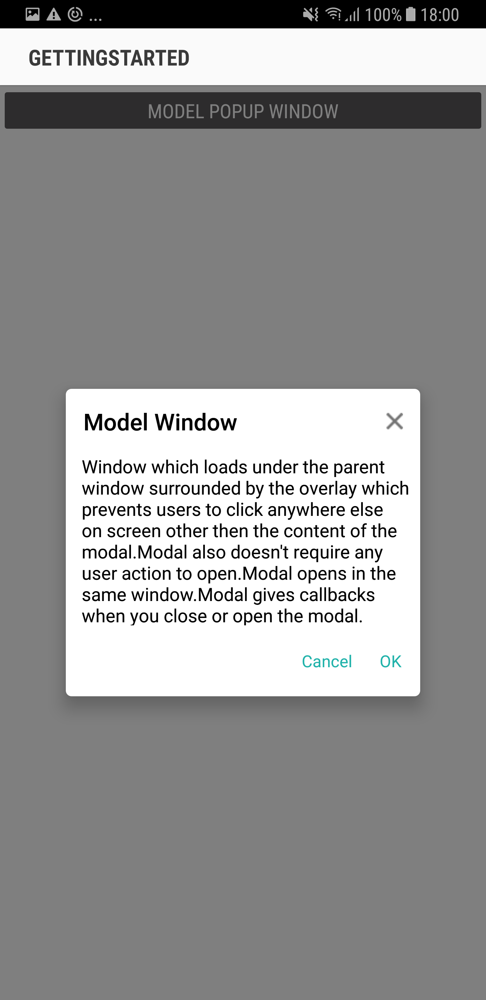

---
layout: post
title: Model Window Popup | SfPopupLayout |Xamarin.Android | Syncfusion
description: Model Window Popup with SfPopupLayout
platform: Xamarin.Android
control: SfPopupLayout
documentation: ug
--- 

# Model Window Popup

You can use pop-up layout as model window by using the built-in close icon and [SfPopupLayout.StaysOpen](https://help.syncfusion.com/cr/cref_files/xamarin-android/sfpopuplayout/Syncfusion.SfPopupLayout.Android~Syncfusion.Android.PopupLayout.SfPopupLayout~StaysOpen.html) to prevent the user from interacting with your application until they close the window.

Model Window will loads under the parent window surrounded by the overlay which prevents users to click anywhere else on screen other then the content of the modal.

Modal also doesn't require any user action to open.

Modal opens in the same window.

Modal gives callbacks when you close or open the modal.

Refer the below code example in which popup will close only if you click cancel button, ok button or close icon with a toast message displayed from popup footer button clicked callback.



using Syncfusion.Android.PopupLayout;

namespace GettingStarted
{
    public class MainActivity : Activity 
    {
       SfPopupLayout popupLayout;
       Button showPopupButton;
       LinearLayout mainLayout;
       TextView popupContent;

        protected override void OnCreate (Bundle bundle) 
        {
            base.OnCreate (bundle); 
            mainLayout = new LinearLayout(this);
            mainLayout.Orientation = Orientation.Vertical;
            mainLayout.SetBackgroundColor(Color.White);

            showPopupButton = new Button(this);
            showPopupButton.Click += ShowPopupButton_Click;
            showPopupButton.SetTextColor(Color.White);
            showPopupButton.Text = "Click to show Popup";

            popupContent = new TextView(this) { Text = "Window which loads under the parent window surrounded by the overlay which prevents users to click anywhere else on screen other then the content of the modal.Modal also doesn't require any user action to open.Modal opens in the same window.Modal gives callbacks when you close or open the modal." };
            popupContent.TextAlignment = TextAlignment.ViewStart;
            popupContent.SetTextColor(Color.Black);
            popupContent.SetPadding(30, 0, 0, 0);

            mainLayout.AddView(showPopupButton, ViewGroup.LayoutParams.MatchParent, ViewGroup.LayoutParams.WrapContent);

            popupLayout = new SfPopupLayout(this);
            popupLayout.PopupView.AppearanceMode = AppearanceMode.TwoButton;
            popupLayout.PopupView.AcceptButtonText = "OK";
            popupLayout.PopupView.DeclineButtonText = "Cancel";
            popupLayout.PopupView.HeaderTitle = "Model Window";
            popupLayout.PopupView.ContentView = popupContent;
            popupLayout.PopupView.HeightRequest = 260;

            popupLayout.PopupView.AcceptButtonClicked += PopupView_AcceptButtonClicked;
            popupLayout.PopupView.DeclineButtonClicked += PopupView_DeclineButtonClicked;
            popupLayout.Content = mainLayout;

            SetContentView(popupLayout);
        } 

        private void PopupView_DeclineButtonClicked(object sender, System.ComponentModel.CancelEventArgs e)
        {
            popupLayout.IsOpen = false;
            Toast.MakeText(this.BaseContext, "Popup Closed", ToastLength.Short).Show();        
        }

        private void PopupView_AcceptButtonClicked(object sender, System.ComponentModel.CancelEventArgs e)
        {
            popupLayout.IsOpen = false;
            Toast.MakeText(this.BaseContext, "Popup Closed", ToastLength.Short).Show();
        }

        private void ShowPopupButton_Click(object sender, System.EventArgs e)
        {
            // Below code ensures that the popup doesnot collapse when user interacts outside the popup.
            popupLayout.PopupView.ShowCloseButton = true;
            popupLayout.StaysOpen = true;
            popupLayout.IsOpen = true;
        }
    } 
}



If we run the above sample, the below output will appears on Android device as shown below.

