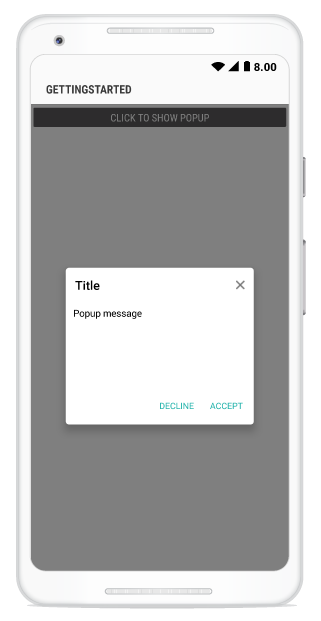

---
layout: post
title: Popup Layouts | SfPopupLayout |Xamarin.Android | Syncfusion
description: Layouts in SfPopupLayout
platform: Xamarin.Android
control: SfPopupLayout
documentation: ug
--- 

### AppearanceMode

SfPopupLayout supports two types of [SfPopupLayout.PopupView.AppearanceMode](https://help.syncfusion.com/cr/cref_files/xamarin-android/sfpopuplayout/Syncfusion.SfPopupLayout.Android~Syncfusion.Android.PopupLayout.AppearanceMode.html). By default, "AppearanceMode.OneButton" is set. You can change the appearance of the SfPopupLayout by using `SfPopupLayout.PopupView.AppearanceMode` property.
Two different appearance mode in SfPopupLayout as listed below.

<table>
<tr>
<th> Modes </th>
<th> Description </th>
</tr>
<tr>
<td> {{'[OneButton](https://help.syncfusion.com/cr/cref_files/xamarin-android/sfpopuplayout/Syncfusion.SfPopupLayout.Android~Syncfusion.Android.PopupLayout.AppearanceMode.html)'| markdownify }} </td>
<td> Shows SfPopupLayout with OneButton in the FooterView. This is the default value.</td>
</tr>
<tr>
<td> {{'[TwoButton](https://help.syncfusion.com/cr/cref_files/xamarin-android/sfpopuplayout/Syncfusion.SfPopupLayout.Android~Syncfusion.Android.PopupLayout.AppearanceMode.html)'| markdownify }} </td>
<td> Shows SfPopupLayout with TwoButtons in the FooterView.</td>
</tr>
</table>

#### OneButton

In the below code example we have set `SfPopupLayout.PopupView.AppearanceMode` property as “OneButton” which displays only AcceptButton in the FooterView.

##### Type A:



using Syncfusion.Android.PopupLayout;

namespace GettingStarted
{
    public class MainActivity : Activity 
    {
       SfPopupLayout popupLayout;
       Button showPopupButton;
       LinearLayout layout;

        protected override void OnCreate (Bundle bundle) 
        {
            base.OnCreate (bundle); 
            layout = new LinearLayout(this);
            layout.Orientation = Orientation.Vertical;
            layout.SetBackgroundColor(Color.White);

            showPopupButton = new Button(this);
            showPopupButton.Click += ShowPopupButton_Click;
            showPopupButton.SetTextColor(Color.White);
            showPopupButton.Text = "Click to show Popup";

            layout.AddView(showPopupButton, ViewGroup.LayoutParams.MatchParent, ViewGroup.LayoutParams.WrapContent);

            // Setting the AppearanceMode as OneButton
            popupLayout.PopupView.AppearanceMode = AppearanceMode.OneButton;
            popupLayout = new SfPopupLayout(this);
            popupLayout.Content = layout;

            SetContentView(popupLayout);
        } 

        private void ShowPopupButton_Click(object sender, System.EventArgs e)
        {
            popupLayout.Show();
        }
    }
} 



If we run the above sample with `AppearanceMode` as `OneButton`, the output will look like on Android device as shown below.

#### TwoButton

In the below code example we have set `SfPopupLayout.PopupView.AppearanceMode` property as `TwoButton` which displays both DeclineButton and AcceptButton in the FooterView.

##### Type A:



using Syncfusion.Android.PopupLayout;

namespace GettingStarted
{
    public class MainActivity : Activity 
    {
       SfPopupLayout popupLayout;
       Button showPopupButton;
       LinearLayout layout;

        protected override void OnCreate (Bundle bundle) 
        {
            base.OnCreate (bundle); 
            layout = new LinearLayout(this);
            layout.Orientation = Orientation.Vertical;
            layout.SetBackgroundColor(Color.White);

            showPopupButton = new Button(this);
            showPopupButton.Click += ShowPopupButton_Click;
            showPopupButton.SetTextColor(Color.White);
            showPopupButton.Text = "Click to show Popup";

            layout.AddView(showPopupButton, ViewGroup.LayoutParams.MatchParent, ViewGroup.LayoutParams.WrapContent);

            // Setting the AppearanceMode as TwoButton
            popupLayout.PopupView.AppearanceMode = AppearanceMode.TwoButton;
            popupLayout = new SfPopupLayout(this);
            popupLayout.Content = layout;

            SetContentView(popupLayout);
        } 

        private void ShowPopupButton_Click(object sender, System.EventArgs e)
        {
            popupLayout.Show();
        }
    }
} 



If we run the above sample with `AppearanceMode` as `TwoButton`, the output will look like on Android device as shown below.

