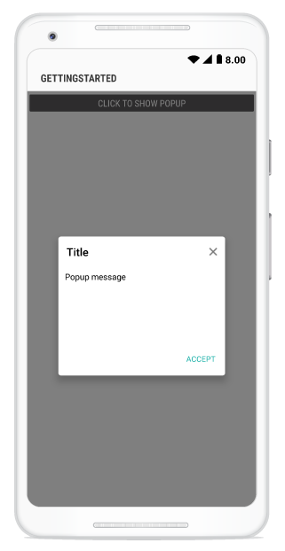

---
layout: post
title: Popup positioning | SfPopupLayout |Xamarin.Android | Syncfusion
description: Positioning capabilities of SfPopupLayout
platform: Xamarin.Android
control: SfPopupLayout
documentation: ug
--- 

### Showing SfPopupLayout at various position

SfPopupLayout allows you to show the Popup content at various position based on the requirement.

Following are the list of options available to show SfPopupLayout at various position.

<table>
<tr>
<th> Methods / Property </th>
<th> Description </th>
</tr>
<tr>
<td> {{'[SfPopupLayout.IsOpen](https://help.syncfusion.com/cr/cref_files/xamarin-android/sfpopuplayout/Syncfusion.SfPopupLayout.Android~Syncfusion.Android.PopupLayout.SfPopupLayout~IsOpen.html)'| markdownify }} </td>
<td> Shows SfPopupLayout at the center.</td>
</tr>
<tr>
<td> {{'[SfPopupLayout.Show()](https://help.syncfusion.com/cr/cref_files/xamarin-android/sfpopuplayout/Syncfusion.SfPopupLayout.Android~Syncfusion.Android.PopupLayout.SfPopupLayout~Show.html)'| markdownify }} </td>
<td> It is similar to SfPopupLayout.IsOpen property.</td>
</tr>
<tr>
<td> {{'[SfPopupLayout.Show(x-position, y-position)](https://help.syncfusion.com/cr/cref_files/xamarin-android/sfpopuplayout/Syncfusion.SfPopupLayout.Android~Syncfusion.Android.PopupLayout.SfPopupLayout~Show.html)'| markdownify }} </td>
<td> Shows SfPopupLayout at the specified X and y position.</td>
</tr>
<tr>
<td> {{'[SfPopupLayout.ShowAtTouchPoint()](https://help.syncfusion.com/cr/cref_files/xamarin-android/sfpopuplayout/Syncfusion.SfPopupLayout.Android~Syncfusion.Android.PopupLayout.SfPopupLayout~ShowAtTouchPoint.html)'| markdownify }} </td>
<td> Shows SfPopupLayout at the touch point.</td>
</tr>
<tr>
<td> {{'[SfPopupLayout.ShowRelativeToView(View, RelativePosition)](https://help.syncfusion.com/cr/cref_files/xamarin-android/sfpopuplayout/Syncfusion.SfPopupLayout.Android~Syncfusion.Android.PopupLayout.SfPopupLayout~ShowRelativeToView.html)'| markdownify }} </td>
<td> Shows SfPopupLayout at the position relative to the specified view.</td>
</tr>
</table>

#### IsOpen Property

In the below code example we have open the SfPopupLayout by using `SfPopupLayout.IsOpen` property.

##### Type A:



using Syncfusion.Android.PopupLayout;

namespace GettingStarted
{
    public class MainActivity : Activity 
    {
       SfPopupLayout popupLayout;
       Button showPopupButton;
       LinearLayout layout;

        protected override void OnCreate (Bundle bundle) 
        {
            base.OnCreate (bundle); 
            layout = new LinearLayout(this);
            layout.Orientation = Orientation.Vertical;
            layout.SetBackgroundColor(Color.White);

            showPopupButton = new Button(this);
            showPopupButton.Click += ShowPopupButton_Click;
            showPopupButton.SetTextColor(Color.White);
            showPopupButton.Text = "Click to show Popup";

            layout.AddView(showPopupButton, ViewGroup.LayoutParams.MatchParent, ViewGroup.LayoutParams.WrapContent);          
            popupLayout = new SfPopupLayout(this);
            popupLayout.Content = layout;

            SetContentView(popupLayout);
        } 

        private void ShowPopupButton_Click(object sender, System.EventArgs e)
        {
            // Shows SfPopupLayout at the center of the view.
            popupLayout.IsOpen = true;
        }
    }
} 



N > SfPopupLayout.IsOpen property is not applicable for Type B.

If we run the above sample, the below output will appear on Android device as shown below.

#### SfPopupLayout.Show()

In the below code example we have open the SfPopupLayout by using `SfPopupLayout.Show()`.

##### Type A:



using Syncfusion.Android.PopupLayout;

namespace GettingStarted
{
    public class MainActivity : Activity 
    {
       SfPopupLayout popupLayout;
       Button showPopupButton;
       LinearLayout layout;

        protected override void OnCreate (Bundle bundle) 
        {
            base.OnCreate (bundle); 
            layout = new LinearLayout(this);
            layout.Orientation = Orientation.Vertical;
            layout.SetBackgroundColor(Color.White);

            showPopupButton = new Button(this);
            showPopupButton.Click += ShowPopupButton_Click;
            showPopupButton.SetTextColor(Color.White);
            showPopupButton.Text = "Click to show Popup";

            layout.AddView(showPopupButton, ViewGroup.LayoutParams.MatchParent, ViewGroup.LayoutParams.WrapContent);           
            popupLayout = new SfPopupLayout(this);
            popupLayout.Content = layout;

            SetContentView(popupLayout);
        } 

        private void ShowPopupButton_Click(object sender, System.EventArgs e)
        {
               // Shows SfPopupLayout at the center of the view.
               popupLayout.Show();
        }
    }
} 



If we run the above sample, the below output will appear on Android device as shown below.

#### SfPopupLayout.Show(x-position, y-position)

In the below code example we have open the SfPopupLayout by using `SfPopupLayout.Show(x-position, y-position)`.

##### Type A:



using Syncfusion.Android.PopupLayout;

namespace GettingStarted
{
    public class MainActivity : Activity 
    {
       SfPopupLayout popupLayout;
       Button showPopupButton;
       LinearLayout layout;

        protected override void OnCreate (Bundle bundle) 
        {
            base.OnCreate (bundle); 
            layout = new LinearLayout(this);
            layout.Orientation = Orientation.Vertical;
            layout.SetBackgroundColor(Color.White);

            showPopupButton = new Button(this);
            showPopupButton.Click += ShowPopupButton_Click;
            showPopupButton.SetTextColor(Color.White);
            showPopupButton.Text = "Click to show Popup";

            layout.AddView(showPopupButton, ViewGroup.LayoutParams.MatchParent, ViewGroup.LayoutParams.WrapContent);       
            popupLayout = new SfPopupLayout(this);
            popupLayout.Content = layout;

            SetContentView(popupLayout);
        } 

        private void ShowPopupButton_Click(object sender, System.EventArgs e)
        {
               // Shows SfPopupLayout at x-position 100 and y position 100.
               popupLayout.Show(100, 100);
        }
    }
} 



If we run the above sample, the below output will appear on Android device as shown below.

#### SfPopupLayout.ShowAtTouchPoint()

In the below code example we have open the SfPopupLayout by using `SfPopupLayout.ShowAtTouchPoint()`.

##### Type A:



using Syncfusion.Android.PopupLayout;

namespace GettingStarted
{
    public class MainActivity : Activity 
    {
       SfPopupLayout popupLayout;
       Button showPopupButton;
       LinearLayout layout;

        protected override void OnCreate (Bundle bundle) 
        {
            base.OnCreate (bundle); 
            layout = new LinearLayout(this);
            layout.Orientation = Orientation.Vertical;
            layout.SetBackgroundColor(Color.White);

            showPopupButton = new Button(this);
            showPopupButton.Click += ShowPopupButton_Click;
            showPopupButton.SetTextColor(Color.White);
            showPopupButton.Text = "Click to show Popup";

            layout.AddView(showPopupButton, ViewGroup.LayoutParams.MatchParent, ViewGroup.LayoutParams.WrapContent);         
            popupLayout = new SfPopupLayout(this);
            popupLayout.Content = layout;

            SetContentView(popupLayout);
        } 

        private void ShowPopupButton_Click(object sender, System.EventArgs e)
        {
               // Shows SfPopupLayout at the touch point.
               popupLayout.ShowAtTouchPoint();
        }
    }
} 



N > SfPopupLayout.ShowAtTouchPoint() is not applicable for Type B.

If we run the above sample, the below output will appear on Android device as shown below.

#### SfPopupLayout.ShowRelativeToView(View, RelativePosition)

In the below code example we have open the SfPopupLayout by using `SfPopupLayout.ShowRelativeToView(View, RelativePosition)`.

##### Type A:



using Syncfusion.Android.PopupLayout;

namespace GettingStarted
{
    public class MainActivity : Activity 
    {
       SfPopupLayout popupLayout;
       Button showPopupButton;
       TextView textView;
       LinearLayout layout;

        protected override void OnCreate (Bundle bundle) 
        {
            base.OnCreate (bundle); 
            layout = new LinearLayout(this);
            layout.Orientation = Orientation.Vertical;
            layout.SetBackgroundColor(Color.White);

            showPopupButton = new Button(this);
            showPopupButton.Click += ShowPopupButton_Click;
            showPopupButton.SetTextColor(Color.White);
            showPopupButton.Text = "Click to show Popup";

            textView = new TextView(this) { Text = "This is SfPopupLayout" };
            textView.SetTextColor(Color.Black);

            layout.AddView(showPopupButton, ViewGroup.LayoutParams.MatchParent, 150);
            layout.AddView(textView, ViewGroup.LayoutParams.MatchParent, 150);

            popupLayout = new SfPopupLayout(this);
            popupLayout.Content = layout;

            SetContentView(popupLayout);
        } 

        private void ShowPopupButton_Click(object sender, System.EventArgs e)
        {
            // Shows SfPopupLayout at the bottom of the text view.
            popupLayout.ShowRelativeToView(textView, RelativePosition.AlignBottom);
        }
    }
} 



If we run the above sample, the below output will appear on Android device as shown below.

