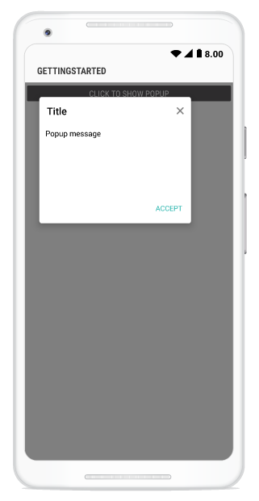
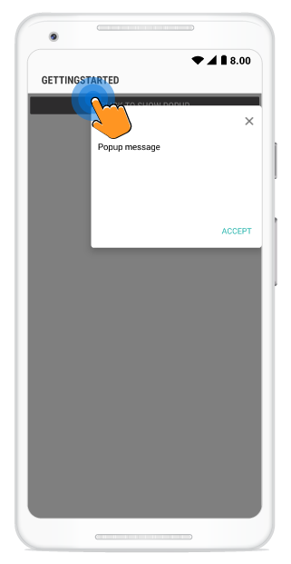
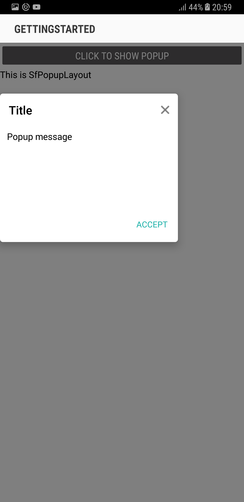
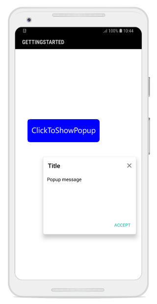

---
layout: post
title: Popup positioning | SfPopupLayout |Xamarin.Android | Syncfusion
description: Positioning capabilities of SfPopupLayout
platform: Xamarin.Android
control: SfPopupLayout
documentation: ug
--- 

# Pop-up Positioning

SfPopupLayout allows you to show the Popup content at various position based on the requirement.

Following are the list of options available to show SfPopupLayout at various position.

<table>
<tr>
<th> Methods / Property </th>
<th> Description </th>
</tr>
<tr>
<td> {{'[SfPopupLayout.IsOpen](https://help.syncfusion.com/cr/cref_files/xamarin-android/sfpopuplayout/Syncfusion.SfPopupLayout.Android~Syncfusion.Android.PopupLayout.SfPopupLayout~IsOpen.html)'| markdownify }} </td>
<td> Shows SfPopupLayout at the center.</td>
</tr>
<tr>
<td> {{'[SfPopupLayout.Show()](https://help.syncfusion.com/cr/cref_files/xamarin-android/sfpopuplayout/Syncfusion.SfPopupLayout.Android~Syncfusion.Android.PopupLayout.SfPopupLayout~Show.html)'| markdownify }} </td>
<td> It is similar to <code>SfPopupLayout.IsOpen</code> property.</td>
</tr>
<tr>
<td> {{'[SfPopupLayout.Show(x-position, y-position)](https://help.syncfusion.com/cr/cref_files/xamarin-android/sfpopuplayout/Syncfusion.SfPopupLayout.Android~Syncfusion.Android.PopupLayout.SfPopupLayout~Show.html)'| markdownify }} </td>
<td> Shows SfPopupLayout at the specified X and y position.</td>
</tr>
<tr>
<td> {{'[SfPopupLayout.ShowAtTouchPoint()](https://help.syncfusion.com/cr/cref_files/xamarin-android/sfpopuplayout/Syncfusion.SfPopupLayout.Android~Syncfusion.Android.PopupLayout.SfPopupLayout~ShowAtTouchPoint.html)'| markdownify }} </td>
<td> Shows SfPopupLayout at the touch point.</td>
</tr>
<tr>
<td> {{'[SfPopupLayout.ShowRelativeToView(View, RelativePosition)](https://help.syncfusion.com/cr/cref_files/xamarin-android/sfpopuplayout/Syncfusion.SfPopupLayout.Android~Syncfusion.Android.PopupLayout.SfPopupLayout~ShowRelativeToView.html)'| markdownify }} </td>
<td> Shows SfPopupLayout at the position relative to the specified view.</td>
</tr>
<tr>
<td> `SfPopupLayout.ShowRelativeToView(View, RelativePosition,x position,y position)` </td>
<td> Shows the SfPopupLayout at the desired position depends on the relative to the specified view while giving absolute point.</td>
</tr>
</table

N> Root view is not required to show the pop-up content at various available positions.

## Center Positioning

SfPopupLayout can be shown at the center by using the following options.

### IsOpen Property

To open the SfPopupLayout, use the `SfPopupLayout.IsOpen` property as in the following code sample.



using Syncfusion.Android.PopupLayout;

namespace GettingStarted
{
    public class MainActivity : Activity 
    {
       SfPopupLayout popupLayout;
       Button showPopupButton;
       LinearLayout layout;

        protected override void OnCreate (Bundle bundle) 
        {
            base.OnCreate (bundle); 
            layout = new LinearLayout(this);
            layout.Orientation = Orientation.Vertical;
            layout.SetBackgroundColor(Color.White);

            showPopupButton = new Button(this);
            showPopupButton.Click += ShowPopupButton_Click;
            showPopupButton.SetTextColor(Color.White);
            showPopupButton.Text = "Click to show Popup";

            layout.AddView(showPopupButton, ViewGroup.LayoutParams.MatchParent, ViewGroup.LayoutParams.WrapContent);          
            popupLayout = new SfPopupLayout(this);
            popupLayout.Content = layout;

            SetContentView(popupLayout);
        } 

        private void ShowPopupButton_Click(object sender, System.EventArgs e)
        {
            // Shows SfPopupLayout at the center of the view.
            popupLayout.IsOpen = true;
        }
    }
} 



Executing the above codes renders the following output in an android device.

### SfPopupLayout.Show()

To open the SfPopupLayout, use the `SfPopupLayout.Show()` as in the following code sample.



using Syncfusion.Android.PopupLayout;

namespace GettingStarted
{
    public class MainActivity : Activity 
    {
       SfPopupLayout popupLayout;
       Button showPopupButton;
       LinearLayout layout;

        protected override void OnCreate (Bundle bundle) 
        {
            base.OnCreate (bundle); 
            layout = new LinearLayout(this);
            layout.Orientation = Orientation.Vertical;
            layout.SetBackgroundColor(Color.White);

            showPopupButton = new Button(this);
            showPopupButton.Click += ShowPopupButton_Click;
            showPopupButton.SetTextColor(Color.White);
            showPopupButton.Text = "Click to show Popup";

            layout.AddView(showPopupButton, ViewGroup.LayoutParams.MatchParent, ViewGroup.LayoutParams.WrapContent);           
            popupLayout = new SfPopupLayout(this);
            popupLayout.Content = layout;

            SetContentView(popupLayout);
        } 

        private void ShowPopupButton_Click(object sender, System.EventArgs e)
        {
               // Shows SfPopupLayout at the center of the view.
               popupLayout.Show();
        }
    }
} 



Executing the above codes renders the following output in an android device.

## Absolute Positioning

SfPopupLayout can be shown at the specified position by using the following method.

### SfPopupLayout.Show(x-position, y-position)

To open the SfPopupLayout in specific X,Y coordinates, use the `SfPopupLayout.Show(x-position, y-position)` property as in the following code sample.



using Syncfusion.Android.PopupLayout;

namespace GettingStarted
{
    public class MainActivity : Activity 
    {
       SfPopupLayout popupLayout;
       Button showPopupButton;
       LinearLayout layout;

        protected override void OnCreate (Bundle bundle) 
        {
            base.OnCreate (bundle); 
            layout = new LinearLayout(this);
            layout.Orientation = Orientation.Vertical;
            layout.SetBackgroundColor(Color.White);

            showPopupButton = new Button(this);
            showPopupButton.Click += ShowPopupButton_Click;
            showPopupButton.SetTextColor(Color.White);
            showPopupButton.Text = "Click to show Popup";

            layout.AddView(showPopupButton, ViewGroup.LayoutParams.MatchParent, ViewGroup.LayoutParams.WrapContent);       
            popupLayout = new SfPopupLayout(this);
            popupLayout.Content = layout;

            SetContentView(popupLayout);
        } 

        private void ShowPopupButton_Click(object sender, System.EventArgs e)
        {
               // Shows SfPopupLayout at x-position 100 and y position 100.
               popupLayout.Show(100, 700);
        }
    }
} 



Executing the above codes renders the following output in an android device.

### SfPopupLayout.ShowAtTouchPoint()

To open the SfPopupLayout from the touch point in the screen, use the `SfPopupLayout.ShowAtTouchPoint()` property as in the following code sample.



using Syncfusion.Android.PopupLayout;

namespace GettingStarted
{
    public class MainActivity : Activity 
    {
       SfPopupLayout popupLayout;
       Button showPopupButton;
       LinearLayout layout;

        protected override void OnCreate (Bundle bundle) 
        {
            base.OnCreate (bundle); 
            layout = new LinearLayout(this);
            layout.Orientation = Orientation.Vertical;
            layout.SetBackgroundColor(Color.White);

            showPopupButton = new Button(this);
            showPopupButton.Click += ShowPopupButton_Click;
            showPopupButton.SetTextColor(Color.White);
            showPopupButton.Text = "Click to show Popup";

            layout.AddView(showPopupButton, ViewGroup.LayoutParams.MatchParent, ViewGroup.LayoutParams.WrapContent);         
            popupLayout = new SfPopupLayout(this);
            popupLayout.Content = layout;

            SetContentView(popupLayout);
        } 

        private void ShowPopupButton_Click(object sender, System.EventArgs e)
        {
               // Shows SfPopupLayout at the touch point.
               popupLayout.ShowAtTouchPoint();
        }
    }
} 



Executing the above codes renders the following output in an android device.

## Relative Positioning

SfPopupLayout can be shown at the relative position by using the following method.

### SfPopupLayout.ShowRelativeToView(View, RelativePosition)

To open the SfPopupLayout relative to a view, use the `SfPopupLayout.ShowRelativeToView(View, RelativePosition)` property as in the following code sample.



using Syncfusion.Android.PopupLayout;

namespace GettingStarted
{
    public class MainActivity : Activity 
    {
       SfPopupLayout popupLayout;
       Button showPopupButton;
       LinearLayout layout;

        protected override void OnCreate (Bundle bundle) 
        {
            base.OnCreate (bundle); 
            layout = new LinearLayout(this);
            layout.Orientation = Orientation.Vertical;
            layout.SetBackgroundColor(Color.White);

            showPopupButton = new Button(this);
            showPopupButton.Click += ShowPopupButton_Click;
            showPopupButton.SetTextColor(Color.White);
            showPopupButton.Text = "Click to show Popup";
            showPopupButton.Gravity = GravityFlags.Center;
            showPopupButton.SetBackgroundColor(Color.Blue);
            showPopupButton.SetX(320);
            showPopupButton.SetY(1000);

            layout.AddView(showPopupButton, 700, 250);
          
            popupLayout = new SfPopupLayout(this);
            popupLayout.Content = layout;

            SetContentView(popupLayout);
        } 

        private void ShowPopupButton_Click(object sender, System.EventArgs e)
        {
            // Shows SfPopupLayout at the bottom of the text view.
            popupLayout.ShowRelativeToView(showPopupButton, RelativePosition.AlignBottom);
        }
    }
} 



Executing the above codes renders the following output in an android device.

### Absolute relative positioning

Along with the relative positioning additionally SfPopupLayout allows to add the absolute relative position by using the following method.

By using absolute relative position pop-up content can be shown at the desired point depends on the relative position.

#### SfPopupLayout.ShowRelativeToView(View, RelativePosition,x-position,y-position)

To open the SfPopupLayout in specific X,Y coordinates depends on the relative to a view, use the `SfPopupLayout.ShowRelativeToView(View, RelativePosition,x-position,y-position)` property as in the following code sample.

To open the SfPopupLayout relative to a view without absolute position, use the `SfPopupLayout.ShowRelativeToView(View, RelativePosition,x position,y position)` property by passing X,Y coordinates as 0. 



using Syncfusion.Android.PopupLayout;

namespace GettingStarted
{
    public class MainActivity : Activity 
    {
       SfPopupLayout popupLayout;
       Button showPopupButton;
       LinearLayout layout;

        protected override void OnCreate (Bundle bundle) 
        {
            base.OnCreate (bundle); 
            layout = new LinearLayout(this);
            layout.Orientation = Orientation.Vertical;
            layout.SetBackgroundColor(Color.White);

            showPopupButton = new Button(this);
            showPopupButton.Click += ShowPopupButton_Click;
            showPopupButton.SetTextColor(Color.White);
            showPopupButton.Text = "Click to show Popup";
            showPopupButton.Gravity = GravityFlags.Center;
            showPopupButton.SetBackgroundColor(Color.Blue);
            showPopupButton.SetX(150);
            showPopupButton.SetY(800);

            layout.AddView(showPopupButton, 700, 250);
          
            popupLayout = new SfPopupLayout(this);
            popupLayout.Content = layout;

            SetContentView(popupLayout);
        } 

        private void ShowPopupButton_Click(object sender, System.EventArgs e)
        {
            // Shows SfPopupLayout at the bottom of the text view with absolute relative position.
            popupLayout.ShowRelativeToView(showPopupButton, RelativePosition.AlignBottom,30,30);
        }
    }
} 



Executing the above codes renders the following output in an android device.

N> SfPopupLayout.ShowRelativeToView(View, RelativePosition,x-position,y-position) also allows to provide the negative value of absolute relative position.