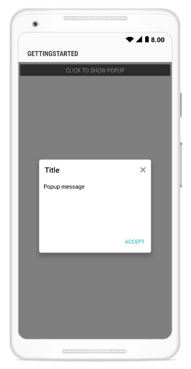

---
layout: post
title: Getting Started | SfPopupLayout |Xamarin.Android | Syncfusion
description: Getting Started with SfPopupLayout
platform: Xamarin.Android
control: SfPopupLayout
documentation: ug
--- 

# Getting Started

This section provides a quick overview for working with the SfPopupLayout in Xamarin.Android. Walk through the entire process of creating a simple application with this control.

## Assembly deployment

After installing Essential Studio for Xamarin, all the required assemblies can be found in the {Syncfusion Essential Studio Installed location}\Essential Studio\16.1.0.24\Xamarin\lib installation folders. 

E.g. C:\Program Files (x86)\Syncfusion\Essential Studio\16.1.0.24\Xamarin\lib

N> Assemblies can be found in an unzipped package location in Mac.

### SfPopupLayout for Xamarin.Android

The following assembly should be added as reference from the "lib" folder to use the SfPopupLayout in the application.

<table>
<tr>
<th> Project </th>
<th> Required assembly </th>
</tr>
<tr>
<td> Xamarin.Android </td>
<td> android\Syncfusion.SfPopupLayout.Android.dll </td>
</tr>
</table>

## NuGet configuration

To install the SfPopupLayout control in the application, configure the NuGet package of the Syncfusion components. Refer to the following KB to configure the NuGet package of the Syncfusion components:

[How to configure package source and install Syncfusion NuGet packages in an existing project?](https://www.syncfusion.com/kb/7441/how-to-configure-package-source-and-install-syncfusion-nuget-packages-in-an-existing-project)

The following NuGet package should be added to use the SfPopupLayout control in the application:

<table>
<tr>
<th> Project </th>
<th> Required package </th>
</tr>
<tr>
<td> Xamarin.Android </td>
<td> Syncfusion.Xamarin.SfPopupLayout.Android </td>
</tr>
</table>

Refer to the following screenshot in which the Syncfusion.Xamarin.SfPopupLayout.Android package is highlighted.

I> Starting with v16.2.0.x, if you reference Syncfusion assemblies from trial setup or from the NuGet feed, you also have to include a license key in your projects. Please refer to this [link](https://help.syncfusion.com/common/essential-studio/licensing/license-key) to know about registering Syncfusion license key in your Xamarin application to use our components.

## Create a simple pop-up

The SfPopupLayout control can be configured entirely in C# code. In this walk through, you will create a new application with SfPopupLayout. To create a sample application, follow the topics: 

* [Adding SfPopupLayout in Xamarin.Android](#adding-sfpopuplayout-in-xamarin.android) 
* [Customize positioning](#Customize-positioning) 
* [Customizing layouts](#Customizing-layouts) 
* [Customizing animations](#Customizing-animations)

Create a new Android application in Xamarin Studio or Visual Studio for Xamarin.Android.

## Adding SfPopupLayout in Xamarin.Android

1. Add the required assembly references to the project as mentioned in the [Assembly deployment](#assembly-deployment) section or install the NuGet as mentioned in the [NuGet Configuration](#nuget-configuration) section.

2. Import the SfPopupLayout control under the namespace `Syncfusion.Android.PopupLayout`.

3. The SfPopupLayout can be displayed by the following cases.

### Displaying Popup when SfPopupLayout is set as root view 

The SfPopupLayout can be displayed by making it as base view or content view of the activity. For first case, set the view over which the SfPopupLayout should be displayed as the content of the SfPopupLayout using the [SfPopupLayout.Content](https://help.syncfusion.com/cr/cref_files/xamarin-android/Syncfusion.SfPopupLayout.Android~Syncfusion.Android.PopupLayout.SfPopupLayout~Content.html) property. Create an instance of the SfPopupLayout control and set it as content view of that activity. 

Refer to the following code example for displaying popup.



using Syncfusion.Android.PopupLayout;

namespace GettingStarted
{
    public class MainActivity : Activity 
    {
       SfPopupLayout popupLayout;
       Button showPopupButton;
       LinearLayout mainLayout;

        protected override void OnCreate (Bundle bundle) 
        {
            base.OnCreate (bundle); 
            mainLayout = new LinearLayout(this);
            mainLayout.Orientation = Orientation.Vertical;
            mainLayout.SetBackgroundColor(Color.White);

            showPopupButton = new Button(this);
            showPopupButton.Click += ShowPopupButton_Click;
            showPopupButton.SetTextColor(Color.White);
            showPopupButton.Text = "Click to show Popup";

            mainLayout.AddView(showPopupButton, ViewGroup.LayoutParams.MatchParent, ViewGroup.LayoutParams.WrapContent);
            popupLayout = new SfPopupLayout(this);
            popupLayout.Content = mainLayout;

            SetContentView(popupLayout);
        } 

        private void ShowPopupButton_Click(object sender, System.EventArgs e)
        {
            popupLayout.Show();
        }
    } 
}



### Displaying pop-up when SfPopupLayout is not set as root view 

 You can continue to keep your view as the content view of the activity and still display pop-up over your view by simply calling the SfPopupLayout.Show() method. 

 Refer to the following code example for displaying popup.



using Syncfusion.Android.PopupLayout;

namespace GettingStarted
{
    public class MainActivity : Activity 
    {
       SfPopupLayout popupLayout;
       Button showPopupButton;
       LinearLayout mainLayout;

        protected override void OnCreate (Bundle bundle) 
        {
            base.OnCreate (bundle); 
            mainLayout = new LinearLayout(this);
            mainLayout.Orientation = Orientation.Vertical;
            mainLayout.SetBackgroundColor(Color.White);

            showPopupButton = new Button(this);
            showPopupButton.Click += ShowPopupButton_Click;
            showPopupButton.SetTextColor(Color.White);
            showPopupButton.Text = "Click to show Popup";

            mainLayout.AddView(showPopupButton, ViewGroup.LayoutParams.MatchParent, ViewGroup.LayoutParams.WrapContent);
            popupLayout = new SfPopupLayout(this);
            SetContentView(mainLayout);
        } 

        private void ShowPopupButton_Click(object sender, System.EventArgs e)
        {
            popupLayout.Show();
        }
    } 
}



Executing the above codes renders the following output in an android device.

You can download the source code of this sample [here](http://www.syncfusion.com/downloads/support/directtrac/general/ze/GettingStarted-1414679923).

## Customize positioning

The SfPopupLayout allows showing the pop-up content at various positions.

The following list of options are available to position the SfPopupLayout in the desired position:

* `Center positioning`: Use the [SfPopupLayout.IsOpen](https://help.syncfusion.com/cr/cref_files/xamarin-android/Syncfusion.SfPopupLayout.Android~Syncfusion.Android.PopupLayout.SfPopupLayout~IsOpen.html) property or [SfPopupLayout.Show()](https://help.syncfusion.com/cr/cref_files/xamarin-android/Syncfusion.SfPopupLayout.Android~Syncfusion.Android.PopupLayout.SfPopupLayout~Show.html) to display the SfPopupLayout at the center.
* `Absolute positioning`: Use the [SfPopupLayout.Show(x-position, y-position)](https://help.syncfusion.com/cr/cref_files/xamarin-android/Syncfusion.SfPopupLayout.Android~Syncfusion.Android.PopupLayout.SfPopupLayout~Show.html) to display the SfPopupLayout at the specified X and y positions.
* `OnTouch`: Use the [SfPopupLayout.ShowAtTouchPoint()](https://help.syncfusion.com/cr/cref_files/xamarin-android/Syncfusion.SfPopupLayout.Android~Syncfusion.Android.PopupLayout.SfPopupLayout~ShowAtTouchPoint.html) to display the SfPopupLayout at the touch point.
* `Relative positioning`: Use the [SfPopupLayout.ShowRelativeToView(View, RelativePosition)](https://help.syncfusion.com/cr/cref_files/xamarin-android/Syncfusion.SfPopupLayout.Android~Syncfusion.Android.PopupLayout.SfPopupLayout~ShowRelativeToView.html) to display the SfPopupLayout at any of the 8 positions relative to the specified view.
* `Absolute relative positioning`: Use the [SfPopupLayout.ShowRelativeToView(View, RelativePosition,x position,y position)](https://help.syncfusion.com/cr/cref_files/xamarin-android/Syncfusion.SfPopupLayout.Android~Syncfusion.Android.PopupLayout.SfPopupLayout~ShowRelativeToView(View,RelativePosition,Double,Double).html) to display the SfPopupLayout at an absolute x,y coordinate from the relative position of the specified view.

More information for pop-up positioning is in this [link](https://help.syncfusion.com/xamarin-android/sfpopuplayout/popup-positioning).

## Customizing layouts

By default, you can choose from the following layouts available in the SfPopupLayout using the property [SfPopupLayout.AppearanceMode](https://help.syncfusion.com/cr/cref_files/xamarin-android/Syncfusion.SfPopupLayout.Android~Syncfusion.Android.PopupLayout.AppearanceMode.html).

* [OneButton](https://help.syncfusion.com/cr/cref_files/xamarin-android/Syncfusion.SfPopupLayout.Android~Syncfusion.Android.PopupLayout.AppearanceMode.html): Shows the SfPopupLayout with one button in the footer view. This is the default value.
* [TwoButton](https://help.syncfusion.com/cr/cref_files/xamarin-android/Syncfusion.SfPopupLayout.Android~Syncfusion.Android.PopupLayout.AppearanceMode.html): Shows the SfPopupLayout with two buttons in the footer view.

You can also customize the entire view of the pop-up by loading the templates or custom views individually for the header, body, and footer.

### Load a view as content view  in the popup body

Any view can be added as the pop-up content using the [SfPopupLayout.PopupView.ContentView](https://help.syncfusion.com/cr/cref_files/xamarin-android/Syncfusion.SfPopupLayout.Android~Syncfusion.Android.PopupLayout.PopupView~ContentView.html) property to refresh it. Refer to the following code example in which a text view is added as pop-up content and  displaying pop-up when the SfPopupLayout is set as root view



//MainActivity.cs

protected override void OnCreate(Bundle bundle)
{
	....

	 TextView popupContentView = new TextView(this) { Text = "This is the Customized view for SfPopupLayout" };
     popupContentView.SetTextColor(Color.Black);
     popupContentView.SetBackgroundColor(Color.LightSkyBlue);
      
     // Adding ContentView of the SfPopupLayout
     popupLayout.PopupView.ContentView = popupContentView;
	....
}



Executing the above codes renders the following output in an android device.

N> Setting the content view is same for both cases i.e. displaying the pop-up when the SfPopupLayout is set as root view and vice versa.

## Customizing animations

Built-in animations are available in the SfPopupLayout applied when the PopupView opens and closes in the screen.

By default, you can choose from the following animations available in the SfPopupLayout using the property [SfPopupLayout.AnimationMode](https://help.syncfusion.com/cr/cref_files/xamarin-android/Syncfusion.SfPopupLayout.Android~Syncfusion.Android.PopupLayout.AnimationMode.html).

* [Zoom](https://help.syncfusion.com/cr/cref_files/xamarin-android/Syncfusion.SfPopupLayout.Android~Syncfusion.Android.PopupLayout.AnimationMode.html): Zoom-out animation will be applied when the PopupView opens, and zoom-in animation will be applied when the PopupView closes. This is the default AnimationMode.
* [Fade](https://help.syncfusion.com/cr/cref_files/xamarin-android/Syncfusion.SfPopupLayout.Android~Syncfusion.Android.PopupLayout.AnimationMode.html): Fade-out animation will be applied when the PopupView opens, and fade-in animation will be applied when the PopupView closes.
* [SlideOnLeft](https://help.syncfusion.com/cr/cref_files/xamarin-android/Syncfusion.SfPopupLayout.Android~Syncfusion.Android.PopupLayout.AnimationMode.html): PopupView will be animated from left-to-right when it opens, and from right-to-left when the PopupView closes.
* [SlideOnRight](https://help.syncfusion.com/cr/cref_files/xamarin-android/Syncfusion.SfPopupLayout.Android~Syncfusion.Android.PopupLayout.AnimationMode.html).
* [SlideOnTop](https://help.syncfusion.com/cr/cref_files/xamarin-android/Syncfusion.SfPopupLayout.Android~Syncfusion.Android.PopupLayout.AnimationMode.html): PopupView will be animated from top-to-bottom when it opens, and from bottom-to-top when the PopupView closes.
* [SlideOnBottom](https://help.syncfusion.com/cr/cref_files/xamarin-android/Syncfusion.SfPopupLayout.Android~Syncfusion.Android.PopupLayout.AnimationMode.html).
* [None](https://help.syncfusion.com/cr/cref_files/xamarin-android/Syncfusion.SfPopupLayout.Android~Syncfusion.Android.PopupLayout.AnimationMode.html): Animation will not be applied.

More information for pop-up animations is in this [link](https://help.syncfusion.com/xamarin-android/sfpopuplayout/popup-animations).