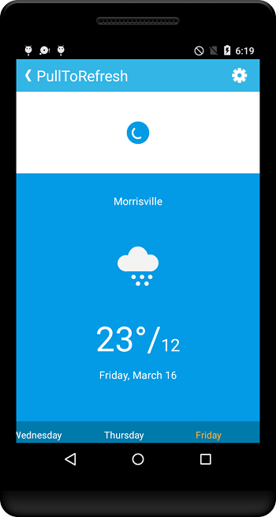

---
layout: post
title: Concepts and Features | PullToRefresh | Xamarin.Android | Syncfusion
description: concepts and features
platform: Xamarin.Android
control: PullToRefresh
documentation: ug
--- 

# Concepts and Features

## PullingThreshold

Gets or sets the threshold value from the edges for easy panning from the edges. The default value of TouchThreshold is 3 times the RefreshContentHeight.





    pullToRefresh.PullingThreshold = 225d;



 

## PullableContent

PullableContent is the main view of the PullToRefresh control on which the desired items can be placed.



    LinearLayout layout = new LinearLayout (context);
	layout.SetBackgroundColor (Color.AliceBlue);
	pullToRefresh.PullableContent = layout;



## RefreshContentHeight

`RefreshContentHeight` sets the height of the refresh content.





    pullToRefresh.RefreshContentHeight = 200d;





## Refresh ()

Refresh method is used to Refresh the `PullableContent` and also hides the `RefreshContent`.



    pullToRefresh.Refresh();



## Transition

The Transition property specifies the animations for the RefreshContent. Transition property has the following two options:

* `SlideOnTop`
* `Push`

The default transition is `SlideOnTop`. That draws the `RefreshContent` on top of the `PullableContent`.





    pullToRefresh.Transition = Transition.SlideOnTop;





The following code example shows how to set `Transition` as `Push` to SfPullToRefresh. This transition moves the refresh content and main content simultaneously.





    pullToRefresh.Transition = Transition.Push;





## PullDirection

PullDirection property specifies the position of the transition to take place.PullDirection property has the following two options:
* `Top`
* `Bottom`

The default PullDirection is `Top`. That draws the `RefreshContent` on top of the `PullableContent`.





    pullToRefresh.PullDirection=PullDirection.Top;





The following code example shows how to set `PullDirection` as `Bottom` to SfPullToRefresh.That draws the `RefreshContent` on Bottom of the `PullableContent`.





    pullToRefresh.PullDirection=PullDirection.Bottom;





## Events

There are three built-in events in the PullToRefresh control namely:

1. `Pulling`
2. `Refreshing`
3. `Refreshed`

## Pulling

`Pulling` event is triggered when we start pulling down the PullableContent. It is triggered as long as the pointer or finger is pressed and the progress is less than 100 and not equal to 0 . The arguments for the event are:

* SfPullToRefresh
* Progress





    pullToRefresh.Pulling+= (object sender, SfPullToRefresh.PullingEventArgs e) => {
				
			};
			




## Refreshing

`Refreshing` event is triggered once the content is pulled through the PullingThreshold or Progress reaches 100. This event is triggered till the Refresh() method is called.





    pullToRefresh.Refreshing += (object sender, EventArgs e) => {
				
			};





## Refreshed

`Refreshed` event is triggered once the refreshing and all the animations associated with the control are completed.





    pullToRefresh.Refreshed += (object sender, EventArgs e) =>
			 {
  
				 if (selectedLayout != null)
				{
					handler.PostDelayed(() =>
					 {
						 System.Random rnd = new System.Random();
						 int i = rnd.Next(20, 50);
						 textView3 = (TextView)view.FindViewById(Resource.Id.text);
						 textView3.Text = i + "°".ToString() + "/12";
						 pullToRefresh.Refresh();
					 }, 2000);
				 }
			 };



